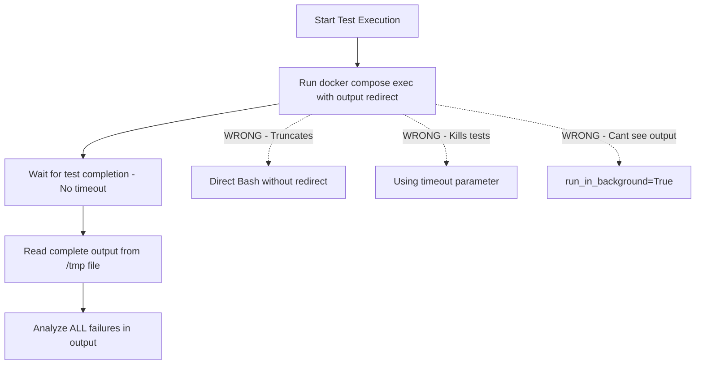

# SpectralMC Development Guide

## Project Overview

SpectralMC is a GPU-accelerated library for online machine learning using Monte Carlo simulation. It trains complex-valued neural networks (CVNNs) using Monte Carlo data, drawing on techniques from Reinforcement Learning, particularly policy gradient methods.

**Primary Use Case**: Quantitative Finance - stochastic process modeling and derivative pricing with significantly reduced computational requirements compared to traditional Monte Carlo methods.

**Key Technology Stack**:
- Python 3.12
- PyTorch 2.7.0 (CUDA 12.8)
- CuPy (CUDA 12.x)
- NumPy, SciPy, scikit-learn
- Distributed: Dask, Ray
- Testing: pytest, hypothesis
- Type checking: mypy (strict mode)

## Architecture

### Core Components

**src/spectralmc/**
- `async_normals.py` - Asynchronous normal distribution generation on GPU
- `cvnn.py` - Complex-valued neural network implementation
- `cvnn_factory.py` - Factory for creating CVNN instances
- `gbm.py` - Geometric Brownian Motion simulation
- `gbm_trainer.py` - Training loop for GBM models
- `sobol_sampler.py` - Quasi-Monte Carlo sampling using Sobol sequences
- `quantlib.py` - QuantLib integration utilities
- `models/` - Model implementations
  - `torch.py` - PyTorch-based model definitions
  - `numerical.py` - Numerical model utilities
  - `cpu_gpu_transfer.py` - CPU/GPU memory transfer utilities
- `storage/` - Blockchain model versioning (S3-based, production-ready)
  - `chain.py` - Blockchain primitives (ModelVersion, hashing, semantic versioning)
  - `store.py` - AsyncBlockchainModelStore with atomic S3 commits
  - `checkpoint.py` - Checkpoint serialization/deserialization utilities
  - `inference.py` - InferenceClient with pinned/tracking modes
  - `verification.py` - Chain integrity verification
  - `gc.py` - Garbage collection for old versions
  - `tensorboard_writer.py` - TensorBoard logging integration
  - `errors.py` - Exception hierarchy for storage operations
  - `__main__.py` - CLI tool for storage operations
- `serialization/` - Protocol Buffer serialization
  - `common.py` - Enum converters (Precision, Device, DType)
  - `simulation.py` - Simulation parameter converters
  - `models.py` - Model configuration converters
  - `training.py` - Training configuration converters
- `proto/` - Generated Protocol Buffer code
  - `common_pb2.py` - Common message types
  - `simulation_pb2.py` - Simulation messages
  - `models_pb2.py` - Model configuration messages
  - `training_pb2.py` - Training configuration messages

### Blockchain Model Versioning - Overview

SpectralMC uses blockchain-based versioning with S3 storage for production ML model control.

**Key Features**:
- Immutable version history (SHA256 content addressing)
- Semantic versioning (MAJOR.MINOR.PATCH)
- Atomic commits with ETag-based CAS
- InferenceClient (pinned/tracking modes)
- Chain verification and garbage collection

#### S3 Storage Structure

```
my-model-bucket/
├── chain.json                    # HEAD pointer with ETag
└── versions/
    ├── v0000000000_1.0.0_abcd1234/
    │   ├── checkpoint.pb         # Serialized model
    │   ├── metadata.json         # Version info
    │   └── content_hash.txt      # SHA256
    └── v0000000001_1.0.1_ef567890/
        ├── checkpoint.pb
        ├── metadata.json
        └── content_hash.txt
```

**Commit a model**:
```python
from spectralmc.storage import AsyncBlockchainModelStore, commit_snapshot

async with AsyncBlockchainModelStore("my-model-bucket") as store:
    version = await commit_snapshot(store, config, message="Trained 1000 epochs")
```

**Load a model**:
```python
from spectralmc.storage import load_snapshot_from_checkpoint

async with AsyncBlockchainModelStore("my-model-bucket") as store:
    head_result = await store.get_head()
    snapshot = await load_snapshot_from_checkpoint(store, head, model_template, config_template)
```

#### CLI Commands

| Command | Description |
|---------|-------------|
| `verify my-model-bucket` | Verify blockchain integrity |
| `list-versions my-model-bucket` | List all versions |
| `inspect my-model-bucket v0000000042` | Inspect specific version |
| `gc-preview my-model-bucket 10` | Preview garbage collection |
| `gc-run my-model-bucket 10 --yes` | Run garbage collection |
| `tensorboard-log my-model-bucket --log-dir runs/` | Log to TensorBoard |

Usage: `python -m spectralmc.storage <command>`

**For complete documentation**, see [Blockchain Storage](documents/engineering/blockchain_storage.md):
- Storage architecture and 10-step atomic commit protocol
- InferenceClient modes (pinned vs tracking)
- Chain verification algorithm
- Training integration examples
- Complete API reference

### Workflow

1. **Monte Carlo Simulation**: Generate finite samples from parametric distributions directly on GPU
2. **Fourier Transform**: Use FFT to estimate the sample's characteristic function
3. **CVNN Training**: Update complex-valued neural network parameters to approximate the characteristic function
4. **CVNN Inference**: Produce estimated distributions for computing means, moments, quantiles, and other metrics

## 🐳 Docker Development

### Critical Development Rules
- ❌ **NEVER** run commands directly on host (poetry, pytest, mypy)
- ✅ **ALWAYS** use: `docker compose -f docker/docker-compose.yml exec spectralmc <command>`
- ✅ **ALL** commands run inside container

### Docker Commands
```bash
# Start services (SpectralMC, MinIO, TensorBoard)
cd docker && docker compose up -d

# View logs
docker compose -f docker/docker-compose.yml logs -f spectralmc

# Execute commands inside container
docker compose -f docker/docker-compose.yml exec spectralmc poetry run test-all
docker compose -f docker/docker-compose.yml exec spectralmc poetry run mypy src/spectralmc --strict
docker compose -f docker/docker-compose.yml exec spectralmc python -m pytest tests/

# Stop services
docker compose -f docker/docker-compose.yml down
```

### Test Output Handling

**CRITICAL - Output Truncation Issue**:

The Bash tool truncates output at 30,000 characters. Test suites may produce large output that WILL BE TRUNCATED, making it impossible to properly analyze failures.

#### Required Test Execution Workflow

Follow this workflow for all test execution to ensure complete output capture:



**REQUIRED Pattern for Test Analysis**:

Always redirect test output to files in /tmp/, then read the complete output:

```bash
# Step 1: Run tests with output redirection
docker compose -f docker/docker-compose.yml exec spectralmc poetry run test-all > /tmp/test-output.txt 2>&1

# Step 2: Read complete output using Read tool
# Read /tmp/test-output.txt

# Step 3: Analyze ALL failures, not just visible ones
```

**For Specific Test Categories**:
```bash
# Run specific test file
docker compose -f docker/docker-compose.yml exec spectralmc poetry run test-all tests/test_gbm.py > /tmp/test-gbm.txt 2>&1

# Run storage tests
docker compose -f docker/docker-compose.yml exec spectralmc poetry run test-all tests/test_storage/ > /tmp/test-storage.txt 2>&1

# Type checking
docker compose -f docker/docker-compose.yml exec spectralmc mypy src/spectralmc --strict > /tmp/mypy-output.txt 2>&1
```

**Why This Matters**:
- Bash tool output truncation at 30K chars is HARD LIMIT
- Test suites can produce 100KB+ of output
- Truncated output hides most failures, making diagnosis impossible
- File-based approach ensures complete output is always available
- Read tool has no size limits for files

### Test Execution Requirements

**Forbidden**:
- ❌ `Bash(command="...test...", timeout=60000)` - Truncates output, kills tests mid-run
- ❌ `Bash(command="...test...", run_in_background=True)` - Can't see failures in real-time
- ❌ Reading only partial output with `head -n 100` or similar truncation
- ❌ Checking test status before completion (polling BashOutput prematurely)

**Required**:
- ✅ No timeout parameter on test commands
- ✅ Wait for complete test execution (GPU tests can take several minutes)
- ✅ Review ALL stdout/stderr output before drawing conclusions
- ✅ Let tests complete naturally, read full results

## 🎮 GPU Support

SpectralMC builds PyTorch from source to support legacy GPUs including GTX 970 (Maxwell, sm_52).

### Usage
```bash
# Build from source (supports all GPUs including GTX 970)
docker compose -f docker/docker-compose.yml up --build -d
```

### Source Build Details

**Build characteristics**:
- Compiles PyTorch 2.4.1 from source with CUDA 11.8
- Build time: 2-4 hours (first build only, cached afterward)
- Supports: All NVIDIA GPUs including Maxwell (sm_52) and Kepler (sm_35)
- Examples: GTX 970, GTX 980, GTX 1060, RTX 2070, RTX 3080
- No dependency on PyPI wheel availability

**Why source builds?**
- Binary PyTorch wheels dropped support for compute capability < 6.0
- GTX 970 requires sm_52 support
- Source builds guarantee reproducibility (no PyPI wheel changes)

### GPU Memory Configuration
Tests are configured for **4GB VRAM minimum**:
- `test_gbm.py` uses 131,072 batches (~1.3GB GPU RAM)
- Larger GPUs can increase `_BATCHES_PER_RUN` for faster convergence
- Smaller GPUs (<4GB) should reduce batch size further

### GTX 970 Validation Status

**Status**: ✅ PRODUCTION READY for source builds (validated 2025-11-26, updated 2025-11-28)

The NVIDIA GeForce GTX 970 (compute capability 5.2, sm_52) is fully validated and production-ready for all SpectralMC GPU workloads when using source builds.

**Configuration**:
- PyTorch 2.4.1 (source build with sm_52 support)
- CUDA 11.8
- CuPy 13.x (NumPy 2.0 compatible)
- NumPy 2.x

**Test Results**: 228/228 passing (100%)
- ✅ All GPU-accelerated workloads (GBM simulation, CVNN training, Monte Carlo sampling)
- ✅ All GPU-specific tests pass
- ✅ CuPy interoperability via DLPack works correctly
- ✅ LAPACK/OpenBLAS support enabled (implemented as of Nov 26, 2025)

**Build Approach**:
- Source-only builds (no binary fallback)
- Eliminates PyPI wheel dependency issues
- Reproducible builds from git tags

See `GTX_970_COMPATIBILITY_INVESTIGATION.md` for complete validation details and Nov 28, 2025 binary fallback removal decision.

## Type Safety - Quick Reference

SpectralMC enforces strict static typing with zero compromises.

**Core Rules**:
- ❌ NO `Any` types, `cast()`, or `# type: ignore`
- ✅ Complete type hints on all functions
- ✅ Run: `docker compose -f docker/docker-compose.yml exec spectralmc poetry run check-code`

**Code Quality Pipeline** (`poetry run check-code`):
1. **Ruff** - Linting with auto-fix
2. **Black** - Code formatting
3. **MyPy** - Static type checking

**For complete documentation**, see [Coding Standards](documents/engineering/coding_standards.md) - Type Safety section.

## Testing

### Running Tests

SpectralMC uses pytest. **All tests require GPU** - silent CPU fallbacks are strictly forbidden. **All commands must run inside Docker container**:

```bash
# Run all tests - redirect to file for complete output
docker compose -f docker/docker-compose.yml exec spectralmc poetry run test-all > /tmp/test-all.txt 2>&1

# Run specific test file
docker compose -f docker/docker-compose.yml exec spectralmc poetry run test-all tests/test_gbm.py > /tmp/test-gbm.txt 2>&1

# Run with coverage
docker compose -f docker/docker-compose.yml exec spectralmc pytest tests --cov=spectralmc --cov-report=term-missing > /tmp/test-coverage.txt 2>&1

# Type checking
docker compose -f docker/docker-compose.yml exec spectralmc mypy src/spectralmc --strict > /tmp/mypy.txt 2>&1
```

**IMPORTANT**: Always redirect output to /tmp/ files and read complete output with Read tool.

### Test Configuration

- **Test directory**: `tests/`
- **GPU required**: All tests assume GPU is available - missing GPU causes test failure
- **No fallbacks**: Silent CPU fallbacks are forbidden - `pytest.skip("CUDA not available")` is not allowed
- **Fixtures**: Global GPU memory cleanup in `tests/conftest.py`

### Test Files

- `test_async_normals.py` - Async normal distribution generation
- `test_cvnn.py` - Complex-valued neural network tests
- `test_cvnn_factory.py` - CVNN factory tests
- `test_gbm.py` - Geometric Brownian Motion tests
- `test_gbm_trainer.py` - GBM trainer tests
- `test_models_cpu_gpu_transfer.py` - CPU/GPU transfer tests
- `test_models_torch.py` - PyTorch model tests
- `test_sobol_sampler.py` - Sobol sampler tests

## Anti-Patterns - Quick Reference

SpectralMC enforces strict standards to prevent common errors in testing and implementation.

**For complete anti-patterns documentation**, see:
- [Testing Requirements](documents/engineering/testing_requirements.md) - 13 testing anti-patterns
- [Coding Standards](documents/engineering/coding_standards.md) - 5 implementation anti-patterns

### Key Testing Anti-Patterns to Avoid

- ❌ Tests that pass when features are broken
- ❌ Using `pytest.skip("CUDA not available")` - missing GPU must fail, not skip
- ❌ Silent CPU fallback: `"cuda" if torch.cuda.is_available() else "cpu"`
- ❌ Testing actions without validating results
- ❌ Analyzing truncated test output

### Key Implementation Anti-Patterns to Avoid

- ❌ Silent failure handling
- ❌ Ignoring numerical warnings
- ❌ Mutable default arguments
- ❌ Inconsistent device handling

## Recovery Checklist

When you encounter test failures or bugs:

1. **Read the complete error output** (redirect to file if truncated)
2. **Reproduce the failure** reliably with minimal example
3. **Check for numerical issues** (NaN, Inf, loss divergence)
4. **Validate inputs and outputs** at each stage
5. **Use debugger** to inspect tensor values, gradients, device placement
6. **Check git diff** - what changed since tests last passed?
7. **Run single test in isolation** - rule out test interaction
8. **Verify random seeds** - ensure reproducibility
9. **Check GPU memory** - OOM can cause silent failures
10. **Profile if slow** - don't guess at bottlenecks

## Prevention: Pre-commit Checklist

Before committing:

- [ ] All tests pass (CPU and GPU)
- [ ] mypy type checking passes (strict mode)
- [ ] No NaN/Inf in test outputs
- [ ] Convergence validated, not just "runs without error"
- [ ] No pytest.skip() added
- [ ] No overly broad exception handlers added
- [ ] No hardcoded magic numbers without comments
- [ ] Type hints on all functions
- [ ] Docstrings on public functions
- [ ] No TODO comments without GitHub issues

## 🔒 Git Workflow Policy

**Critical Rule**: Claude Code is NOT authorized to commit or push changes.

### Forbidden Git Operations
- ❌ **NEVER** run `git commit` (including `--amend`, `--no-verify`, etc.)
- ❌ **NEVER** run `git push` (including `--force`, `--force-with-lease`, etc.)
- ❌ **NEVER** run `git add` followed by commit operations
- ❌ **NEVER** create commits under any circumstances

### Required Workflow
- ✅ Make all code changes as requested
- ✅ Run tests and validation (via Docker: `docker compose -f docker/docker-compose.yml exec spectralmc poetry run test-all`)
- ✅ Leave ALL changes as **uncommitted** working directory changes
- ✅ User reviews changes using `git status` and `git diff`
- ✅ User manually commits and pushes when satisfied

**Rationale**: All changes must be human-reviewed before entering version control. This ensures code quality, prevents automated commit mistakes, and maintains clear authorship.

## Dependency Management - Quick Reference

SpectralMC enforces a zero-tolerance policy for deprecated APIs in production code.

**For complete documentation**, see [Coding Standards](documents/engineering/coding_standards.md) - Dependency Deprecation Management section.

### Key Points

- ❌ NO deprecated APIs in `src/spectralmc/` code
- ✅ Monthly review checklist (1st of each month)
- ✅ Immediate migration when deprecations appear
- ✅ DLPack API migration completed
- ✅ NumPy 2.0 compatibility achieved

## Engineering Standards

See `documents/engineering/index.md` for comprehensive engineering standards including:

- **Code Quality**: Black formatting, mypy strict mode, custom type stubs
- **Immutability Doctrine**: Never bypass immutability guarantees (frozen dataclasses, etc.)
- **Development Patterns**: Pydantic models, PyTorch facade, project-specific patterns
- **Testing**: Requirements, GPU testing, CPU/GPU compute policy
- **Infrastructure**: Docker build philosophy (binary vs source builds, Poetry management)

All code must pass `mypy --strict`, `black --check`, and `poetry run test-all` before committing.

## Documentation

- **[Engineering Standards](documents/engineering/index.md)** - Development practices and code quality
- **[Product Documentation](documents/product/index.md)** - Deployment and operations guides
- **[Domain Knowledge](documents/domain/index.md)** - Scientific theory and research papers

## Contact

Author: matt@resolvefintech.com
