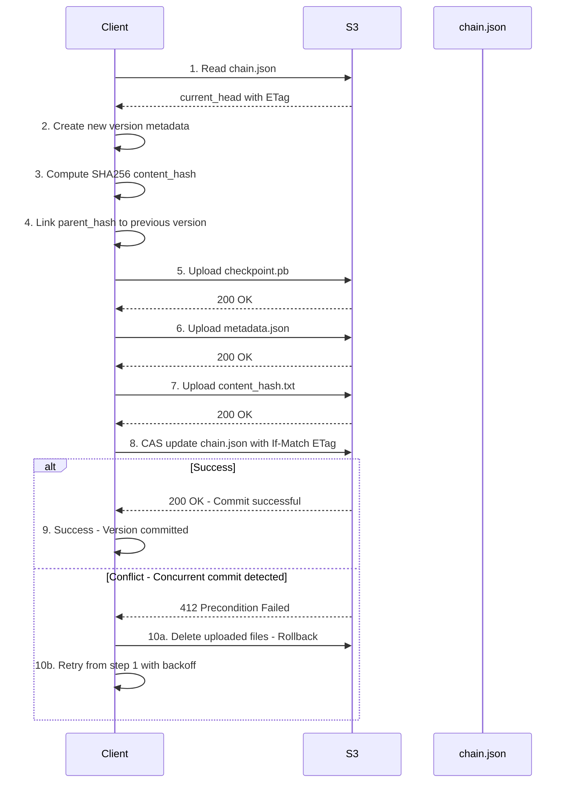
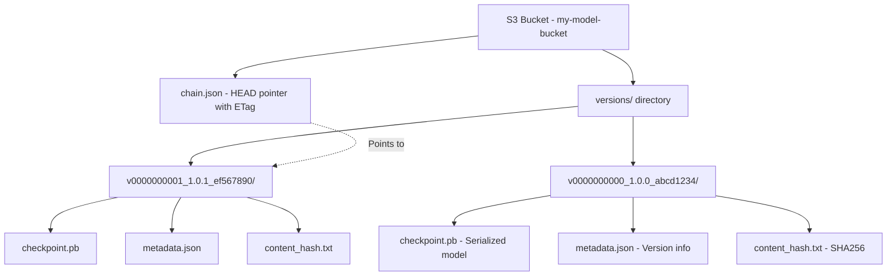
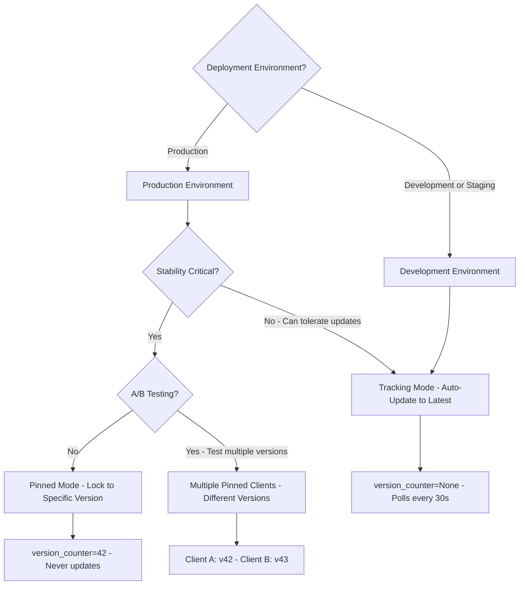
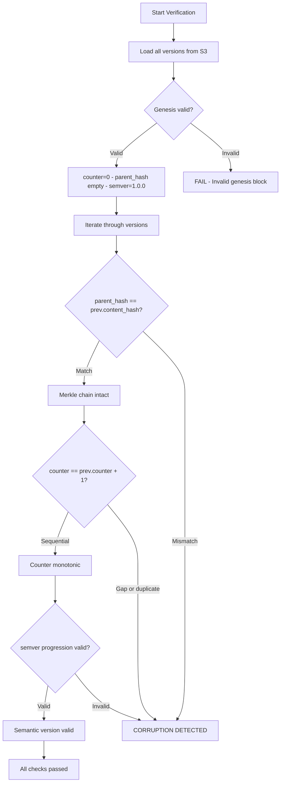
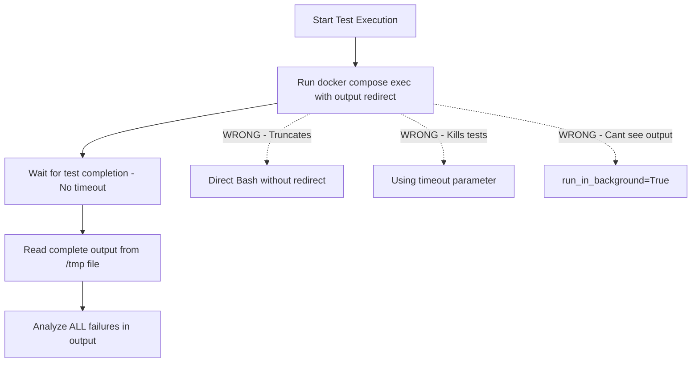

# SpectralMC Development Guide

## Project Overview

SpectralMC is a GPU-accelerated library for online machine learning using Monte Carlo simulation. It trains complex-valued neural networks (CVNNs) using Monte Carlo data, drawing on techniques from Reinforcement Learning, particularly policy gradient methods.

**Primary Use Case**: Quantitative Finance - stochastic process modeling and derivative pricing with significantly reduced computational requirements compared to traditional Monte Carlo methods.

**Key Technology Stack**:
- Python 3.12
- PyTorch 2.7.0 (CUDA 12.8)
- CuPy (CUDA 12.x)
- NumPy, SciPy, scikit-learn
- Distributed: Dask, Ray
- Testing: pytest, hypothesis
- Type checking: mypy (strict mode)

## Architecture

### Core Components

**src/spectralmc/**
- `async_normals.py` - Asynchronous normal distribution generation on GPU
- `cvnn.py` - Complex-valued neural network implementation
- `cvnn_factory.py` - Factory for creating CVNN instances
- `gbm.py` - Geometric Brownian Motion simulation
- `gbm_trainer.py` - Training loop for GBM models
- `sobol_sampler.py` - Quasi-Monte Carlo sampling using Sobol sequences
- `quantlib.py` - QuantLib integration utilities
- `models/` - Model implementations
  - `torch.py` - PyTorch-based model definitions
  - `numerical.py` - Numerical model utilities
  - `cpu_gpu_transfer.py` - CPU/GPU memory transfer utilities
- `storage/` - Blockchain model versioning (S3-based, production-ready)
  - `chain.py` - Blockchain primitives (ModelVersion, hashing, semantic versioning)
  - `store.py` - AsyncBlockchainModelStore with atomic S3 commits
  - `checkpoint.py` - Checkpoint serialization/deserialization utilities
  - `inference.py` - InferenceClient with pinned/tracking modes
  - `verification.py` - Chain integrity verification
  - `gc.py` - Garbage collection for old versions
  - `tensorboard_writer.py` - TensorBoard logging integration
  - `errors.py` - Exception hierarchy for storage operations
  - `__main__.py` - CLI tool for storage operations
- `serialization/` - Protocol Buffer serialization
  - `common.py` - Enum converters (Precision, Device, DType)
  - `simulation.py` - Simulation parameter converters
  - `models.py` - Model configuration converters
  - `training.py` - Training configuration converters
- `proto/` - Generated Protocol Buffer code
  - `common_pb2.py` - Common message types
  - `simulation_pb2.py` - Simulation messages
  - `models_pb2.py` - Model configuration messages
  - `training_pb2.py` - Training configuration messages

### Blockchain Model Versioning

SpectralMC uses a blockchain-based approach for model versioning with S3 storage, providing production-ready version control for ML models.

**Features**:
- **Immutable version history** with SHA256 content addressing
- **Semantic versioning** (MAJOR.MINOR.PATCH)
- **Merkle chain linking** for tamper detection
- **Atomic commits** with ETag-based CAS (Compare-And-Swap)
- **S3 storage** with aioboto3 async operations
- **Protocol Buffer serialization** for cross-platform compatibility
- **InferenceClient** with pinned/tracking modes
- **Chain verification** to detect corruption
- **Garbage collection** for old versions
- **TensorBoard integration** for metrics logging

#### Storage Architecture

**AsyncBlockchainModelStore** (`src/spectralmc/storage/store.py`):
- Production S3-based storage with atomic CAS commits
- 10-step atomic commit protocol using ETag/If-Match
- Conflict detection and fast-forward enforcement
- Automatic retry with exponential backoff

**Atomic Commit Protocol** (10-step CAS):



**CAS Guarantees**:
- **Atomicity**: Either all files committed or none (rollback on conflict)
- **Consistency**: chain.json always points to valid version
- **Isolation**: Concurrent commits detected via ETag mismatch
- **Durability**: S3 provides 99.999999999% durability

**S3 Storage Structure**:



**Key Features**:
- `chain.json`: Atomic HEAD pointer updated via CAS (ETag-based)
- `versions/`: Immutable version directories (never modified after creation)
- `checkpoint.pb`: Protocol Buffer serialized model state
- `metadata.json`: Version metadata (counter, semver, parent_hash, timestamp)
- `content_hash.txt`: SHA256 checksum for integrity verification

#### Core Usage

**Committing Models**:
```python
from spectralmc.storage import AsyncBlockchainModelStore, commit_snapshot

# Initialize async store (S3)
async with AsyncBlockchainModelStore("my-model-bucket") as store:
    # Commit a trained model snapshot
    config = GbmCVNNPricerConfig(...)  # Your trained config
    version = await commit_snapshot(
        store, 
        config, 
        message="Trained for 1000 epochs"
    )
    
    print(f"Committed version {version.counter}: {version.content_hash[:8]}")
```

**Loading Models**:
```python
from spectralmc.storage import load_snapshot_from_checkpoint

async with AsyncBlockchainModelStore("my-model-bucket") as store:
    # Get HEAD version
    head = await store.get_head()
    
    # Load checkpoint
    model_template = torch.nn.Linear(5, 5)
    config_template = make_config(model_template)
    
    snapshot = await load_snapshot_from_checkpoint(
        store,
        head,
        model_template,
        config_template
    )
    
    # Use snapshot.cvnn for inference
    model = snapshot.cvnn
```

#### InferenceClient

Production model serving with version control integration.

**Mode Selection Decision Tree**:



**Pinned Mode** (production):
```python
from spectralmc.storage import InferenceClient

# Pin to specific version for production stability
async with InferenceClient(
    version_counter=42,  # Pin to v42
    poll_interval=60.0,
    store=store,
    model_template=model,
    config_template=config
) as client:
    # Always serves v42, never updates
    snapshot = client.get_model()
    predictions = run_inference(snapshot.cvnn, inputs)
```

**Tracking Mode** (development):
```python
# Auto-track latest version with hot-swapping
async with InferenceClient(
    version_counter=None,  # Track HEAD
    poll_interval=30.0,
    store=store,
    model_template=model,
    config_template=config
) as client:
    # Model auto-updates every 30 seconds
    snapshot = client.get_model()
    predictions = run_inference(snapshot.cvnn, inputs)
```

#### Chain Verification

Detect tampering and corruption with automated verification.

**Chain Verification Algorithm**:



**Code Usage**:

```python
from spectralmc.storage import verify_chain, verify_chain_detailed

async with AsyncBlockchainModelStore("my-model-bucket") as store:
    # Simple verification (raises ChainCorruptionError if invalid)
    await verify_chain(store)

    # Detailed report
    report = await verify_chain_detailed(store)
    if not report.is_valid:
        print(f"Corruption: {report.corruption_type}")
        print(f"At version: {report.corrupted_version.counter}")
```

**Validates**:
- Genesis block integrity (counter=0, empty parent_hash, semver="1.0.0")
- Merkle chain property: `parent_hash == previous.content_hash`
- Counter monotonicity (strictly increasing by 1)
- Semantic version progression

#### Garbage Collection

Automated cleanup of old versions:

```python
from spectralmc.storage import run_gc, RetentionPolicy

async with AsyncBlockchainModelStore("my-model-bucket") as store:
    # Preview what would be deleted (dry run)
    report = await run_gc(
        store,
        keep_versions=10,          # Keep last 10 versions
        protect_tags=[5, 12, 20],  # Protect production releases
        dry_run=True
    )
    
    print(f"Would delete: {report.deleted_versions}")
    print(f"Would free: {report.bytes_freed / (1024**2):.2f} MB")
    
    # Actually delete
    report = await run_gc(store, keep_versions=10, dry_run=False)
```

**Safety Features**:
- Genesis (v0) always protected
- Configurable minimum versions (default: 3)
- Protected tags for production releases
- Dry-run preview before deletion

#### TensorBoard Integration

Log model versions and training metrics:

```python
from spectralmc.storage import log_blockchain_to_tensorboard

async with AsyncBlockchainModelStore("my-model-bucket") as store:
    await log_blockchain_to_tensorboard(
        store,
        log_dir="runs/my_experiment",
        model_template=model,
        config_template=config
    )

# View with: tensorboard --logdir=runs/
```

**Logs**:
- Version metadata (counter, semver, content_hash, timestamp)
- Training metrics (global_step, param_count, sobol_skip)
- Summary statistics (total versions, versions per day)

#### Training Integration

Automatic blockchain commits during training via `GbmCVNNPricer.train()`:

**Auto-commit after training completes**:
```python
from spectralmc.gbm_trainer import GbmCVNNPricer, TrainingConfig
from spectralmc.storage import AsyncBlockchainModelStore

async with AsyncBlockchainModelStore("my-model-bucket") as store:
    pricer = GbmCVNNPricer(config)

    training_config = TrainingConfig(
        num_batches=1000,
        batch_size=32,
        learning_rate=0.001
    )

    # Train with automatic commit when done
    pricer.train(
        training_config,
        blockchain_store=store,
        auto_commit=True,
        commit_message_template="Final checkpoint: step={step}, loss={loss:.4f}"
    )

    # Version automatically committed after training
    head = await store.get_head()
    print(f"Training committed as version {head.counter}")
```

**Periodic commits during training**:
```python
# Commit every 100 batches during training
pricer.train(
    training_config,
    blockchain_store=store,
    auto_commit=True,
    commit_interval=100,  # Commit every 100 batches
    commit_message_template="Checkpoint: step={step}, loss={loss:.4f}"
)
```

**Features**:
- **Backward compatible**: Training without `blockchain_store` still works
- **Graceful error handling**: Commit failures logged but don't crash training
- **Optimizer state preservation**: Full checkpoint including Adam state
- **Template interpolation**: Variables `{step}`, `{loss}`, `{batch}` in messages
- **Async-to-sync bridge**: Uses `asyncio.run()` to commit within sync training loop

**Validation**:
- `auto_commit=True` requires `blockchain_store` parameter
- `commit_interval` requires `blockchain_store` parameter

See `examples/training_with_blockchain_storage.py` for complete example.

#### CLI Tools

**Usage**:
```bash
# Verify chain integrity
python -m spectralmc.storage verify my-model-bucket

# List all versions
python -m spectralmc.storage list-versions my-model-bucket

# Inspect specific version
python -m spectralmc.storage inspect my-model-bucket v0000000042

# Preview garbage collection
python -m spectralmc.storage gc-preview my-model-bucket 10

# Run garbage collection (keep last 10, protect v5 and v12)
python -m spectralmc.storage gc-run my-model-bucket 10 --protect-tags 5,12 --yes

# Log to TensorBoard
python -m spectralmc.storage tensorboard-log my-model-bucket --log-dir runs/exp1
```

**Complete CLI Commands**:
- `verify` - Verify blockchain integrity
- `find-corruption` - Find first corrupted version
- `list-versions` - List all versions
- `inspect` - Inspect specific version in detail
- `gc-preview` - Preview garbage collection (dry run)
- `gc-run` - Run garbage collection
- `tensorboard-log` - Log blockchain to TensorBoard

#### Test Coverage

All storage features have comprehensive test coverage:
- **CLI commands**: 22 tests (83% coverage of `__main__.py`)
  - verify, find-corruption, list-versions, inspect commands
  - gc-preview, gc-run with protected tags
  - tensorboard-log, error handling
- **InferenceClient**: 8 tests (pinned mode, tracking mode, lifecycle)
- **Chain verification**: 15 tests (genesis, merkle chain, corruption detection)
- **Garbage collection**: 15 tests (retention policies, safety checks)
- **TensorBoard**: 12 tests (logging, metadata, error handling)
- **Training integration**: 7 tests (auto_commit, periodic commits, optimizer state preservation)

**Total: 86 storage tests, 73% overall coverage**

Run storage tests:
```bash
docker compose -f docker/docker-compose.yml exec spectralmc pytest tests/test_storage/ -v
docker compose -f docker/docker-compose.yml exec spectralmc pytest tests/test_integrity/ -v
```

### Workflow

1. **Monte Carlo Simulation**: Generate finite samples from parametric distributions directly on GPU
2. **Fourier Transform**: Use FFT to estimate the sample's characteristic function
3. **CVNN Training**: Update complex-valued neural network parameters to approximate the characteristic function
4. **CVNN Inference**: Produce estimated distributions for computing means, moments, quantiles, and other metrics

## 🐳 Docker Development

### Critical Development Rules
- ❌ **NEVER** run commands directly on host (poetry, pytest, mypy)
- ✅ **ALWAYS** use: `docker compose -f docker/docker-compose.yml exec spectralmc <command>`
- ✅ **ALL** commands run inside container

### Docker Commands
```bash
# Start services (SpectralMC, MinIO, TensorBoard)
cd docker && docker compose up -d

# View logs
docker compose -f docker/docker-compose.yml logs -f spectralmc

# Execute commands inside container
docker compose -f docker/docker-compose.yml exec spectralmc poetry run test-all
docker compose -f docker/docker-compose.yml exec spectralmc poetry run mypy src/spectralmc --strict
docker compose -f docker/docker-compose.yml exec spectralmc python -m pytest tests/

# Stop services
docker compose -f docker/docker-compose.yml down
```

### Test Output Handling

**CRITICAL - Output Truncation Issue**:

The Bash tool truncates output at 30,000 characters. Test suites may produce large output that WILL BE TRUNCATED, making it impossible to properly analyze failures.

#### Required Test Execution Workflow

Follow this workflow for all test execution to ensure complete output capture:



**REQUIRED Pattern for Test Analysis**:

Always redirect test output to files in /tmp/, then read the complete output:

```bash
# Step 1: Run tests with output redirection
docker compose -f docker/docker-compose.yml exec spectralmc poetry run test-all > /tmp/test-output.txt 2>&1

# Step 2: Read complete output using Read tool
# Read /tmp/test-output.txt

# Step 3: Analyze ALL failures, not just visible ones
```

**For Specific Test Categories**:
```bash
# CPU tests only
docker compose -f docker/docker-compose.yml exec spectralmc pytest tests -m 'not gpu' > /tmp/test-cpu.txt 2>&1

# GPU tests only
docker compose -f docker/docker-compose.yml exec spectralmc pytest tests -m gpu > /tmp/test-gpu.txt 2>&1

# Type checking
docker compose -f docker/docker-compose.yml exec spectralmc mypy src/spectralmc --strict > /tmp/mypy-output.txt 2>&1
```

**Why This Matters**:
- Bash tool output truncation at 30K chars is HARD LIMIT
- Test suites can produce 100KB+ of output
- Truncated output hides most failures, making diagnosis impossible
- File-based approach ensures complete output is always available
- Read tool has no size limits for files

### Test Execution Requirements

**Forbidden**:
- ❌ `Bash(command="...test...", timeout=60000)` - Truncates output, kills tests mid-run
- ❌ `Bash(command="...test...", run_in_background=True)` - Can't see failures in real-time
- ❌ Reading only partial output with `head -n 100` or similar truncation
- ❌ Checking test status before completion (polling BashOutput prematurely)

**Required**:
- ✅ No timeout parameter on test commands
- ✅ Wait for complete test execution (GPU tests can take several minutes)
- ✅ Review ALL stdout/stderr output before drawing conclusions
- ✅ Let tests complete naturally, read full results

## 🎮 GPU Support

SpectralMC uses pre-compiled GPU packages by default, with an option to build from source for legacy GPUs.

### Usage
```bash
# Standard build (pre-compiled binaries, works for most GPUs)
docker compose -f docker/docker-compose.yml up --build -d

# Build from source (for legacy GPUs like GTX 970 with compute capability < 6.0)
BUILD_FROM_SOURCE=true docker compose -f docker/docker-compose.yml up --build -d
```

### When to Build from Source
Use `BUILD_FROM_SOURCE=true` if you have a legacy GPU with compute capability < 6.0:
- **Maxwell GPUs**: GTX 970, GTX 980 (compute capability 5.2)
- **Kepler GPUs**: GTX 780 Ti (compute capability 3.5)

Source builds take 2-4 hours but only need to run once (cached in Docker layers).

### GPU Memory Configuration
Tests are configured for **4GB VRAM minimum**:
- `test_gbm.py` uses 131,072 batches (~1.3GB GPU RAM)
- Larger GPUs can increase `_BATCHES_PER_RUN` for faster convergence
- Smaller GPUs (<4GB) should reduce batch size further

### GTX 970 Validation Status

**Status**: ✅ PRODUCTION READY (validated 2025-11-26)

The NVIDIA GeForce GTX 970 (compute capability 5.2, sm_52) is fully validated and production-ready for all SpectralMC GPU workloads:

**Configuration**:
- PyTorch 2.4.0a0 (source build with sm_52 support)
- CUDA 11.8
- CuPy 13.6.0
- NumPy 2.3.5

**Test Results**: 224/228 passing (98.2%)
- ✅ All GPU-accelerated workloads (GBM simulation, CVNN training, Monte Carlo sampling)
- ✅ All GPU-specific tests pass
- ✅ CuPy interoperability via DLPack works correctly
- ⚠️ 4 CPU-only tests fail due to missing LAPACK (eigendecomposition in `CovarianceComplexBatchNorm`)

**Known Limitation**:
- `CovarianceComplexBatchNorm` requires GPU for eigendecomposition when built without LAPACK
- This is not a practical limitation (GPU batch norm is faster than CPU anyway)
- To enable CPU batch norm: rebuild Docker with LAPACK (adds 2-4 hours to build time)

See `GTX_970_COMPATIBILITY_INVESTIGATION.md` for complete validation details.

## 🔍 Type Safety

SpectralMC enforces **strict static typing** with zero compromises.

### Requirements

**Core Rules**:
- ❌ **NO** `Any` types (explicit or implicit via `--disallow-any-explicit`)
- ❌ **NO** `cast()` expressions
- ❌ **NO** `# type: ignore` comments
- ✅ All functions must have complete type hints (parameters and return types)
- ✅ All Pydantic models must use `ConfigDict(extra="forbid")`

### Type Checking

**CRITICAL**: Always run mypy from the **repository root** with **no path arguments**:

```bash
# CORRECT: Run mypy from repo root, no path argument
docker compose -f docker/docker-compose.yml exec spectralmc mypy

# WRONG: Don't specify paths or run from subdirectories
# docker compose -f docker/docker-compose.yml exec spectralmc mypy src/spectralmc
# cd src && mypy spectralmc
```

**Why no path argument?**
- Configuration in `pyproject.toml` controls what gets checked via `files = [...]`
- Currently checks: `src/spectralmc/`, `tests/`, `examples/`
- Running `mypy` with no args uses the config automatically
- Specifying paths bypasses config and can miss folders

**Configuration** (`pyproject.toml`):
```toml
[tool.mypy]
files = ["src/spectralmc", "tests", "examples"]  # What gets checked
strict = true                                     # All --strict checks
disallow_any_explicit = true                      # No explicit Any types
disallow_any_unimported = true                    # No Any from missing stubs
disallow_any_decorated = true                     # No Any from untyped decorators
warn_unreachable = true                           # Warn unreachable code
extra_checks = true                               # Experimental checks
```

**Adding new folders to type checking:**
1. Edit `pyproject.toml` and add folder to `files = [...]` list
2. Run `mypy` from repo root to verify

**Why check tests and examples?**
- Tests contain critical type stub usage (torch.nn.Linear, S3 protocols)
- Type errors in tests can hide bugs in production code
- Examples are user-facing documentation - must be correct
- Tests and examples document expected types through usage

**Verify no forbidden constructs**:
```bash
docker compose -f docker/docker-compose.yml exec spectralmc grep -r "# type: ignore" src/spectralmc/ && echo "FOUND type:ignore" || echo "OK"
docker compose -f docker/docker-compose.yml exec spectralmc grep -r "cast(" src/spectralmc/ && echo "FOUND cast()" || echo "OK"
docker compose -f docker/docker-compose.yml exec spectralmc grep -r ": Any" src/spectralmc/ && echo "FOUND Any" || echo "OK"
```

**Success Criteria**:
- `mypy` exits with code 0 (checks all configured files)
- Zero occurrences of `# type: ignore`, `cast()`, or explicit `Any` in `src/`
- All source, tests, and examples pass type checking

### Rationale

Type safety is **non-negotiable** for SpectralMC:
- **Reproducibility**: Type errors can silently break deterministic guarantees
- **Correctness**: Numerical code with `Any` can produce wrong results at runtime
- **Maintainability**: Complete types serve as executable documentation
- **Refactoring**: Strong types enable confident large-scale changes

## Testing

### Running Tests

SpectralMC uses pytest with GPU and CPU test separation. **All commands must run inside Docker container**:

```bash
# Run all tests (CPU + GPU) - redirect to file for complete output
docker compose -f docker/docker-compose.yml exec spectralmc poetry run test-all > /tmp/test-all.txt 2>&1

# Run default tests (CPU only, excludes @pytest.mark.gpu)
docker compose -f docker/docker-compose.yml exec spectralmc pytest tests -m 'not gpu' > /tmp/test-cpu.txt 2>&1

# Run only GPU tests
docker compose -f docker/docker-compose.yml exec spectralmc pytest tests -m gpu > /tmp/test-gpu.txt 2>&1

# Run with coverage
docker compose -f docker/docker-compose.yml exec spectralmc pytest tests --cov=spectralmc --cov-report=term-missing > /tmp/test-coverage.txt 2>&1

# Type checking
docker compose -f docker/docker-compose.yml exec spectralmc mypy src/spectralmc --strict > /tmp/mypy.txt 2>&1
```

**IMPORTANT**: Always redirect output to /tmp/ files and read complete output with Read tool.

### Test Configuration

- **Test directory**: `tests/`
- **Default behavior**: Excludes GPU tests (`-m 'not gpu'`)
- **GPU tests**: Marked with `@pytest.mark.gpu` decorator
- **Fixtures**: Global GPU memory cleanup in `tests/conftest.py`

### Test Files

- `test_async_normals.py` - Async normal distribution generation
- `test_cvnn.py` - Complex-valued neural network tests
- `test_cvnn_factory.py` - CVNN factory tests
- `test_gbm.py` - Geometric Brownian Motion tests
- `test_gbm_trainer.py` - GBM trainer tests
- `test_models_cpu_gpu_transfer.py` - CPU/GPU transfer tests
- `test_models_torch.py` - PyTorch model tests
- `test_sobol_sampler.py` - Sobol sampler tests

## 🚫 Testing Anti-Patterns (1-13)

### 1. Tests Pass When Features Are Broken
- **Problem**: Test validates that code runs, not that it produces correct results
- ❌ `assert result is not None` - accepts any output
- ❌ `assert len(simulations) > 0` - passes even with wrong values
- ✅ `assert torch.allclose(result, expected, rtol=1e-5)` - validates numerical accuracy
- ✅ `assert torch.isfinite(result).all()` - ensures no NaN/Inf values
- **Impact**: Broken numerical computations go undetected, corrupting downstream calculations

### 2. Accepting NotImplementedError as Success
- **Problem**: Treating placeholder implementations as working features
- ❌ Accepting `NotImplementedError` or returning `None` in convergence checks
- ❌ Methods that return empty tensors when they should compute values
- ✅ All methods must have complete implementations before merging
- ✅ Use abstract base classes to enforce interface contracts
- **Example**: A pricer method that returns `torch.zeros()` instead of computing actual prices

### 3. Using pytest.skip()
- **Problem**: Hides test failures instead of fixing them
- ❌ `pytest.skip("TODO: fix later")` - technical debt grows unbounded
- ❌ `pytest.skip("flaky test")` - masks real bugs
- ✅ Fix the test or remove it entirely
- ✅ Use `@pytest.mark.gpu` for hardware requirements, not skip
- **Impact**: Critical bugs remain hidden, test suite provides false confidence

### 4. Testing Actions Without Validating Results
- **Problem**: Running simulations without verifying convergence or correctness
- ❌ Run Monte Carlo simulation, only check that it completes
- ❌ Train model, only verify training loop finishes
- ✅ Validate convergence metrics (loss, variance reduction)
- ✅ Check statistical properties of outputs (mean, std, distribution shape)
- ✅ Compare against analytical solutions when available
- **Example**: Test runs 10,000 simulations but never checks if the estimated mean converges to expected value

### 5. Hardcoded Success Tests
- **Problem**: Tests that always pass regardless of implementation
- ❌ `assert True` - meaningless validation
- ❌ `assert result or not result` - tautology
- ❌ `assert gradient is not None` - doesn't validate gradient correctness
- ✅ `assert torch.autograd.gradcheck(func, inputs)` - validates gradient computation
- ✅ Use property-based testing with hypothesis for numerical properties

### 6. Overly Permissive Convergence Criteria
- **Problem**: Accepting numerical instability or divergence as "success"
- ❌ Not checking for NaN/Inf in outputs
- ❌ Accepting any loss decrease as "converged"
- ❌ `assert results.shape == expected_shape` - shape correct but values wrong
- ✅ `assert torch.isfinite(results).all()` - reject NaN/Inf
- ✅ `assert loss < threshold and variance < max_variance` - validate convergence quality
- ✅ Check condition numbers for numerical stability
- **Impact**: Silently propagates numerical instability through pipelines

### 7. Lowered Standards for Flaky Tests
- **Problem**: Weakening assertions to make tests pass instead of fixing root cause
- ❌ Changing `rtol=1e-5` to `rtol=1e-1` to make test pass
- ❌ Using `assert len(results) > 0` instead of validating statistical properties
- ❌ Adding broad exception handlers to suppress errors
- ✅ Investigate why tolerance needs to be so loose
- ✅ Use statistical tests (e.g., Kolmogorov-Smirnov) for distribution validation
- ✅ Set random seeds for reproducibility, investigate variance sources

### 8. Test Timeouts for Long Simulations
- **Problem**: Artificially limiting execution time instead of optimizing or validating correctly
- ❌ Adding `pytest.timeout(10)` to skip slow tests
- ❌ Reducing simulation count to avoid timeout
- ✅ Optimize the algorithm if it's too slow
- ✅ Use @pytest.mark.slow for long-running tests, run in CI
- ✅ Profile to identify bottlenecks before adding timeouts
- **Note**: Some Monte Carlo methods are inherently expensive - validate, don't skip

### 9. Masking Root Causes with Increased Iterations
- **Problem**: Increasing iteration limits or simulation counts to hide convergence issues
- ❌ Increasing max_iter from 1000 to 100000 to make test pass
- ❌ Doubling sample size instead of investigating why convergence is slow
- ✅ Investigate why convergence is slow (bad initialization, poor hyperparameters)
- ✅ Fix the algorithm, not the iteration count
- ✅ Set realistic iteration limits and validate convergence criteria
- **Example**: GBM trainer takes 10x more iterations than expected - investigate learning rate, loss function, not max_iter

### 10. Trial-and-Error Debugging
- **Problem**: Randomly changing code without understanding the root cause
- ❌ Changing learning rates, batch sizes, or model architecture randomly
- ❌ Adding `.detach()`, `.clone()`, or `.cpu()` calls without understanding memory flow
- ✅ **Systematic debugging process**:
  1. **Establish baseline**: Document current behavior (loss curves, gradients, outputs)
  2. **Identify root cause**: Use debugger, print intermediate tensors, check gradients
  3. **Form hypothesis**: What specific change will fix the issue and why?
  4. **Make targeted change**: Implement one fix at a time
  5. **Validate fix**: Confirm it resolves the issue without breaking other tests

### 11. Adding Unvalidated Features During Test Fixing
- **Problem**: Adding new functionality while debugging test failures
- ❌ Adding new training features while fixing convergence test
- ❌ Refactoring model architecture while debugging gradient test
- ✅ Fix the test first, add features later
- ✅ Keep debugging changes minimal and focused
- ✅ Create separate PR for new features after tests are green

### 12. Analyzing Truncated Test Output
- **Problem**: Making decisions based on incomplete test output
- ❌ Terminal truncates 10,000 line stack trace, missing root cause
- ❌ Truncated tensor values hide NaN/Inf in middle of array
- ✅ **Always redirect to file for analysis**:
  ```bash
  pytest tests/test_gbm.py -v > test_output.txt 2>&1
  # Then read complete output
  ```
- ✅ Use `torch.set_printoptions(profile="full")` to see all tensor values
- ✅ Save intermediate results to disk for post-mortem analysis

### 13. Disabling Safety Checks for Performance
- **Problem**: Removing validation to speed up tests
- ❌ Commenting out `assert torch.isfinite()` checks
- ❌ Disabling gradient checking in tests
- ❌ Skipping convergence validation
- ✅ Keep safety checks in tests, optimize implementation instead
- ✅ Use separate performance benchmarks without safety overhead
- ✅ In production, make safety checks configurable but default to enabled

## 🚫 Implementation Anti-Patterns (1-5)

### 1. Silent Failure Handling
- **Problem**: Catching exceptions without proper handling or logging
- ❌ `try: result = simulate() except: return default_value` - hides errors
- ❌ `if torch.isnan(loss).any(): loss = torch.tensor(0.0)` - masks numerical issues
- ❌ Broad exception handlers: `except Exception: pass`
- ✅ Let exceptions propagate unless you can meaningfully handle them
- ✅ Log errors with context before re-raising
- ✅ Use specific exception types: `except ValueError as e:`
- **Impact**: Silent failures in numerical code lead to incorrect results downstream

**Example**:
```python
# ❌ Silent failure
try:
    result = monte_carlo_simulation(params)
except Exception:
    result = torch.zeros(batch_size)  # Wrong! Hides the error

# ✅ Proper handling
try:
    result = monte_carlo_simulation(params)
except NumericalInstabilityError as e:
    logger.error(f"Simulation failed: {e}, params: {params}")
    raise  # Re-raise to fail fast
```

### 2. False Success Patterns
- **Problem**: Tests or implementations that report success without validation
- ❌ Training loop returns success even when loss diverged
- ❌ `status = "converged"` without checking convergence criteria
- ❌ Function returns successfully with NaN/Inf values
- ✅ Always validate outputs before returning success status
- ✅ Use type hints and runtime validation (pydantic)
- ✅ Raise exceptions for invalid states rather than returning error codes

**Example**:
```python
# ❌ False success
def train_model(model, data):
    for epoch in range(100):
        loss = train_step(model, data)
    return {"status": "success", "loss": loss}  # Could be NaN!

# ✅ Validated success
def train_model(model, data):
    for epoch in range(100):
        loss = train_step(model, data)
        if not torch.isfinite(loss):
            raise TrainingDivergenceError(f"Loss became {loss} at epoch {epoch}")
    return {"status": "converged", "final_loss": float(loss)}
```

### 3. Ignoring Numerical Warnings
- **Problem**: Treating warnings as noise instead of signals
- ❌ Suppressing "divide by zero" warnings
- ❌ Ignoring "invalid value encountered" from NumPy/PyTorch
- ❌ Filtering out all warnings with `warnings.filterwarnings("ignore")`
- ✅ Investigate and fix root cause of warnings
- ✅ Only filter specific expected warnings (e.g., QuantLib deprecation warnings)
- ✅ Convert warnings to errors during testing: `warnings.simplefilter("error")`

### 4. Mutable Default Arguments
- **Problem**: Using mutable objects as default arguments
- ❌ `def simulate(config={}):` - shared across calls
- ❌ `def run_batch(params=[]):` - accumulates across calls
- ✅ `def simulate(config=None): config = config or {}`
- ✅ Use immutable defaults or None
- **Impact**: Especially dangerous in parallel/distributed computing with Ray/Dask

### 5. Inconsistent Device Handling
- **Problem**: Not managing CPU/GPU device placement consistently
- ❌ Assuming tensors are on CUDA without checking
- ❌ Moving tensors between devices unnecessarily
- ❌ Not handling device in function signatures
- ✅ Explicit device management: `device = torch.device("cuda" if torch.cuda.is_available() else "cpu")`
- ✅ Keep tensors on same device throughout computation
- ✅ Use `models/cpu_gpu_transfer.py` utilities for controlled transfers
- **Example**: Model on GPU, input data on CPU - causes cryptic errors

## Recovery Checklist

When you encounter test failures or bugs:

1. **Read the complete error output** (redirect to file if truncated)
2. **Reproduce the failure** reliably with minimal example
3. **Check for numerical issues** (NaN, Inf, loss divergence)
4. **Validate inputs and outputs** at each stage
5. **Use debugger** to inspect tensor values, gradients, device placement
6. **Check git diff** - what changed since tests last passed?
7. **Run single test in isolation** - rule out test interaction
8. **Verify random seeds** - ensure reproducibility
9. **Check GPU memory** - OOM can cause silent failures
10. **Profile if slow** - don't guess at bottlenecks

## Prevention: Pre-commit Checklist

Before committing:

- [ ] All tests pass (CPU and GPU)
- [ ] mypy type checking passes (strict mode)
- [ ] No NaN/Inf in test outputs
- [ ] Convergence validated, not just "runs without error"
- [ ] No pytest.skip() added
- [ ] No overly broad exception handlers added
- [ ] No hardcoded magic numbers without comments
- [ ] Type hints on all functions
- [ ] Docstrings on public functions
- [ ] No TODO comments without GitHub issues

## 🔒 Git Workflow Policy

**Critical Rule**: Claude Code is NOT authorized to commit or push changes.

### Forbidden Git Operations
- ❌ **NEVER** run `git commit` (including `--amend`, `--no-verify`, etc.)
- ❌ **NEVER** run `git push` (including `--force`, `--force-with-lease`, etc.)
- ❌ **NEVER** run `git add` followed by commit operations
- ❌ **NEVER** create commits under any circumstances

### Required Workflow
- ✅ Make all code changes as requested
- ✅ Run tests and validation (via Docker: `docker compose -f docker/docker-compose.yml exec spectralmc poetry run test-all`)
- ✅ Leave ALL changes as **uncommitted** working directory changes
- ✅ User reviews changes using `git status` and `git diff`
- ✅ User manually commits and pushes when satisfied

**Rationale**: All changes must be human-reviewed before entering version control. This ensures code quality, prevents automated commit mistakes, and maintains clear authorship.

## 🔄 Dependency Deprecation Management

SpectralMC enforces a **zero-tolerance policy** for deprecated APIs in production code to ensure long-term maintainability and compatibility.

### Zero-Tolerance Policy

**Prohibited**:
- ❌ NO deprecated APIs in `src/spectralmc/` code
- ❌ NO suppressing deprecation warnings without documented upstream issue
- ❌ NO using `# type: ignore` or similar to hide deprecation warnings

**Required**:
- ✅ All deprecations must have migration plan within 1 sprint
- ✅ Use modern, non-deprecated APIs for all new code
- ✅ Fix deprecation warnings immediately when they appear

### Allowed Exceptions

Only third-party library internals may use deprecated code if:
1. **Upstream issue tracked**: Must have link to library's GitHub issue
2. **Pytest filter documented**: Must add filter in `pyproject.toml` with explanation
3. **Monthly review**: Must check for fixes in dependency updates

**Example** (current exceptions):
```toml
[tool.pytest.ini_options]
filterwarnings = [
    # Botocore datetime.utcnow() - AWS SDK internal (boto/botocore#3201)
    "ignore::DeprecationWarning:botocore.*",
    # QuantLib SWIG bindings - unfixable (generated code)
    "ignore::DeprecationWarning:.*QuantLib.*",
]
```

### Monthly Review Checklist

Run these checks on the 1st of each month:

```bash
# 1. Check for dependency updates
docker compose -f docker/docker-compose.yml exec spectralmc poetry show --outdated

# 2. Check botocore for datetime.utcnow fix (currently pending)
# Visit: https://github.com/boto/botocore/releases

# 3. Check for new deprecation warnings in tests
docker compose -f docker/docker-compose.yml exec spectralmc \
  pytest tests/ -W default::DeprecationWarning > /tmp/warnings.txt 2>&1
grep "DeprecationWarning" /tmp/warnings.txt | grep -v "botocore\|QuantLib"

# 4. Review PyTorch/NumPy/CuPy changelogs for upcoming deprecations
# - PyTorch: https://github.com/pytorch/pytorch/releases
# - NumPy: https://numpy.org/news/
# - CuPy: https://github.com/cupy/cupy/releases
```

### Code Review Checklist

Block merge if ANY of these are present:

- [ ] Uses `torch.utils.dlpack.from_dlpack()` instead of `torch.from_dlpack()`
- [ ] Uses `cupy_array.toDlpack()` instead of direct `torch.from_dlpack()`
- [ ] Uses removed NumPy aliases (`np.float`, `np.int`, `np.complex_`, `np.bool`)
- [ ] Adds `@pytest.mark.skip()` without upstream issue link
- [ ] Suppresses `DeprecationWarning` in production code without explanation
- [ ] Ignores deprecation warnings in function/method implementations

### Migration Examples

**DLPack API (COMPLETED)**:
```python
# ❌ DEPRECATED (removed in CuPy 14+)
capsule = cupy_array.toDlpack()
torch_tensor = torch.utils.dlpack.from_dlpack(capsule)

# ✅ MODERN (PyTorch 1.10+, CuPy 9.0+)
torch_tensor = torch.from_dlpack(cupy_array)
```

**NumPy Type Aliases (already correct)**:
```python
# ❌ REMOVED in NumPy 2.0
Type[np.float]    # Don't use
Type[np.int]      # Don't use
Type[np.complex_] # Don't use

# ✅ CORRECT (NumPy 2.0+)
Type[np.float64]
Type[np.int64]
Type[np.complex128]
```

### Dependency Update Protocol

When updating major dependencies (PyTorch, NumPy, CuPy):

1. **Read migration guide FIRST**
   - PyTorch: Check release notes "Breaking Changes" section
   - NumPy: https://numpy.org/doc/stable/numpy_2_0_migration_guide.html
   - CuPy: Check changelog "Backward Incompatible Changes"

2. **Test in isolation**
   ```bash
   git checkout -b deps/pytorch-upgrade
   poetry update torch  # ONE dependency at a time
   docker compose -f docker/docker-compose.yml exec spectralmc \
     poetry run test-all > /tmp/test_upgrade.txt 2>&1
   ```

3. **Verify no new deprecations**
   ```bash
   docker compose -f docker/docker-compose.yml exec spectralmc \
     pytest tests/ -W error::DeprecationWarning
   ```

### Status: Deprecation-Free Codebase ✅

**Last Audit**: 2025-01-09

**SpectralMC Code**:
- ✅ All DLPack usage migrated to `torch.from_dlpack()`
- ✅ All NumPy types using explicit precision (`np.float64`, not `np.float`)
- ✅ All PyTorch APIs using non-deprecated methods
- ✅ Zero deprecation warnings from `src/spectralmc/`

**Third-Party Dependencies**:
- ⏳ `botocore 1.36.1`: Waiting for `datetime.utcnow()` fix (tracked: boto/botocore#3201)
- ⏸️ `QuantLib 1.37`: SWIG deprecations unfixable (accepted as permanent exception)

## Engineering Standards

See `documents/engineering/index.md` for comprehensive engineering standards including:

- **Code Quality**: Black formatting, mypy strict mode, custom type stubs
- **Development Patterns**: Pydantic models, PyTorch facade, project-specific patterns
- **Testing**: Requirements, GPU testing, CPU/GPU compute policy
- **Infrastructure**: Docker build philosophy (binary vs source builds, Poetry management)

All code must pass `mypy --strict`, `black --check`, and `poetry run test-all` before committing.

## Documentation

- **[Engineering Standards](documents/engineering/index.md)** - Development practices and code quality
- **[Product Documentation](documents/product/index.md)** - Deployment and operations guides
- **[Domain Knowledge](documents/domain/index.md)** - Scientific theory and research papers

## Contact

Author: matt@resolvefintech.com
