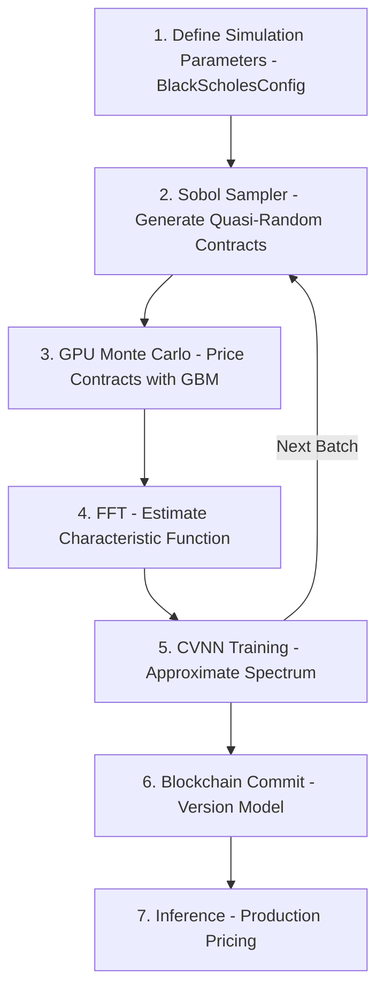
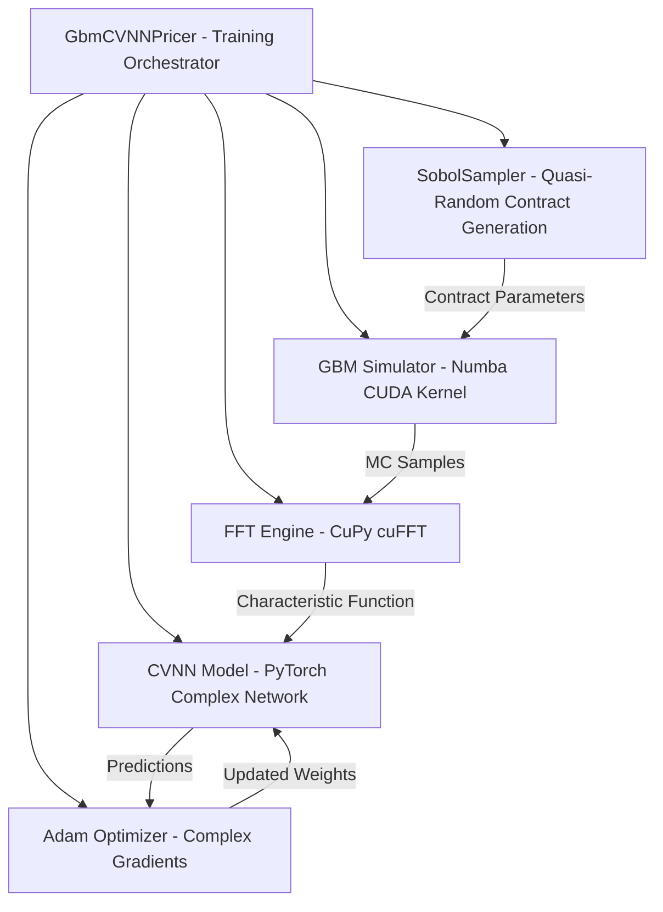
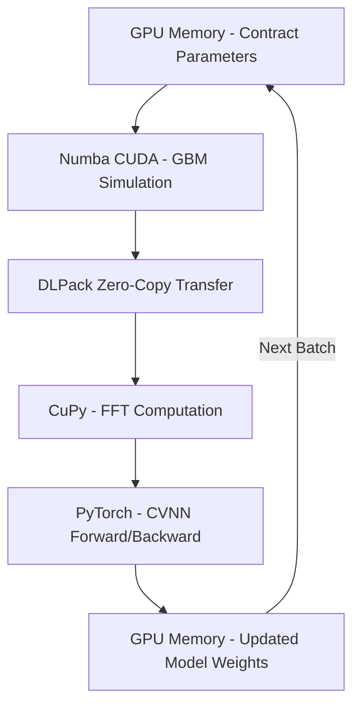

# File: README.md
# Spectral Monte-Carlo Learning

**Status**: Reference only  
**Supersedes**: None  
**Referenced by**: AGENTS.md; CLAUDE.md  

> **Purpose**: Overview and quickstart for SpectralMC (install, usage, commands).
> **📖 Authoritative Reference**: [AGENTS.md](AGENTS.md)

## Overview

Spectral Monte-Carlo (SpectralMC) is an online machine-learning method that trains complex-valued neural networks (CVNNs)using Monte-Carlo data. It draws on techniques from Reinforcement Learning, particularly policy gradient methods. This method is especially useful when the desired quantity is an expected function of a simulated distribution.

While useful in multiple domains, SpectralMC is especially relevant to the field of Quantitative Finance, where stochastic processes are widely used. Traditional Monte-Carlo-based solutions can be compute-intensive, sometimes requiring large compute clusters. By contrast, SpectralMC trains and performs inference continuously on the GPU to reduce overall computational load. This allows efficient training and inference accuracy, with a much smaller computational footprint than traditional Monte-Carlo methods.

## Key Features

### Training Lifecycle Overview

SpectralMC's complete training workflow from simulation to production deployment:



### Component Architecture

SpectralMC's tightly-coupled components in the GbmCVNNPricer:



### GPU Execution Pipeline

Pure-GPU workflow with zero CPU transfers during training:



### Core Capabilities

- **Monte-Carlo Simulation**: Generates a finite sample from a parametric distribution directly on the GPU.
- **Fourier Transform**: Uses Fast Fourier Transform (FFT) to estimate the sample's characteristic function.
- **CVNN Training**: Updates the parameters of a complex-valued neural network to approximate the characteristic function.
- **CVNN Inference**: Produces an estimated distribution (via the characteristic function), enabling computation of means, moments, quantiles, and other metrics.
- **Blockchain Model Versioning**: Production-ready S3-based version control for trained models with:
  - Automatic commits during training (auto_commit, periodic checkpoints)
  - Immutable version history with SHA256 content addressing
  - Atomic commits with CAS (Compare-And-Swap) using ETag
  - InferenceClient for production model serving (pinned/tracking modes)
  - Chain integrity verification to detect tampering
  - Automated garbage collection for old versions
  - TensorBoard integration for metrics logging
  - CLI tools for version management (83% test coverage)

## Getting Started

## Prerequisites

- A ubuntu 24.04 machine with an NVIDIA GPU


## Installation

1. Use a Ubuntu 24.04 machine with an nvidia GPU. If you're on AWS, for example, you might choose a g5.xlarge instance, running Ubuntu 24.04.

2. Clone this repository:
```bash
# File: README.md
git clone https://github.com/Tuee22/SpectralMC.git
cd SpectralMC
```

3. Install Docker, the NVIDIA drivers, and the NVIDIA Container Toolkit (follow NVIDIA's installation docs). After installation, reboot to ensure the driver is active and verify Docker can access the GPU:
```bash
# File: README.md
docker run --gpus all --rm nvidia/cuda:12.4.1-base-ubuntu24.04 nvidia-smi
```

4. To interact with the container manually:

```bash
# File: README.md
cd docker
docker compose up -d
docker compose exec -it spectralmc bash
```

This will open a bash terminal, which will allow you to explicitly call the python library, eg

```bash
# File: README.md
python -m spectralmc.gbm
```


## Usage Examples

### Automatic Training Commits

Train models with automatic blockchain commits:

```python
# File: README.md
from spectralmc.gbm_trainer import GbmCVNNPricer, TrainingConfig
from spectralmc.storage import AsyncBlockchainModelStore

async with AsyncBlockchainModelStore("my-model-bucket") as store:
    pricer = GbmCVNNPricer(config)

    training_config = TrainingConfig(
        num_batches=1000,
        batch_size=32,
        learning_rate=0.001
    )

    # Auto-commit after training completes
    pricer.train(
        training_config,
        blockchain_store=store,
        auto_commit=True,
        commit_message_template="Final: step={step}, loss={loss:.4f}"
    )

    # Or commit every 100 batches during training
    pricer.train(
        training_config,
        blockchain_store=store,
        auto_commit=True,
        commit_interval=100
    )
```

### Manual Model Commits

```python
# File: README.md
from spectralmc.storage import AsyncBlockchainModelStore, commit_snapshot
import torch

# Train your model
model = torch.nn.Linear(5, 5)
config = make_config(model)  # Create GbmCVNNPricerConfig

# Commit to blockchain storage
async with AsyncBlockchainModelStore("my-model-bucket") as store:
    version = await commit_snapshot(
        store,
        config,
        message="Trained for 1000 epochs, loss=0.001"
    )
    print(f"Committed version {version.counter}")
```

### Production Inference

```python
# File: README.md
from spectralmc.storage import InferenceClient

# Pinned mode: Always serve version 42 (production stability)
async with InferenceClient(
    version_counter=42,
    poll_interval=60.0,
    store=store,
    model_template=model,
    config_template=config
) as client:
    snapshot = client.get_model()
    # Run inference with snapshot.cvnn
```

### CLI Tools

```bash
# File: README.md
# List all versions
python -m spectralmc.storage list-versions my-model-bucket

# Verify chain integrity
python -m spectralmc.storage verify my-model-bucket

# Garbage collection (keep last 10 versions)
python -m spectralmc.storage gc-run my-model-bucket 10 --yes

# Log to TensorBoard
python -m spectralmc.storage tensorboard-log my-model-bucket
tensorboard --logdir=runs/
```

For complete documentation, see [CLAUDE.md](CLAUDE.md).

## Testing

SpectralMC enforces poetry-based test execution to ensure consistency across environments. All tests must run via poetry commands inside the Docker container.

### Running Tests

**All commands must run inside the Docker container:**

```bash
# File: README.md
# Start the container
cd docker && docker compose up -d

# Run all tests (CPU + GPU)
docker compose -f docker/docker-compose.yml exec spectralmc poetry run test-all

# Run with verbose output
docker compose -f docker/docker-compose.yml exec spectralmc poetry run test-all -v

# Run specific test file
docker compose -f docker/docker-compose.yml exec spectralmc poetry run test-all tests/test_gbm.py

# Run specific test function
docker compose -f docker/docker-compose.yml exec spectralmc poetry run test-all tests/test_gbm.py::test_gbm_simulation

# Run tests matching keyword
docker compose -f docker/docker-compose.yml exec spectralmc poetry run test-all -k "sobol"

# Run with coverage report
docker compose -f docker/docker-compose.yml exec spectralmc poetry run test-all --cov=spectralmc --cov-report=term-missing

# Stop on first failure
docker compose -f docker/docker-compose.yml exec spectralmc poetry run test-all -x
```

### Important Testing Rules

**REQUIRED by CLAUDE.md:**
- ❌ **NEVER** run `pytest` directly (blocked by Dockerfile)
- ❌ **NEVER** use timeout commands with tests (blocked by Dockerfile)
- ✅ **ALWAYS** use `poetry run test-all` (with or without arguments)
- ✅ **ALWAYS** redirect test output to files for complete analysis:
  ```bash
  # File: README.md
  docker compose -f docker/docker-compose.yml exec spectralmc poetry run test-all > /tmp/test-output.txt 2>&1
  ```

### Test Organization

- **Test directory**: `tests/`
- **GPU required**: All tests require GPU - missing GPU causes test failure
- **No fallbacks**: Silent CPU fallbacks are forbidden
- **Fixtures**: Global GPU memory cleanup in `tests/conftest.py`

### Type Checking

Run mypy from repository root (no path arguments):

```bash
# File: README.md
docker compose -f docker/docker-compose.yml exec spectralmc mypy
```

This checks all configured paths (`src/spectralmc`, `tests`, `examples`) per the appropriate pyproject file (pyproject.binary.toml or pyproject.source.toml - they share identical `[tool.mypy]` configuration).

## Contribution

We welcome contributions to SpectralMC. A few steps: 

- Fork this repo.
- Create a new branch for your new feature or bugfix.
- Open a pull request describing changes.

## License

This project is distributed under the MIT License. See the LICENSE file for details.


## Contact

Author: matt@resolvefintech.com


Send any questions or suggestions to this email address.

## To-do:
-Genaralize the library to be a server via asynciohttp (spectralmc server)
-Generalize pricers to take instances of async_normals from a shared instance 
-create an abstract interface for queueing requests and referencing market data
    - there will be a market data class topology (spots, fixings, curves, surfaces) and an abstract server. queries will be based on (valuation_namespace, val_datetime, data_asof). For absolute reproducibility, any valuation request must uniquely identify a dataset.
    If spectralmc is being used for intermediate processing of data (eg turning raw quotes into a surface), it
    will store the (valuation_namespace, val_datetime, data_asof) that was used for creating it. it will have
    the same (valuation_namespace, val_datetime) but a later data_asof.
    -There will be something declarative for running real-time jobs, eg one per second
-every class that allocates GPU memory has a hard cap (to manage shared memory across pricers)
