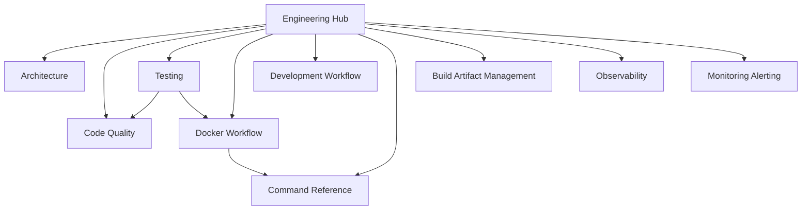

# File: documents/engineering/README.md
# SpectralMC Engineering Standards

**Status**: Reference only  
**Supersedes**: Legacy engineering index page  
**Referenced by**: documents/README.md; documents/documentation_standards.md; CLAUDE.md

> **Purpose**: Navigation hub for SpectralMC engineering practices, coding standards, and development workflows. This page aligns filenames with effectful’s layout while keeping SpectralMC’s GPU-first scope.
> **📖 Authoritative Reference**: [Documentation Standards](../documentation_standards.md)

## SSoT Link Map

| What do you need? | SSoT document |
|-------------------|---------------|
| Understand system/stack design | [Architecture](architecture.md) |
| Enforce type/purity standards | [Code Quality](code_quality.md) |
| Run tests correctly (GPU-only) | [Testing](testing.md) |
| Test organization and DRY patterns | [Testing Architecture](testing_architecture.md) |
| Run commands in Docker | [Docker Workflow](docker_workflow.md) |
| Daily development loop | [Development Workflow](development_workflow.md) |
| Exact command syntax | [Command Reference](command_reference.md) |
| Handle build artifacts/lockfiles | [Build Artifact Management](build_artifact_management.md) |
| Metrics/observability policy | [Observability](observability.md) |
| Monitoring/alerting status | [Monitoring & Alerting](monitoring_and_alerting.md) |
| GPU build paths | [GPU Build Guide](gpu_build.md) |

## Core Standards

- **[Architecture](architecture.md)** — Layers, effect boundaries, and SpectralMC's GPU/storage/RNG topology.
- **[Code Quality](code_quality.md)** — Aggregated type safety, purity, immutability, and interpreter doctrines.
- **[Testing](testing.md)** — GPU-only test requirements, determinism, timeouts, and anti-patterns.
- **[Testing Architecture](testing_architecture.md)** — Test organization, DRY doctrine, fixture patterns, helper consolidation.
- **[Docker Workflow](docker_workflow.md)** — Docker-only contract, forbidden host commands, and command patterns.
- **[Development Workflow](development_workflow.md)** — Daily loop, adding effects/models, and git expectations.
- **[Command Reference](command_reference.md)** — Canonical command list (check-code, test-all, logs).
- **[Build Artifact Management](build_artifact_management.md)** — Lockfile policy, `/opt` containment, verification.
- **[Observability](observability.md)** — Metrics scope tailored to SpectralMC (GPU + storage).
- **[Monitoring & Alerting](monitoring_and_alerting.md)** — Placeholder for deployment-specific alert rules.

## Domain-Specific Standards

- **[CPU/GPU Compute Policy](cpu_gpu_compute_policy.md)** — Deterministic CPU init → GPU compute contract.
- **[PyTorch Facade Pattern](pytorch_facade.md)** — Deterministic import order and device/dtype safety.
- **[Effect Interpreter Doctrine](effect_interpreter.md)** — Effect ADTs and interpreter isolation.
- **[Reproducibility Proofs](reproducibility_proofs.md)** — Formal guarantees for determinism and checkpointing.
- **[Blockchain Model Versioning](blockchain_storage.md)** — Storage CAS protocol and integrity checks.
- **[Pydantic Best Practices](pydantic_patterns.md)** — Config and validation patterns.
- **[GPU Build Guide](gpu_build.md)** — Legacy GPU build-from-source workflow.

## Navigation Notes

- Standards are authoritative; overlays must link here and describe only deltas.
- Keep filenames aligned with effectful (snake_case) and update this hub after adds/renames.
- Run link validation after changes and ensure SSoT documents are referenced from the hub.
