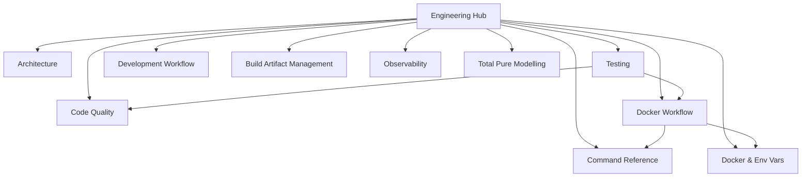

# File: documents/engineering/README.md
# SpectralMC Engineering Standards

**Status**: Reference only  
**Supersedes**: Legacy engineering index page  
**Referenced by**: documents/README.md; documents/documentation_standards.md; CLAUDE.md

> **Purpose**: Navigation hub for SpectralMC engineering practices, coding standards, and development workflows. This page aligns filenames with effectful’s layout while keeping SpectralMC’s GPU-first scope.
> **📖 Authoritative Reference**: [Documentation Standards](../documentation_standards.md)

## SSoT Link Map

| What do you need? | SSoT document |
|-------------------|---------------|
| Understand system/stack design | [Architecture](architecture.md) |
| Enforce type/purity standards | [Code Quality](code_quality.md) |
| Run tests correctly (GPU-only) | [Testing](testing.md) |
| Test organization and DRY patterns | [Testing Architecture](testing_architecture.md) |
| Model impossible states + device transitions | [Total Pure Modelling](total_pure_modelling.md) |
| Environment variables and SSoT policy | [Docker & Environment Variables](docker.md) |
| Run commands in Docker | [Docker Workflow](docker_workflow.md) |
| Daily development loop | [Development Workflow](development_workflow.md) |
| Exact command syntax | [Command Reference](command_reference.md) |
| Handle build artifacts/lockfiles | [Build Artifact Management](build_artifact_management.md) |
| Metrics/observability policy | [Observability](observability.md) |
| GPU build paths | [GPU Build Guide](gpu_build.md) |

## Core Standards

- **[Architecture](architecture.md)** — Layers, effect boundaries, and SpectralMC's GPU/storage/RNG topology.
- **[Code Quality](code_quality.md)** — Aggregated type safety, purity, immutability, and interpreter doctrines.
- **[Total Pure Modelling](total_pure_modelling.md)** — Pure ADTs and state machines that keep GPU/CPU/storage reality in sync.
- **[Testing](testing.md)** — GPU-only test requirements, determinism, timeouts, and anti-patterns.
- **[Testing Architecture](testing_architecture.md)** — Test organization, DRY doctrine, fixture patterns, helper consolidation.
- **[Docker & Environment Variables](docker.md)** — Complete environment variable documentation and SSoT policy.
- **[Docker Workflow](docker_workflow.md)** — Docker-only contract, forbidden host commands, and command patterns.
- **[Development Workflow](development_workflow.md)** — Daily loop, adding effects/models, and git expectations.
- **[Command Reference](command_reference.md)** — Canonical command list (check-code, test-all, logs).
- **[Build Artifact Management](build_artifact_management.md)** — Lockfile policy, `/opt` containment, verification.
- **[Observability](observability.md)** — Metrics scope tailored to SpectralMC (GPU + storage).
- **[Monitoring & Alerting](monitoring_and_alerting.md)** — Retired; centralized monitoring is out of scope.
- **[Warnings Policy](warnings_policy.md)** — Zero-tolerance warning enforcement across Python, PyTorch, Docker.

## Domain-Specific Standards

- **[CPU/GPU Compute Policy](cpu_gpu_compute_policy.md)** — Deterministic CPU init → GPU compute contract.
- **[Torch Runtime (facade removed)](pytorch_facade.md)** — Pure runtime ADT plus deterministic configuration effect for torch.
- **[Effect Interpreter Doctrine](effect_interpreter.md)** — Effect ADTs and interpreter isolation.
- **[Reproducibility Proofs](reproducibility_proofs.md)** — Formal guarantees for determinism and checkpointing.
- **[Total Pure Modelling](total_pure_modelling.md)** — Total ADTs for device placement, retries, and storage ownership.
- **[Blockchain Model Versioning](blockchain_storage.md)** — Storage CAS protocol and integrity checks.
- **[Pydantic Best Practices](pydantic_patterns.md)** — Config and validation patterns.
- **[GPU Build Guide](gpu_build.md)** — Legacy GPU build-from-source workflow.

## Navigation Notes

- Standards are authoritative; overlays must link here and describe only deltas.
- Keep filenames aligned with effectful (snake_case) and update this hub after adds/renames.
- Run link validation after changes and ensure SSoT documents are referenced from the hub.

## Philosophy

> **Make impossible states unrepresentable through the type system and total ADTs.**

All engineering decisions flow from this principle. Every standard, pattern, and anti-pattern serves to eliminate entire classes of bugs at compile time rather than runtime, with special emphasis on GPU determinism and reproducibility.

### Core Principles

1. **GPU-First Development**: All code assumes CUDA availability; determinism and reproducibility are first-class concerns
2. **Type Safety First**: If it type-checks with MyPy strict, it's likely correct
3. **Purity by Default**: Effects as data, not execution; zero tolerance for imperative patterns in business logic
4. **Total Pure Modelling**: Device states, retries, and storage transitions use total ADTs to make invalid states unrepresentable
5. **Test to Find Problems**: Tests exist to catch bugs, not provide false confidence; GPU-only, no fallbacks
6. **DRY Documentation**: Link liberally, duplicate never
7. **SSoT Enforcement**: Each piece of knowledge lives in exactly one place
8. **Reproducibility Proofs**: Formal guarantees for determinism, checkpointing, and inference equivalence

## Document Status

**Total**: 29 engineering documents (12 core + 17 domain-specific/guides)
**Lines of Documentation**: ~15,000+ lines of engineering documentation

**Core Documents** (12):
- Architecture
- Code Quality
- Docker & Environment Variables (new)
- Docker Workflow
- Docker Build Philosophy
- Development Workflow
- Command Reference
- Build Artifact Management
- Testing
- Testing Architecture
- Observability
- Warnings Policy

**Domain-Specific Documents** (17):
- CPU/GPU Compute Policy
- Torch Runtime (facade removed)
- Effect Interpreter Doctrine
- Reproducibility Proofs
- Total Pure Modelling
- Blockchain Model Versioning
- Pydantic Best Practices
- GPU Build Guide
- Purity Doctrine
- Purity Enforcement
- Immutability Doctrine
- Effect Patterns
- Coding Standards
- Testing Requirements
- Monitoring & Alerting (retired)
- PyTorch Facade (deprecated)
- User Automation Reference

All engineering documents marked with "**Authoritative source**" or "**SSoT**" are canonical. When conflicts arise between documents, authoritative/SSoT documents take precedence.

## Meta-Documentation

**How to update these standards:**

1. Read [Documentation Standards](../documentation_standards.md) for SSoT principles and cross-reference management
2. Make changes to appropriate SSoT document
3. Confirm header metadata (Status/Supersedes/Referenced by/Purpose) is correct
4. Update "Referenced by" list if adding new cross-references
5. Update SSoT link maps in affected documents
6. Run full quality gate: `docker compose -f docker/docker-compose.yml exec spectralmc poetry run check-code`
   - Ruff (linting with auto-fix)
   - Black (code formatting)
   - MyPy (strict type checking)
   - Link verification
7. Leave changes uncommitted for manual review (per Git Workflow Policy in CLAUDE.md)

**Naming conventions**:
- All files lowercase with underscores (snake_case)
- Descriptive names (e.g., `docker_build_philosophy.md` not `docker.md` for builds)
- Align with effectful naming where possible

**Cross-reference best practices**:
- Use Mermaid diagrams for SSoT link maps
- Include navigation tables at top of documents
- Cross-reference sections at document end
- Update "Referenced by" headers bidirectionally

## See Also

- **[Documentation Standards](../documentation_standards.md)** - SSoT and DRY principles, Mermaid diagram guidelines
- **[CLAUDE.md](../../CLAUDE.md)** - Quick-start guide for SpectralMC development
- **[Main README](../../README.md)** - Project overview and installation
