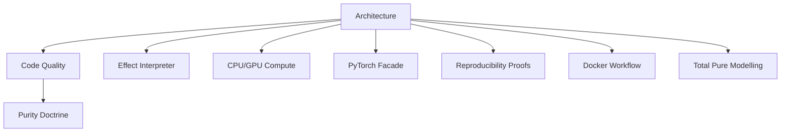
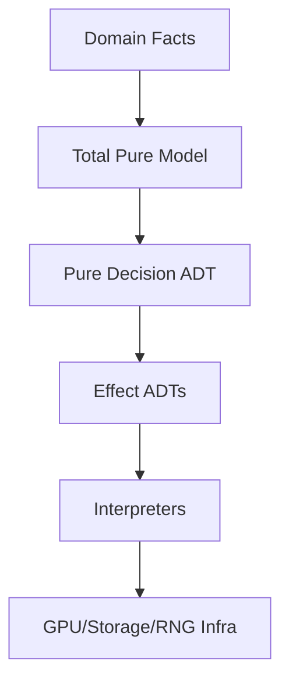

# File: documents/engineering/architecture.md
# Architecture

**Status**: Authoritative source  
**Supersedes**: Prior informal architecture notes  
**Referenced by**: engineering/README.md; code_quality.md; effect_patterns.md

> **Purpose**: Describe SpectralMC’s architectural layering, effect boundaries, and GPU/storage/RNG topology. Mirrors effectful’s layout while remaining SpectralMC-specific.

## SSoT Link Map

## Design Principles

- **Make invalid states unrepresentable**: Effects and domain models are ADTs with exhaustive `match` coverage; Result types replace exceptions for expected flows.
- **Pure descriptions, isolated execution**: Programs describe work as generators of effect ADTs; interpreters own all I/O (GPU kernels, storage, RNG, logging).
- **Deterministic GPU-first execution**: CPU-only initialization followed by explicit device transfer; PyTorch imports flow through the facade to enforce deterministic settings and thread safety.
- **Immutable state**: Frozen dataclasses for models/effects; functional updates only.
- **Total pure models drive effects**: Pure ADTs from [total_pure_modelling.md](total_pure_modelling.md)
  choose device placement, retries, and hand-offs before interpreters run any side effects.

## Layered Architecture

1. **Application / Programs (Pure)**  
   - Pure generator functions build sequences of effect ADTs.  
   - No `for`/`while`/`if` in pure paths; composition via expressions and `yield from`.  
   - Domain models are immutable; errors are Result/ADT variants.

2. **Program Runner (Pure driver)**  
   - Orchestrates generator execution, threading RNG state explicitly.  
   - Enforces ordering for GPU transfers vs. kernels to keep determinism.

3. **Interpreters (Impure boundary)**  
   - Single boundary for side effects.  
   - Handles GPU operations (kernels, streams), storage (S3/blockchain CAS), logging, RNG capture/restore.  
   - Uses PyTorch facade for deterministic device/dtype defaults.

4. **Infrastructure (Adapters)**  
   - Concrete integrations (PyTorch, CuPy, S3 client, chain verification tools).  
   - May hold mutable handles but expose pure-facing interfaces through interpreters.

## GPU/Storage Topology

- **GPU path**: CPU initialization → explicit `TensorTransfer` → kernel launches guarded by device checks (`cpu_gpu_compute_policy.md`).  
- **Storage path**: Immutable model/version ADTs → CAS writes via blockchain storage interpreter.  
- **RNG path**: RNG state captured/restored as effects; Sobol/PRNG selection is explicit and typed.

### Pure Model → Effects → Infrastructure

- Domain facts are encoded in total models that make impossible states unrepresentable.
- Pure decisions select device placement, transfer caps, and storage ownership; no side
  effects occur here.
- Interpreters execute only the effects they are handed; infrastructure never bypasses
  the model/decision boundary.

## Boundaries and Imports

- Pure layers never import infrastructure modules directly; they depend on effect ADTs and domain types.
- Interpreters/adapters may import infrastructure and must remain the sole owners of side effects.
- PyTorch must be imported through the facade before any interpreter or model import to set deterministic global state.

## Migration Notes

- When introducing new effects, add ADTs and unions in effect SSoTs, update interpreters, and extend exhaustive matches/tests.  
- When adding infrastructure, wrap it in interpreters rather than leaking host APIs into pure code.  
- Keep docs and stubs synchronized; link new standards back to this file and the engineering hub.

## Cross-References

- [Effect Interpreter Doctrine](effect_interpreter.md)
- [Purity Doctrine](purity_doctrine.md)
- [CPU/GPU Compute Policy](cpu_gpu_compute_policy.md)
- [PyTorch Facade Pattern](pytorch_facade.md)
- [Reproducibility Proofs](reproducibility_proofs.md)
- [Docker Workflow](docker_workflow.md)
- [Total Pure Modelling](total_pure_modelling.md)
