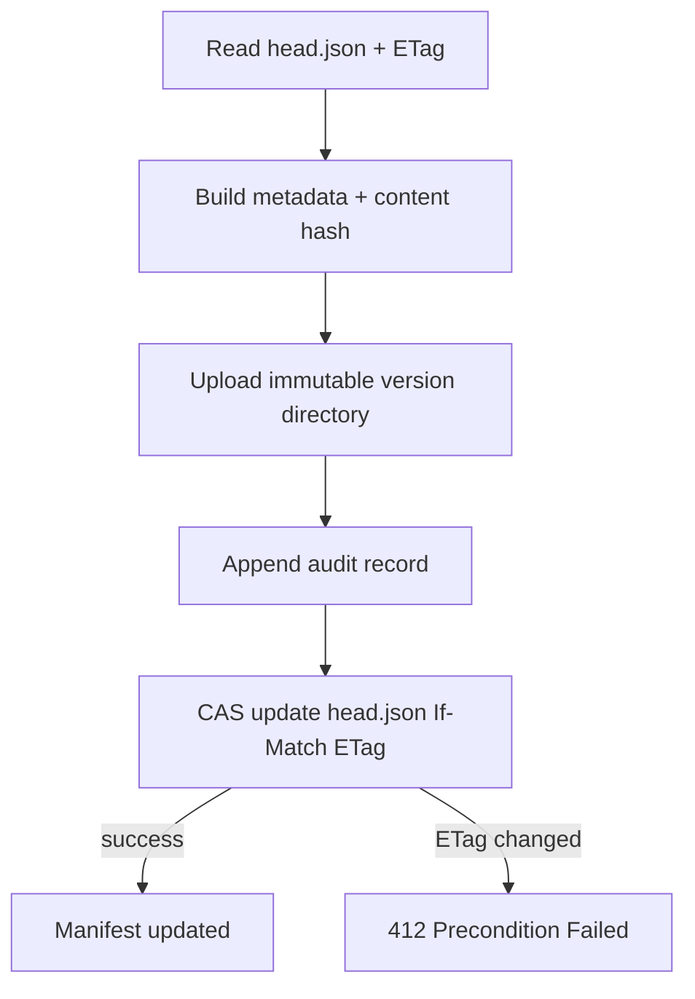
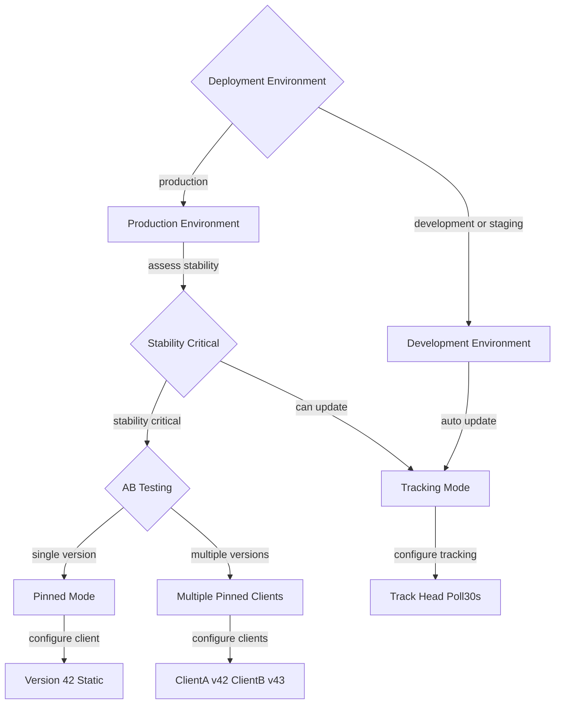
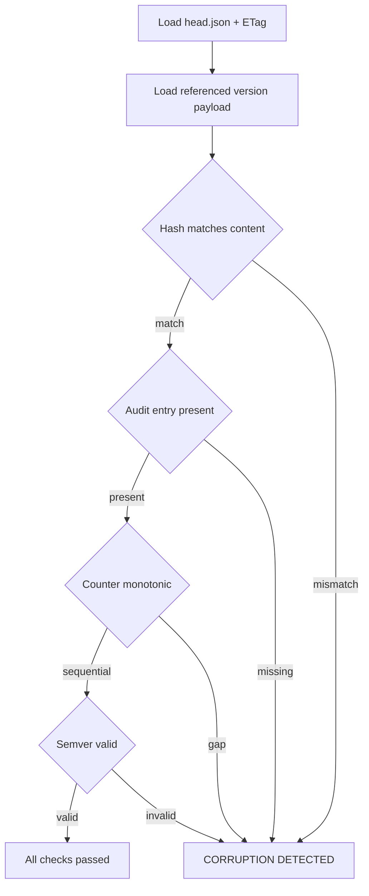

# File: documents/engineering/blockchain_storage.md
# Blockchain Model Versioning

**Status**: Authoritative source  
**Supersedes**: Prior blockchain storage notes  
**Referenced by**: documents/product/deployment.md

> **Purpose**: Define blockchain-based model versioning architecture using S3 storage, atomic CAS commits, and semantic versioning for production ML models.

## Cross-References
- [effect_interpreter.md](effect_interpreter.md)
- [../product/deployment.md](../product/deployment.md)
- [../product/training_integration.md](../product/training_integration.md)

## Overview

SpectralMC uses immutable S3 objects with a single manifest to provide production-ready model
version control. S3 (and its object-lock/ETag history) is the sole source of truth for
training state; no auxiliary monitoring system is required.

**Key Features**:
- **Immutable version history** with SHA256 content addressing
- **Version directories keyed by counter + hash** (no Merkle parent links)
- **Single `head.json`** guarded by ETag or S3 object-lock as the manifest SSoT
- **Append-only audit log** in S3 for human-readable commit traceability
- **Atomic manifest updates** via ETag-based Compare-And-Swap (CAS)
- **S3 storage** with aioboto3 async operations
- **Protocol Buffer serialization** for cross-platform compatibility
- **InferenceClient** with pinned/tracking modes
- **Garbage collection** for old versions
- **TensorBoard integration** for metrics logging

**Source of truth**: `head.json` in S3 is authoritative for training/inference state. All
derivative signals (logs, audit entries, TensorBoard summaries) are advisory only.

---

## Storage Architecture

### AsyncBlockchainModelStore

**Location**: `src/spectralmc/storage/store.py`

Production S3-based storage with atomic CAS commits:
- 10-step atomic commit protocol using ETag/If-Match
- Conflict detection and fast-forward enforcement
- Automatic retry with exponential backoff

### S3 Storage Structure

```text
# File: documents/engineering/blockchain_storage.md
S3 Bucket Structure:
my-model-bucket/
├── head.json                     # Manifest: current counter/hash, ETag-guarded
├── audit/
│   └── 2024/05/05T12:00:00Z.json # Append-only audit records (one file per commit)
└── versions/
    ├── v0000000000_abcd1234/
    │   ├── checkpoint.pb         # Protocol Buffer serialized model
    │   ├── metadata.json         # Version info (counter, semver, content_hash)
    │   └── content_hash.txt      # SHA256 checksum
    └── v0000000001_ef567890/
        ├── checkpoint.pb
        ├── metadata.json
        └── content_hash.txt
```

**Key Features**:
- `head.json`: Atomic manifest (counter, content_hash, version_id) guarded by ETag or
  S3 object-lock/versioning
- `audit/`: Append-only human-readable entries referencing the manifest counter/hash
- `versions/`: Immutable version directories keyed by counter + content hash
- `checkpoint.pb`: Protocol Buffer serialized model state
- `metadata.json`: Version metadata (counter, semver, timestamp, content_hash)
- `content_hash.txt`: SHA256 checksum for integrity verification

### Audit Log

- Append-only JSON entries written to `audit/` with timestamp, counter, content hash,
  commit message, and writer identity.
- Used for operational forensics; does not participate in CAS for `head.json`.
- Consumers should treat audit entries as advisory; `head.json` remains authoritative.

---

## Atomic Manifest Update (CAS)



### CAS Guarantees

- **Atomicity at manifest**: Either `head.json` advances to the new counter/hash or it does
  not; version payloads remain immutable even on conflicts.
- **Consistency**: `head.json` always references a valid version directory.
- **Isolation**: Concurrent writers are detected via ETag/Object-Lock; retry with a fresh
  read of `head.json`.
- **Durability**: S3 durability plus optional object-lock protects `head.json` and audit logs.

---

## Core Usage

### Committing Models

```python
# File: documents/engineering/blockchain_storage.md
from spectralmc.storage import AsyncBlockchainModelStore, commit_snapshot

# Initialize async store (S3)
async with AsyncBlockchainModelStore("my-model-bucket") as store:
    # Commit a trained model snapshot
    config = GbmCVNNPricerConfig(...)  # Your trained config
    version = await commit_snapshot(
        store,
        config,
        message="Trained for 1000 epochs"
    )

    print(f"Committed version {version.counter}: {version.content_hash[:8]}")
```

### Loading Models

```python
# File: documents/engineering/blockchain_storage.md
from spectralmc.storage import load_snapshot_from_checkpoint
from spectralmc.result import Success, Failure

async with AsyncBlockchainModelStore("my-model-bucket") as store:
    # Get HEAD version
    head_result = await store.get_head()

    match head_result:
        case Success(head):
            # Load checkpoint
            model_template = torch.nn.Linear(5, 5)
            config_template = make_config(model_template)

            snapshot = await load_snapshot_from_checkpoint(
                store,
                head,
                model_template,
                config_template
            )

            # Use snapshot.cvnn for inference
            model = snapshot.cvnn
        case Failure(error):
            print(f"Error getting HEAD: {error}")
```

---

## InferenceClient

Production model serving with version control integration.

### Mode Selection Decision Tree



### Pinned Mode (Production)

```python
# File: documents/engineering/blockchain_storage.md
from spectralmc.storage import InferenceClient

# Pin to specific version for production stability
async with InferenceClient(
    version_counter=42,  # Pin to v42
    poll_interval=60.0,
    store=store,
    model_template=model,
    config_template=config
) as client:
    # Always serves v42, never updates
    snapshot = client.get_model()
    predictions = run_inference(snapshot.cvnn, inputs)
```

### Tracking Mode (Development)

```python
# File: documents/engineering/blockchain_storage.md
# Auto-track latest version with hot-swapping
async with InferenceClient(
    version_counter=None,  # Track HEAD
    poll_interval=30.0,
    store=store,
    model_template=model,
    config_template=config
) as client:
    # Model auto-updates every 30 seconds
    snapshot = client.get_model()
    predictions = run_inference(snapshot.cvnn, inputs)
```

---

## Manifest and Audit Verification

Detect corruption or drift by validating the manifest and audit log against immutable
version payloads.

### Verification Algorithm



### Code Usage

```python
# File: documents/engineering/blockchain_storage.md
from spectralmc.storage import verify_chain, verify_chain_detailed
from spectralmc.result import Success, Failure

async with AsyncBlockchainModelStore("my-model-bucket") as store:
    result = await verify_chain(store)

    match result:
        case Success(report) if report.is_valid:
            print(f"Manifest valid: {report.details}")
        case Success(report):
            print(f"Corruption: {report.corruption_type}")
        case Failure(error):
            print(f"S3 error during verification: {error}")
```

### Validation Checks

- Manifest hash matches the payload in `versions/`
- Counter monotonicity (strictly increasing by 1)
- Semantic version progression
- Audit entry exists for every manifest advance

---

## Garbage Collection

Automated cleanup of old versions:

```python
# File: documents/engineering/blockchain_storage.md
from spectralmc.storage import run_gc, RetentionPolicy

async with AsyncBlockchainModelStore("my-model-bucket") as store:
    # Preview what would be deleted (dry run)
    report = await run_gc(
        store,
        keep_versions=10,          # Keep last 10 versions
        protect_tags=[5, 12, 20],  # Protect production releases
        dry_run=True
    )

    print(f"Would delete: {report.deleted_versions}")
    print(f"Would free: {report.bytes_freed / (1024**2):.2f} MB")

    # Actually delete
    report = await run_gc(store, keep_versions=10, dry_run=False)
```

### Safety Features

- Genesis (v0) always protected
- Configurable minimum versions (default: 3)
- Protected tags for production releases
- Dry-run preview before deletion

---

## TensorBoard Integration

Log model versions and training metrics:

```python
# File: documents/engineering/blockchain_storage.md
from spectralmc.storage import log_blockchain_to_tensorboard

async with AsyncBlockchainModelStore("my-model-bucket") as store:
    await log_blockchain_to_tensorboard(
        store,
        log_dir="runs/my_experiment",
        model_template=model,
        config_template=config
    )

# View with: tensorboard --logdir=runs/
```

**Logs**:
- Version metadata (counter, semver, content_hash, timestamp)
- Training metrics (global_step, param_count, sobol_skip)
- Summary statistics (total versions, versions per day)

---

## Training Integration

Automatic blockchain commits during training via `GbmCVNNPricer.train()`.

### Auto-commit after training completes

```python
# File: documents/engineering/blockchain_storage.md
from spectralmc.gbm_trainer import GbmCVNNPricer, build_training_config
from spectralmc.storage import AsyncBlockchainModelStore

async with AsyncBlockchainModelStore("my-model-bucket") as store:
    pricer = GbmCVNNPricer(config)

    training_config = build_training_config(
        num_batches=1000,
        batch_size=32,
        learning_rate=0.001
    ).unwrap()

    # Train with automatic commit when done
    pricer.train(
        training_config,
        blockchain_store=store,
        auto_commit=True,
        commit_message_template="Final checkpoint: step={step}, loss={loss:.4f}"
    )

    # Version automatically committed after training
    head = await store.get_head()
    print(f"Training committed as version {head.counter}")
```

### Periodic commits during training

```python
# File: documents/engineering/blockchain_storage.md
# Commit every 100 batches during training
pricer.train(
    training_config,
    blockchain_store=store,
    auto_commit=True,
    commit_interval=100,  # Commit every 100 batches
    commit_message_template="Checkpoint: step={step}, loss={loss:.4f}"
)
```

### Features

- **Backward compatible**: Training without `blockchain_store` still works
- **Graceful error handling**: Commit failures logged but don't crash training
- **Optimizer state preservation**: Full checkpoint including Adam state
- **Template interpolation**: Variables `{step}`, `{loss}`, `{batch}` in messages
- **Async-to-sync bridge**: Uses `asyncio.run()` to commit within sync training loop

### Validation

- `auto_commit=True` requires `blockchain_store` parameter
- `commit_interval` requires `blockchain_store` parameter

See `examples/training_with_blockchain_storage.py` for complete example.

---

## CLI Tools

### Usage

```bash
# File: documents/engineering/blockchain_storage.md
# Verify manifest integrity (Docker-only)
docker compose -f docker/docker-compose.yml exec spectralmc \
  poetry run python -m spectralmc.storage verify my-model-bucket

# List all versions
docker compose -f docker/docker-compose.yml exec spectralmc \
  poetry run python -m spectralmc.storage list-versions my-model-bucket

# Inspect specific version
docker compose -f docker/docker-compose.yml exec spectralmc \
  poetry run python -m spectralmc.storage inspect my-model-bucket v0000000042

# Preview garbage collection
docker compose -f docker/docker-compose.yml exec spectralmc \
  poetry run python -m spectralmc.storage gc-preview my-model-bucket 10

# Run garbage collection (keep last 10, protect v5 and v12)
docker compose -f docker/docker-compose.yml exec spectralmc \
  poetry run python -m spectralmc.storage gc-run my-model-bucket 10 --protect-tags 5,12 --yes

# Log to TensorBoard
docker compose -f docker/docker-compose.yml exec spectralmc \
  poetry run python -m spectralmc.storage tensorboard-log my-model-bucket --log-dir runs/exp1
```

### Complete CLI Commands

- `verify` - Verify manifest and payload integrity
- `find-corruption` - Find first corrupted version (hash/counter/semver mismatch)
- `list-versions` - List all versions
- `inspect` - Inspect specific version in detail
- `gc-preview` - Preview garbage collection (dry run)
- `gc-run` - Run garbage collection
- `tensorboard-log` - Log blockchain to TensorBoard

---

## Test Coverage

All storage features have comprehensive test coverage:

- **CLI commands**: 22 tests (83% coverage of `__main__.py`)
  - verify, find-corruption, list-versions, inspect commands
  - gc-preview, gc-run with protected tags
  - tensorboard-log, error handling
- **InferenceClient**: 8 tests (pinned mode, tracking mode, lifecycle)
- **Manifest verification**: 15 tests (hash, counter, semver, audit presence)
- **Garbage collection**: 15 tests (retention policies, safety checks)
- **TensorBoard**: 12 tests (logging, metadata, error handling)
- **Training integration**: 7 tests (auto_commit, periodic commits, optimizer state preservation)

**Total: 86 storage tests, 73% overall coverage**

### Run storage tests

```bash
# File: documents/engineering/blockchain_storage.md
docker compose -f docker/docker-compose.yml exec spectralmc poetry run test-all tests/test_storage/
docker compose -f docker/docker-compose.yml exec spectralmc poetry run test-all tests/test_integrity/
```

---

## Related Documentation

- [Testing Requirements](testing_requirements.md) - Test output handling and anti-patterns
- [Coding Standards](coding_standards.md) - Type safety, Result types, ADTs, and error handling
- [Main Project Guide](../../CLAUDE.md) - Quick reference
