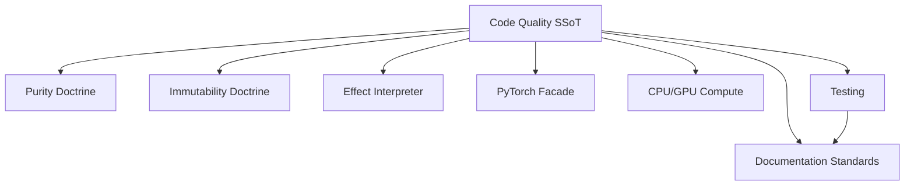

# File: documents/engineering/code_quality.md
# Code Quality

**Status**: Authoritative source  
**Supersedes**: Prior scattered purity/type/pattern drafts  
**Referenced by**: engineering/README.md; documents/README.md

> **Purpose**: Single source for SpectralMC code-quality doctrines: strict typing, purity, immutability, and interpreter isolation. Aligns naming with effectful while preserving SpectralMC’s GPU/storage constraints.

## SSoT Link Map

| Need | Link |
|------|------|
| Formatting, mypy strict, stubs | [Coding Standards](coding_standards.md) |
| Pure code rules (no `for`/`if`/`raise` in pure paths) | [Purity Doctrine](purity_doctrine.md) |
| Frozen data + safe updates | [Immutability Doctrine](immutability_doctrine.md) |
| Effect ADTs + interpreter boundary | [Effect Interpreter Doctrine](effect_interpreter.md) |
| Deterministic PyTorch import/device | [PyTorch Facade Pattern](pytorch_facade.md) |
| CPU init → GPU compute rules | [CPU/GPU Compute Policy](cpu_gpu_compute_policy.md) |
| Determinism proofs | [Reproducibility Proofs](reproducibility_proofs.md) |
| Testing gates | [Testing](testing.md) |

## Cross-References

- [Architecture](architecture.md) — Layering boundaries and interpreter placement.
- [Documentation Standards](../documentation_standards.md) — Required metadata/linking rules for this SSoT.
- [Coding Standards](coding_standards.md) — Lint/type configuration backing these policies.
- [Testing Requirements](testing_requirements.md) — GPU-first test contracts and timeouts.
- [Effect Interpreter Doctrine](effect_interpreter.md) — Execution boundaries and side-effect isolation.

## Doctrines

- **Zero escape hatches**: No `Any`, no `cast`, no `# type: ignore`, strict typing everywhere (prod, tests, docs, scripts). Enforced via `poetry run check-code` and AST-based checks.
- **Purity-first**: Pure code forbids `for`/`while` and even `if` branching; use `match`/comprehensions/expressions and Result/ADT flows. Side effects live only in interpreters and adapters.
- **Immutability by default**: All domain/effect dataclasses are `frozen=True`; updates use `dataclasses.replace` or new instances. No mutation through `__dict__`, `object.__setattr__`, or tuple hacks.
- **Effects as data**: Programs yield effect ADTs; interpreters execute. No direct infrastructure calls inside programs or models.
- **GPU determinism**: CPU-only initialization + explicit device transfer; PyTorch imports flow through the facade for deterministic settings and thread safety.
- **Reproducibility**: RNG state is explicit; checkpoint/restore semantics prove equivalence. See reproducibility proofs for invariants.

## Anti-Pattern Routing

| Anti-pattern | Fix | SSoT |
|--------------|-----|------|
| `Any`/`cast`/`type: ignore` | Remove and annotate; narrow via `match` | coding_standards.md |
| Loops/`if` in pure code | Refactor to expressions or generator yields | purity_doctrine.md |
| Mutable dataclasses | Convert to frozen + functional updates | immutability_doctrine.md |
| Side effects in pure layers | Model as effect ADTs and interpret | effect_interpreter.md |
| CPU fallbacks in tests | Assert GPU availability; explicit `cuda:0` | cpu_gpu_compute_policy.md; testing.md |
| Direct `import torch` | Import facade first | pytorch_facade.md |
| Silent exception swallowing | Return Result ADTs; exhaustive `match` | coding_standards.md; purity_doctrine.md |

## Enforcement

- Primary gate: `docker compose -f docker/docker-compose.yml exec spectralmc poetry run check-code`
  - Ruff → Black (100 chars) → MyPy strict → link verification
- Secondary gates:
  - `poetry run typecheck` / `check-types` for AST-based typing violations
  - `poetry run test-all` (GPU-only) to exercise interpreter/purity constraints
- Review checklist: exhaustive matches with `assert_never`, no host-level commands, facade before torch, immutable data, Result-based errors, link to SSoT not duplicates.
