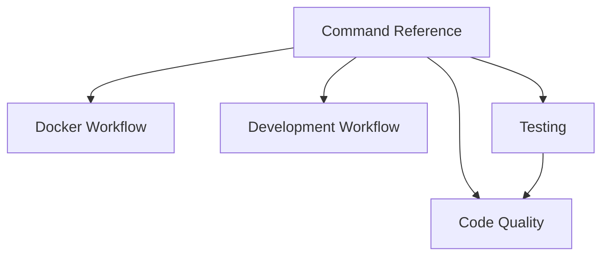

# Command Reference

**Status**: Authoritative source  
**Supersedes**: Ad-hoc command snippets  
**Referenced by**: engineering/README.md; docker_workflow.md; development_workflow.md; testing.md

> **Purpose**: Canonical commands for SpectralMC development, testing, and validation inside Docker. Aligns naming with effectful’s reference while keeping SpectralMC’s `test-all` runner.

## SSoT Link Map

| Task | Command |
|------|---------|
| Start stack | `docker compose -f docker/docker-compose.yml up -d` |
| Exec shell | `docker compose -f docker/docker-compose.yml exec spectralmc bash` |
| Lint/format/type | `docker compose -f docker/docker-compose.yml exec spectralmc poetry run check-code` |
| Type-only | `docker compose -f docker/docker-compose.yml exec spectralmc poetry run typecheck` |
| AST type rules | `docker compose -f docker/docker-compose.yml exec spectralmc poetry run check-types` |
| All tests (GPU) | `docker compose -f docker/docker-compose.yml exec spectralmc poetry run test-all` |
| All tests w/ log capture | `docker compose -f docker/docker-compose.yml exec spectralmc poetry run test-all > /tmp/test-output.txt 2>&1` |
| Specific test file | `docker compose -f docker/docker-compose.yml exec spectralmc poetry run test-all tests/test_example.py` |
| View captured log | `docker compose -f docker/docker-compose.yml exec spectralmc tail -n 200 /tmp/test-output.txt` |
| Rebuild (binary) | `cd docker && docker compose up --build -d` |
| Rebuild (source/legacy GPU) | `cd docker && BUILD_FROM_SOURCE=true docker compose up --build -d` |

## Command Patterns

- Prefix everything with `docker compose -f docker/docker-compose.yml exec spectralmc poetry run ...`.
- Use `test-all` instead of `pytest`; GPU is required and module-level asserts must fail fast.
- Always capture full test output when triaging failures (`> /tmp/test-output.txt 2>&1`).
- `check-code` is the gate (Ruff → Black → MyPy + link verification); run before tests.

## Forbidden Practices

- Running `pytest`, `mypy`, or `poetry` on the host.
- Bypassing `test-all` (e.g., `pytest tests/` inside container).
- Adding shell-level timeouts around `test-all` (per-test timeout is built in).
- Copying build artifacts or lockfiles into the repo; see [Build Artifact Management](build_artifact_management.md).

## See Also

- [Docker Workflow](docker_workflow.md)
- [Development Workflow](development_workflow.md)
- [Testing](testing.md)
- [Code Quality](code_quality.md)
