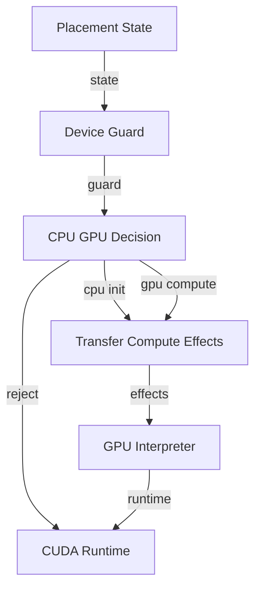

# File: documents/engineering/cpu_gpu_compute_policy.md
# CPU/GPU Compute Policy

**Status**: Authoritative source  
**Supersedes**: Prior CPU/GPU compute policy drafts  
**Referenced by**: documents/documentation_standards.md; documents/engineering/README.md

> **Purpose**: Define device placement rules for deterministic CPU setup followed by GPU execution.

## Cross-References
- [Torch Runtime (facade removed)](pytorch_facade.md)
- [Coding Standards](coding_standards.md)
- [Testing Requirements](testing_requirements.md)
- [Reproducibility Proofs](reproducibility_proofs.md)
- [Total Pure Modelling](total_pure_modelling.md)

## Overview

SpectralMC uses a **two-phase architecture**: deterministic CPU initialization → GPU compute. This policy ensures bit-exact reproducibility while maintaining GPU performance.

---

## Architecture: Deterministic CPU Initialization → GPU Compute

### Phase 1: CPU Initialization

Models are built on CPU with deterministic Sobol-based weight initialization using the injected torch
handle from the TorchRuntime effect:

```python
# File: documents/engineering/cpu_gpu_compute_policy.md
from spectralmc.cvnn_factory import build_model
from spectralmc.models.torch import Device
from spectralmc.result import Failure, Result, Success
from spectralmc.errors.cvnn_factory import CVNNFactoryError

# torch_handle is provided by the TorchRuntime configuration effect
torch = torch_handle

def _unwrap_model(result: Result[torch.nn.Module, CVNNFactoryError]) -> torch.nn.Module:
    match result:
        case Success(value):
            return value
        case Failure(error):
            raise RuntimeError(f"Failed to build CVNN deterministically: {error}")

# CORRECT PATTERN: Initialize on CPU with explicit device/dtype args, not global defaults
cpu_dev = Device.cpu.to_torch()
torch_dtype = torch.float32
model = _unwrap_model(build_model(config))
model = model.to(device=cpu_dev, dtype=torch_dtype)

# Verify CPU initialization
assert next(model.parameters()).device.type == "cpu"
```

### Phase 2: GPU Compute

After initialization, transfer model to GPU for all training and inference:

```python
# File: documents/engineering/cpu_gpu_compute_policy.md
# Transfer to GPU
gpu_dev = Device.cuda.to_torch()
model = model.to(gpu_dev)

# All compute on GPU
optimizer = torch.optim.Adam(model.parameters(), lr=0.001)

for batch in dataloader:
    # Forward, backward, optimizer all on GPU
    loss = training_step(model, batch)
    loss.backward()
    optimizer.step()
```

---

## Why CPU Initialization is Required

**Problem**: GPU weight initialization is non-deterministic across different GPU architectures.

**Example of non-determinism**:
- Same model initialized on GTX 970 vs RTX 4090 produces different weights
- Random number generators (cuRAND) behave differently across compute capabilities
- Even with same seed, GPU RNG state is architecture-dependent

**Solution**: Initialize all model parameters on CPU using deterministic Sobol sequences.

### Reproducibility Impact

✅ **Bit-exact reproducibility** across different GPUs (GTX 970, RTX 4090, A100)
✅ Same trained model weights across different environments
✅ Verifiable scientific results

**Cost**: One-time CPU→GPU transfer overhead (~milliseconds, negligible compared to training time)

---

## Acceptable CPU Usage

CPU compute is **acceptable** for these non-computational operations:

### 1. Model Initialization (Required for Determinism)

**Where**: `cvnn_factory.build_model()`
**Why**: Ensures deterministic Sobol-based weight initialization
**Pattern**: Build on CPU, transfer to GPU via `.to(device)`

### 2. Checkpoint Serialization (I/O-Bound)

**Where**: `gbm_trainer.py`, `serialization/tensors.py`
**Why**: Platform-independent checkpoint format
**Pattern**: `.cpu()` before serialization, `.to(device)` after loading

```python
# File: documents/engineering/cpu_gpu_compute_policy.md
# Checkpoint saving (CPU transfer acceptable)
def save_checkpoint(model: nn.Module, path: str) -> None:
    """Save model checkpoint to disk."""
    cpu_state = {k: v.cpu() for k, v in model.state_dict().items()}
    torch.save(cpu_state, path)

# Checkpoint loading
def load_checkpoint(model: nn.Module, path: str, device: torch.device) -> None:
    """Load model checkpoint from disk."""
    cpu_state = torch.load(path, map_location="cpu")
    gpu_state = {k: v.to(device) for k, v in cpu_state.items()}
    model.load_state_dict(gpu_state)
```

### 3. RNG State Management (PyTorch Limitation)

**Where**: `gbm_trainer.py` (RNG state capture/restore)
**Why**: PyTorch RNG state is CPU-only
**Impact**: Minimal (small state tensors)

### 4. Optimizer State Snapshots (Checkpoint Consistency)

**Where**: `gbm_trainer.py` (optimizer state serialization)
**Why**: Consistent checkpoint format
**Impact**: Infrequent operation

**Key Principle**: CPU usage is acceptable if it's **I/O-bound** or **required for determinism**, not compute-bound.

---

## GPU Compute Requirements

All **computational** operations must run on GPU:

### 1. Training Loops (Enforced)

**Where**: `GbmCVNNPricer.train()`
**Enforcement**: Raises `RuntimeError` if model not on CUDA device

```python
# File: documents/engineering/cpu_gpu_compute_policy.md
# In gbm_trainer.py
def train(self, config: TrainingConfig) -> None:
    """Train model (GPU required)."""
    if self._device != Device.cuda:
        raise RuntimeError("GbmCVNNPricer requires CUDA.")

    # Training loop runs on GPU
    for batch in range(config.num_batches):
        loss = self._training_step(batch)
        loss.backward()
        self.optimizer.step()
```

### 2. Forward Passes (All Inference)

**Where**: All CVNN module `forward()` methods
**Validation**: Debug-mode warnings if CPU tensors detected

```python
# File: documents/engineering/cpu_gpu_compute_policy.md
def forward(self, real: Tensor, imag: Tensor) -> tuple[Tensor, Tensor]:
    """Forward pass (GPU expected)."""
    if __debug__:
        _validate_device(real, "ComplexLinear input (real)")
        _validate_device(imag, "ComplexLinear input (imag)")

    # GPU compute guaranteed here
    real_out = F.linear(real, self.real_weight, self.real_bias)
    imag_out = F.linear(imag, self.imag_weight, self.imag_bias)
    return real_out, imag_out
```

### 3. Monte Carlo Simulations (CuPy)

**Where**: `gbm.py`, `async_normals.py`, `sobol_sampler.py` outputs
**Enforcement**: CuPy arrays are GPU-only by design
**Pattern**: All simulations return CuPy arrays (GPU tensors)

---

## Test Guidelines

### Default to GPU

Tests must use GPU by default and fail explicitly if CUDA unavailable:

```python
# File: documents/engineering/cpu_gpu_compute_policy.md
# tests/test_cvnn.py - CORRECT
import pytest
import torch

# Module-level GPU requirement (fail fast if CUDA missing)
assert torch.cuda.is_available(), "CUDA required for GPU compute tests"

# Default to GPU device
GPU_DEV: torch.device = torch.device("cuda:0")

def test_complex_linear() -> None:
    """Test ComplexLinear on GPU."""
    layer = ComplexLinear(10, 5).to(GPU_DEV)
    real_in = torch.randn(32, 10, device=GPU_DEV)
    imag_in = torch.randn(32, 10, device=GPU_DEV)

    real_out, imag_out = layer(real_in, imag_in)

    assert real_out.device == GPU_DEV
    assert imag_out.device == GPU_DEV
```

**Avoid**: Conditional device fallback (silent CPU execution)

```python
# File: documents/engineering/cpu_gpu_compute_policy.md
# ❌ WRONG - Silent CPU fallback
device = torch.device("cuda" if torch.cuda.is_available() else "cpu")

# ✅ CORRECT - Explicit GPU requirement
device = torch.device("cuda:0")  # Fails if CUDA unavailable
```

### Explicit Device Selection

When CPU testing is intentional, explicitly specify device:

```python
# File: documents/engineering/cpu_gpu_compute_policy.md
# Intentional CPU test - CORRECT
@pytest.mark.cpu
def test_cpu_serialization() -> None:
    """Test CPU serialization (intentional CPU usage)."""
    cpu_dev = torch.device("cpu")
    model = ComplexLinear(10, 5).to(cpu_dev)

    # Test CPU-specific behavior
    state = model.state_dict()
    assert all(v.device.type == "cpu" for v in state.values())
```

---

## Runtime Device Validation

Use `__debug__` guards for zero-overhead production validation:

```python
# File: documents/engineering/cpu_gpu_compute_policy.md
def _validate_device(tensor: torch.Tensor, name: str) -> None:
    """Validate tensor is on CUDA (debug mode only)."""
    if tensor.device.type != "cuda":
        import warnings
        warnings.warn(
            f"{name} is on {tensor.device} but expected cuda. "
            "This may cause performance degradation."
        )

# In forward() methods - CORRECT PATTERN
def forward(self, real: Tensor, imag: Tensor) -> tuple[Tensor, Tensor]:
    if __debug__:
        _validate_device(real, "ComplexLinear input (real)")
        _validate_device(imag, "ComplexLinear input (imag)")

    # GPU compute guaranteed here
    ...
```

**Production**: Validation removed with `python -O` (zero overhead)
**Development**: Warnings appear if CPU tensors detected

---

## Decision Tree: CPU vs GPU

Pure device models from [total_pure_modelling.md](total_pure_modelling.md) decide the
allowed transitions; interpreters only execute them.



- Initialization and checkpoint I/O remain CPU-bound for determinism and format
  constraints.
- Compute stays on GPU; guards reject silent CPU fallbacks or oversized host transfers.

---

## Transfer Planner (Pinned & Staged)

- Host→CUDA copies require pinned host memory for non-blocking transfers; unpinned host tensors are staged through a pinned buffer first.
- Transfer planning is pure (`TransferDecision` in `models/cpu_gpu_transfer.py`); interpreters own execution and stream synchronization.
- Reject transfers explicitly (no timing toggles or best-effort fallbacks); surfaced as `TransferRejected` errors.
- Tests rely on the planner to avoid races: no non-blocking copy on unpinned CPU tensors, no silent CPU fallback when CUDA is requested.

## Debugging Silent CPU Fallback

If you suspect unintended CPU compute:

### 1. Check Test Device Defaults

```bash
# File: documents/engineering/cpu_gpu_compute_policy.md
grep "CPU_DEV" tests/*.py  # Should find nothing

# Should be GPU_DEV instead
grep "GPU_DEV" tests/*.py
```

### 2. Enable Debug Mode Validation

```bash
# File: documents/engineering/cpu_gpu_compute_policy.md
# Run without -O flag (enables __debug__ checks)
docker compose -f docker/docker-compose.yml exec spectralmc \
  poetry run test-all tests/test_cvnn.py -v

# Look for device validation warnings
# UserWarning: ComplexLinear input (real) is on cpu but expected cuda.
```

### 3. Verify Model Device After Factory

```python
# File: documents/engineering/cpu_gpu_compute_policy.md
from spectralmc.cvnn_factory import build_model
from spectralmc.result import Failure, Result, Success
from spectralmc.errors.cvnn_factory import CVNNFactoryError
import torch

result = build_model(config, torch.float32)
match result:
    case Success(built_model):
        model = built_model
        print(f"Model device after build: {next(model.parameters()).device}")  # cpu
    case Failure(error):
        raise RuntimeError(f"CVNN factory failed: {error}")

model = model.to(torch.device("cuda:0"))
print(f"Model device after transfer: {next(model.parameters()).device}")  # cuda:0
```

### 4. Check for Conditional Fallbacks

```bash
# File: documents/engineering/cpu_gpu_compute_policy.md
# Search for conditional device logic
grep -r 'if torch.cuda.is_available()' src/ tests/

# Look for fallback patterns (avoid these)
grep -r 'else.*cpu' src/ tests/
```

---

## Summary

- **Two-phase architecture**: CPU init (deterministic) → GPU compute (performance)
- **CPU acceptable**: Model init, checkpoint I/O, RNG state (I/O-bound or determinism-required)
- **GPU required**: Training, inference, Monte Carlo (computational operations)
- **Test defaults**: GPU by default, fail explicitly if CUDA unavailable
- **Debug validation**: `__debug__` guards for zero-overhead production
- **Decision tree**: CPU for determinism/I/O, GPU for compute

See also: [Torch Runtime](pytorch_facade.md), [Coding Standards](coding_standards.md), [Testing Requirements](testing_requirements.md)
