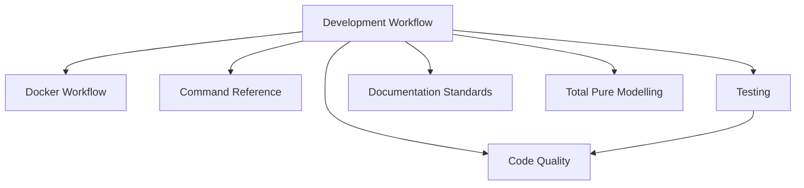

# File: documents/engineering/development_workflow.md
# Development Workflow

**Status**: Authoritative source  
**Supersedes**: Prior informal workflow notes  
**Referenced by**: engineering/README.md; command_reference.md

> **Purpose**: SSoT for daily development, adding features, and git hygiene in SpectralMC. Mirrors effectful naming while retaining SpectralMC’s GPU and effect/interpreter model.

## SSoT Link Map

| Need | Link |
|------|------|
| Docker-only commands | [Docker Workflow](docker_workflow.md) |
| Exact command syntax | [Command Reference](command_reference.md) |
| Purity/type rules | [Code Quality](code_quality.md) |
| Testing policy | [Testing](testing.md) |
| Doc metadata | [Documentation Standards](../documentation_standards.md) |
| Model purity/ADT shapes | [Total Pure Modelling](total_pure_modelling.md) |

## Daily Loop

1. Start stack: `docker compose -f docker/docker-compose.yml up -d`
2. Edit code (host editor).
3. Run `poetry run check-code` inside container.
4. Run `poetry run test-all` (arguments allowed) inside container.
5. Iterate; keep changes uncommitted until reviewed.

## Adding Effects or Models

1. Define immutable ADTs/effects in `src/spectralmc/...` (`@dataclass(frozen=True)`)
   following [total_pure_modelling.md](total_pure_modelling.md) so impossible states stay
   unrepresentable.
2. Extend unions/constructors per [Effect Interpreter Doctrine](effect_interpreter.md).
3. Keep pure code free of loops/conditionals/`raise` per [Purity Doctrine](purity_doctrine.md).
4. Add interpreter logic at boundaries; avoid direct infrastructure calls from pure layers.
5. Write tests (GPU-only) alongside feature area; seed deterministically and cover all
   model variants (including rejections) from the total model.
6. Update docs/stubs if APIs change; run `check-code` + `test-all`.

## Adding Configuration/Stubs

- Use Pydantic patterns (`extra="forbid"`, `frozen=True`) per [Pydantic Best Practices](pydantic_patterns.md).
- Add strict stubs under `stubs/` (no `Any`, no `type: ignore`).
- Document new config in `documents/domain` or `documents/product` as appropriate; link back here.

## Git Hygiene

- Keep working tree uncommitted until human review; no automated commits or pushes from tooling.
- Avoid destructive git commands (`reset --hard`, force pushes) during development.
- Small, focused commits with imperative summaries once reviewed.

## Environment Notes

- GPU required for all tests; validate with `nvidia-smi` inside `spectralmc` container.
- Build mode (binary/source) is selected via `BUILD_FROM_SOURCE`; see [Docker Build Philosophy](docker_build_philosophy.md).
- Host Python/Poetry/pytest are out-of-scope; use only container commands.

## Cross-References

- [Docker Workflow](docker_workflow.md)
- [Command Reference](command_reference.md)
- [Code Quality](code_quality.md)
- [Testing](testing.md)
