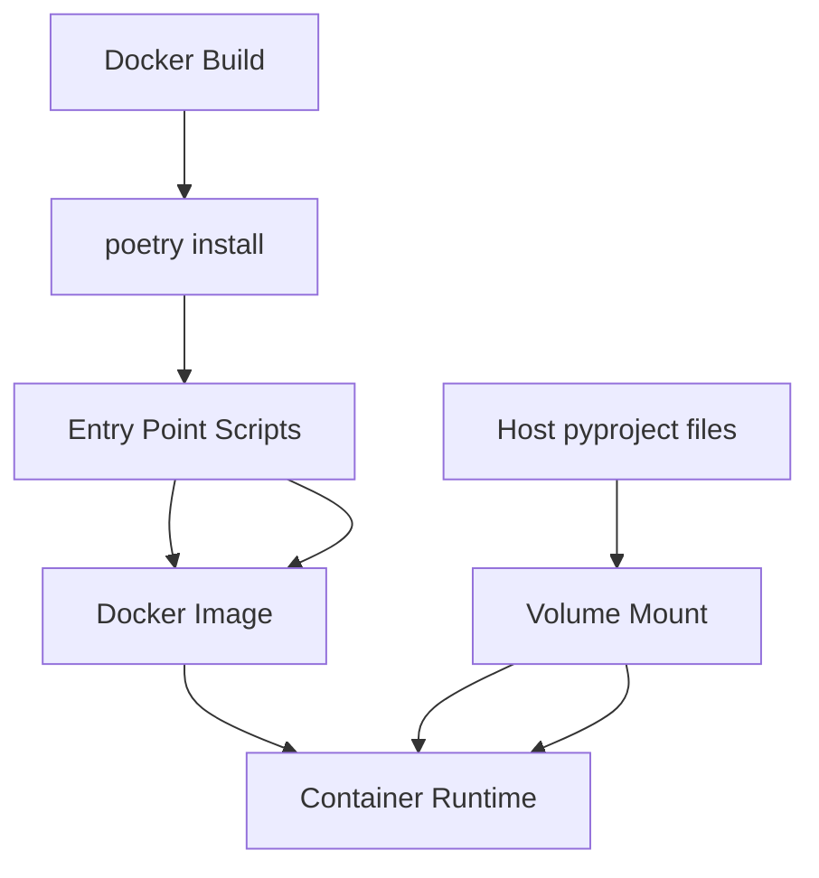

# File: documents/engineering/docker_build_philosophy.md
# Docker Build Philosophy

**Status**: Authoritative source
**Supersedes**: Prior docker build philosophy drafts
**Referenced by**: CLAUDE.md, docker_workflow.md, docker.md, documentation_standards.md

> **Purpose**: Define the dual-mode Docker build approach for SpectralMC across GPU generations, Poetry-first dependency management, and entry point script policies.

## Cross-References
- [Docker & Environment Variables](docker.md) - Complete environment variable documentation and SSoT policy
- [Docker Workflow](docker_workflow.md) - Development workflow and command patterns
- [GPU Build Guide](gpu_build.md) - Legacy GPU build instructions
- [Coding Standards](coding_standards.md) - Code quality standards
- [Documentation Standards](../documentation_standards.md) - Documentation requirements
- [CLAUDE.md](../../CLAUDE.md) - Quick reference for developers

## Overview

SpectralMC uses a **dual-mode Docker build strategy** to support both modern GPUs (binary packages) and legacy Maxwell GPUs like the GTX 970 (source builds). This document explains the build philosophy, Poetry-first dependency management, and layer optimization strategies.

---

## SSoT Scope

This document is the SSoT for:
- Docker build strategy (binary vs source builds)
- Compose topology and sidecar policy
- Poetry-first dependency management
- **Entry point script management and immutability policies**

### Sidecar Isolation Rule

- **Sidecars stay private**: Services that run alongside the main `spectralmc` container (e.g., TensorBoard, MinIO jobs) must not publish ports to the host. Keep them on the Compose VPN only.
- **Access from inside**: Interact with sidecars through the Compose network (`docker compose exec spectralmc curl http://tensorboard:6006`) or tunnel through the main container if host access is required, rather than adding host-level `ports` entries.
- **Rationale**: Fewer exposed surfaces, consistent with the sidecar pattern, and avoids host port conflicts when multiple developers run the stack.

---

## Build Modes

SpectralMC supports two build modes controlled by the `BUILD_FROM_SOURCE` environment variable:

### Binary Build (Default)

**When to use**: Modern GPUs with compute capability ≥ 6.0 (Pascal, Volta, Turing, Ampere, Ada, Hopper, Blackwell)

```bash
# File: documents/engineering/docker_build_philosophy.md
# Standard build (fast, pre-compiled packages)
cd docker && docker compose up --build -d
```

**Characteristics**:
- **Build time**: 10-15 minutes
- **Dockerfile**: `docker/Dockerfile`
- **Base image**: `nvidia/cuda:12.8.1-devel-ubuntu22.04`
- **PyTorch**: Pre-compiled binary wheel (PyTorch 2.7.1+cu128)
- **CuPy**: Pre-compiled binary wheel (CuPy 13.4.0+, cuda12x)
- **GPU support**: Compute capability 6.0+ (GTX 1060+, Tesla P100+, RTX series including RTX 5090)
- **Use case**: Development, modern hardware, fast iteration

### Source Build (Legacy GPUs)

**When to use**: Legacy Maxwell GPUs with compute capability 5.2 (GTX 970, GTX 980)

```bash
# File: documents/engineering/docker_build_philosophy.md
# Source build for GTX 970 (sm_52 support)
BUILD_FROM_SOURCE=true docker compose up --build -d
```

**Characteristics**:
- **Build time**: 2-4 hours (first build only, cached thereafter)
- **Dockerfile**: `docker/Dockerfile.source`
- **Base image**: `nvidia/cuda:11.8.0-cudnn8-devel-ubuntu22.04`
- **PyTorch**: Built from source with sm_52 support (PyTorch 2.4.1)
- **CuPy**: Latest version from PyPI (CuPy 13.x, cuda11x)
- **GPU support**: Compute capability 5.2+ (GTX 970+)
- **Use case**: Legacy hardware, validated on GTX 970

**Why 2-4 hours?**
- PyTorch compilation from source with CUDA support
- Compiling thousands of CUDA kernels for sm_52
- Worth it for legacy GPU compatibility

---

## Poetry-First Dependency Management

SpectralMC uses **Poetry** as the single source of truth for all Python dependencies. This ensures consistency across development, testing, and production environments.

### Container Parity and Dependency Boundaries

- **Single manifest + command**: `docker/Dockerfile` and `docker/Dockerfile.source` copy the appropriate pyproject variant (`pyproject.binary.toml` or `pyproject.source.toml`) to `pyproject.toml` at build time, then use identical `poetry install` invocations—no per-container tweaks or extra flags.
- **Minimal pyproject files**: Keep both `pyproject.binary.toml` and `pyproject.source.toml` scoped to their respective build requirements. Binary build uses pre-compiled wheels; source build includes dependencies for PyTorch compilation.
- **Source-build installs stay in-line**: Anything required solely to compile from source (Python included) lives inside the inline build script within the `BUILD_FROM_SOURCE` block in `Dockerfile.source`; do not scatter extra `RUN` steps elsewhere.
- **Isolated artefacts**: Source-build outputs install into a dedicated `/opt` subtree reserved for build artefacts rather than the global interpreter site-packages.
- **Swap-in workflow**: In `Dockerfile.source`, run the long C/CUDA build early, before `poetry install`. Use a Poetry dependency group (e.g., `binary-torch`) so binary wheels are skipped for source builds (`POETRY_WITHOUT=binary-torch`) yet installed for binary builds (`POETRY_WITH=binary-torch`). After `poetry install`, surface the built `/opt` wheel via `.pth`/`PYTHONPATH` activation. This remains Poetry-safe because container venvs are disabled via `poetry.toml`.

### The Only pip Command

There is exactly **one** pip command in SpectralMC Dockerfiles:

```dockerfile
# File: documents/engineering/docker_build_philosophy.md
RUN curl -sS https://bootstrap.pypa.io/get-pip.py | python3.12 && \
    python -m pip install --upgrade pip setuptools wheel poetry
```

This single command:
1. Installs pip via bootstrap script
2. Upgrades pip, setuptools, and wheel
3. Installs Poetry

After this line, **only Poetry commands** are used for all dependencies.

### Virtual Environment Configuration

Poetry's virtual environment behavior is controlled by `poetry.toml` at the repository root:

```toml
# File: documents/engineering/docker_build_philosophy.md
[virtualenvs]
create = false
```

This file is automatically used by Poetry in the Docker build context. **Do NOT add `poetry config` commands to Dockerfiles** - the `poetry.toml` file is the single source of truth for this configuration.

### Forbidden Patterns

- ❌ `curl -sSL https://install.python-poetry.org | python3 -` (external script)
- ❌ `pip install <package>` after Poetry is installed
- ❌ `poetry config virtualenvs.create false` (handled by poetry.toml)
- ❌ Multiple `pip install` commands
- ❌ Separate RUN commands for pip and Poetry installation

### Why This Pattern?

1. **Single Layer**: pip + Poetry in one RUN command = fewer Docker layers
2. **No External Scripts**: Poetry's official installer is unnecessary complexity
3. **poetry.toml as SSoT**: Virtual environment config in one place, not scattered across Dockerfiles
4. **Reproducibility**: pip install is deterministic and cached well by Docker

---

## Dual-Pyproject Architecture

SpectralMC uses **dual pyproject files** to support different PyTorch and CUDA versions across binary and source builds:

- **pyproject.binary.toml** - Modern GPU binary build (PyTorch 2.7.1+cu128, CuPy cuda12x)
- **pyproject.source.toml** - Legacy GPU source build (PyTorch 2.4.1, CuPy cuda11x)

### Build-Time Generation

Each Dockerfile copies the appropriate variant to `pyproject.toml` at build time:

**docker/Dockerfile** (line 88):
```dockerfile
# File: documents/engineering/docker_build_philosophy.md
RUN cp pyproject.binary.toml pyproject.toml
```

**docker/Dockerfile.source** (line 137):
```dockerfile
# File: documents/engineering/docker_build_philosophy.md
RUN cp pyproject.source.toml pyproject.toml
```

Poetry then uses the generated `pyproject.toml` file for dependency resolution.

### Shared vs Different Sections

**Shared sections** (identical in both files):
- `[tool.poetry]` - Package metadata (name, version, description, authors)
- `[tool.poetry.scripts]` - Entry point scripts (check-code, test-all, check-purity, etc.)
- `[tool.poetry.group.dev.dependencies]` - Development dependencies (pytest, mypy, black, ruff)
- `[tool.mypy]` - Type checking configuration
- `[tool.black]` - Code formatting configuration
- `[tool.pytest.ini_options]` - Pytest configuration
- `[tool.pydantic-mypy]` - Pydantic plugin configuration
- `[build-system]` - Poetry core build backend

**Different sections**:
- `[tool.poetry.dependencies]` - PyTorch version (2.7.1+cu128 vs 2.4.1), CuPy variant (cuda12x vs cuda11x)
- `[[tool.poetry.source]]` - Binary build defines custom pytorch-cu128 source (pyproject.binary.toml lines 14-21 only)

### Why Dual Files?

**Binary build (pyproject.binary.toml)**:
- PyTorch 2.7.1+cu128 from custom wheel source
- Requires `[[tool.poetry.source]]` entry for pytorch-cu128 repository
- CuPy cuda12x for CUDA 12.8 compatibility
- Pre-compiled binaries, 10-15 minute build

**Source build (pyproject.source.toml)**:
- PyTorch 2.4.1 compiled from source with sm_52 support
- Uses standard PyPI sources (no custom [[tool.poetry.source]])
- CuPy cuda11x for CUDA 11.8 compatibility
- 2-4 hour first build for GTX 970 support

### Source of Truth

**pyproject.toml is the source of truth** for Poetry during builds. It's generated at build time from:
- `pyproject.binary.toml` for binary builds (default)
- `pyproject.source.toml` for source builds (BUILD_FROM_SOURCE=true)

The dual-file approach ensures:
- Clean separation of binary vs source dependencies
- No conditional logic within pyproject files
- Each build mode has optimized dependencies
- Shared configuration sections remain synchronized

### Synchronization Requirements

**CRITICAL**: Changes to shared sections must be synchronized:

```bash
# File: documents/engineering/docker_build_philosophy.md
# When updating [tool.poetry.scripts], edit BOTH files:
vim pyproject.binary.toml  # Add new script
vim pyproject.source.toml  # Add same script

# When updating dependencies, edit appropriate file:
vim pyproject.binary.toml  # Binary-specific (PyTorch 2.7.1+cu128)
vim pyproject.source.toml  # Source-specific (PyTorch 2.4.1)
```

**Shared sections requiring sync**:
- `[tool.poetry.scripts]`
- `[tool.mypy]`
- `[tool.black]`
- `[tool.pytest.ini_options]`
- `[tool.pydantic-mypy]`
- `[tool.poetry.group.dev.dependencies]`

### Manual Enforcement

**Validation tool** (bundled inside `check-code`):
```bash
# File: documents/engineering/docker_build_philosophy.md
docker compose -f docker/docker-compose.yml exec spectralmc poetry run check-code
```

**Manual checks** (automation is prohibited):
- ✅ `poetry run check-code` - Runs pyproject validation and quality checks when invoked by a contributor
- ❌ No git hooks or CI/CD workflows may enforce these checks

**Exit codes**:
- `0` - All shared sections synchronized
- `1` - Synchronization failures detected
- `2` - File error (missing file, malformed TOML)

See [PyProject Validation Tool](../../tools/check_pyproject.py) for implementation details.

---

## poetry.lock Handling

SpectralMC **does NOT copy `poetry.lock`** into Docker images. The lockfile is regenerated inside the container from `pyproject.toml`.

### Configuration

```dockerfile
# File: documents/engineering/docker_build_philosophy.md
# ✅ CORRECT - Copy both pyproject variants and poetry.toml
COPY pyproject.binary.toml pyproject.source.toml poetry.toml ./
RUN cp pyproject.binary.toml pyproject.toml  # Binary build
# or: RUN cp pyproject.source.toml pyproject.toml  # Source build

# ❌ INCORRECT - Don't copy poetry.lock
# COPY pyproject.toml poetry.lock* ./
```

Both `.dockerignore` and `.gitignore` include `poetry.lock`:

**`.dockerignore`**:
```text
# File: documents/engineering/docker_build_philosophy.md
# Poetry - exclude lock to reduce context size, will be regenerated
poetry.lock
```

**`.gitignore`**:
```python
# File: documents/engineering/docker_build_philosophy.md
# poetry
#   Similar to Pipfile.lock, it is generally recommended to include poetry.lock in version control.
#   This is especially recommended for binary packages to ensure reproducibility, and is more
#   commonly ignored for libraries.
#   https://python-poetry.org/docs/basic-usage/#commit-your-poetrylock-file-to-version-control
poetry.lock
```

### Rationale

1. **Environment-specific**: Lockfiles can vary by platform (Linux/macOS/Windows)
2. **Docker isolation**: Each build should resolve dependencies fresh
3. **Avoid conflicts**: poetry.lock from host may conflict with container environment
4. **pyproject.toml is source of truth**: Generated at build time from pyproject.binary.toml or pyproject.source.toml. Version constraints in the appropriate variant control what gets installed.

**Trade-off**: Builds are less deterministic (different minor versions possible), but more flexible across environments.

---

## Entry Point Script Management

### Problem: Volume Mount vs Build-Time Artifacts

SpectralMC uses volume mounts for live code synchronization:

```yaml
# File: documents/engineering/docker_build_philosophy.md
volumes:
  - ..:/spectralmc  # Live code sync
```

**What syncs automatically** (via volume mount):
- Source code: `src/spectralmc/`
- Tools: `tools/`
- Tests: `tests/`
- Configuration: `pyproject.binary.toml`, `pyproject.source.toml`, `poetry.toml`
- **Note**: Generated `pyproject.toml` is baked into image at build time, not synced by volume mount

**What requires rebuild** (baked into image):
- System packages (apt)
- Python dependencies (via `poetry install`)
- **Entry point scripts** (`/usr/local/bin/check-code`, etc.)

### Rebuild Requirement

When `[tool.poetry.scripts]` changes in pyproject.binary.toml or pyproject.source.toml:

```toml
# File: documents/engineering/docker_build_philosophy.md
# Edit in BOTH pyproject.binary.toml AND pyproject.source.toml
[tool.poetry.scripts]
new-script = "module.submodule:main"  # Adding this requires rebuild
```

**CRITICAL**: `[tool.poetry.scripts]` is a shared section. Changes must be synchronized in both files, otherwise binary and source builds will have different entry points.

**Rebuild command**:
```bash
# File: documents/engineering/docker_build_philosophy.md
docker compose -f docker/docker-compose.yml up --build -d
```

### Why Rebuild is Required



**Key insight**:
- Changes to pyproject.binary.toml or pyproject.source.toml are visible at runtime (volume mount)
- Generated pyproject.toml and entry point scripts are baked into image at build time
- Volume mount overlays source pyproject files but NOT generated pyproject.toml or scripts
- Result: Source files and baked scripts can be out of sync after [tool.poetry.scripts] changes

### Build-Time Script Installation

Both Dockerfiles properly install scripts:

**docker/Dockerfile**:
```dockerfile
# File: documents/engineering/docker_build_philosophy.md
RUN poetry install --no-interaction --with dev
# Generates scripts from pyproject.toml at build time
```

**docker/Dockerfile.source**:
```dockerfile
# File: documents/engineering/docker_build_philosophy.md
RUN poetry install -vvv --no-interaction --with dev
# Generates scripts from pyproject.toml at build time
```

### Temporary Workaround

If you need scripts immediately without rebuilding:

```bash
# File: documents/engineering/docker_build_philosophy.md
docker compose -f docker/docker-compose.yml exec spectralmc poetry install
```

**Warning**: This is temporary - scripts will revert on container restart. Always rebuild for permanent fix.

### Prevention

- Document when rebuilds are needed (CLAUDE.md)
- Manually run `check-code` when `[tool.poetry.scripts]` changes
- Use consistent workflow: changes to scripts → immediate rebuild

### Policy: No Custom Entrypoint Scripts

**CRITICAL**: SpectralMC uses **build-time script installation only**. Do NOT add custom entrypoint scripts or startup hooks to work around this.

**Forbidden**:
- ❌ `ENTRYPOINT ["/usr/bin/tini", "--", "/usr/local/bin/custom-entrypoint.sh"]`
- ❌ `CMD ["sh", "-c", "poetry install && ..."]`
- ❌ Runtime `poetry install` in entrypoint scripts
- ❌ Any script that regenerates entry points on container startup

**Required**:
- ✅ Use Poetry entry points defined in `[tool.poetry.scripts]` (shared section in both pyproject files)
- ✅ Keep `[tool.poetry.scripts]` synchronized in both pyproject.binary.toml and pyproject.source.toml
- ✅ Rebuild Docker image when `[tool.poetry.scripts]` changes in either file
- ✅ Keep `ENTRYPOINT ["/usr/bin/tini", "--"]` (process manager only)
- ✅ Keep `CMD ["sleep", "infinity"]` (default behavior)

**Rationale**:
1. **Immutability**: Docker images should be immutable artifacts
2. **Performance**: No startup overhead for script regeneration
3. **Predictability**: Scripts match image build, not runtime state
4. **Standards compliance**: Aligns with Docker best practices
5. **Simplicity**: One clear contract - rebuild when scripts change

**If you see this warning**:
```text
# File: documents/engineering/docker_build_philosophy.md
Warning: 'script-name' is an entry point defined in pyproject.toml, but it's not installed as a script.
```

**Cause**: `[tool.poetry.scripts]` was added to pyproject.binary.toml or pyproject.source.toml after the image was built.

**Solution**: Rebuild the image, do NOT add entrypoint workarounds.

```bash
# File: documents/engineering/docker_build_philosophy.md
docker compose -f docker/docker-compose.yml up --build -d
```

---

## BUILD_FROM_SOURCE Flag

The `BUILD_FROM_SOURCE` environment variable controls which build path is taken.

### Setting the Flag

**In docker-compose.yml**:
```yaml
# File: documents/engineering/docker_build_philosophy.md
services:
  spectralmc:
    build:
      args:
        BUILD_FROM_SOURCE: "${BUILD_FROM_SOURCE:-false}"
```

**On command line**:
```bash
# File: documents/engineering/docker_build_philosophy.md
# Binary build (default)
docker compose -f docker/docker-compose.yml up --build -d

# Source build (GTX 970)
BUILD_FROM_SOURCE=true docker compose -f docker/docker-compose.yml up --build -d
```

### How It Works

SpectralMC uses **separate Dockerfiles** for binary and source builds:

- **Binary builds** → `docker/Dockerfile` (CUDA 12.8.1, PyTorch 2.7.1+cu128)
- **Source builds** → `docker/Dockerfile.source` (CUDA 11.8.0, PyTorch 2.4.1 source)

The `docker-compose.yml` file uses shell parameter expansion to select the correct Dockerfile:

```yaml
# File: documents/engineering/docker_build_philosophy.md
spectralmc:
  build:
    dockerfile: docker/${BUILD_FROM_SOURCE:+Dockerfile.source}${BUILD_FROM_SOURCE:-Dockerfile}
```

**Selection logic**:
- `BUILD_FROM_SOURCE=true` → expands to `docker/Dockerfile.source`
- `BUILD_FROM_SOURCE=false` (or unset) → expands to `docker/Dockerfile`

**Why separate Dockerfiles?**
- **Different base images**: CUDA 12.8.1 (RTX 5090) vs CUDA 11.8.0 (GTX 970)
- **Clean separation**: Each Dockerfile optimized for its use case
- **Simpler maintenance**: No complex conditional logic within Dockerfiles
- **Docker limitation**: Cannot conditionally select base image with ARG in single Dockerfile

---

## Layer Optimization Strategy

SpectralMC's Dockerfile is organized to **maximize Docker build cache hits** and **minimize rebuild time**.

### Layer Structure (Binary Build)

```text
# File: documents/engineering/docker_build_philosophy.md
┌─────────────────────────────────────┐
│ Layer 1-2: System Dependencies     │  Changes: NEVER
│ - apt packages, build tools         │  Cache: Always hit
│ - Python 3.12 installation          │
├─────────────────────────────────────┤
│ Layer 3: Poetry Installation       │  Changes: RARELY
│ - pip, setuptools, wheel, poetry    │  Cache: Usually hit
├─────────────────────────────────────┤
│ Layer 4: pyproject.toml COPY       │  Changes: OCCASIONALLY
│ - Only dependency manifest          │  Cache: Often hit
├─────────────────────────────────────┤
│ Layer 5: Poetry Install             │  Changes: WHEN DEPS CHANGE
│ - poetry install (all dependencies) │  Cache: Sometimes hit
├─────────────────────────────────────┤
│ Layer 6-10: PyTorch/CuPy Build     │  Changes: BUILD_FROM_SOURCE
│ - Binary OR source build            │  Cache: Build-mode dependent
│ - Most expensive layer if source    │
├─────────────────────────────────────┤
│ Layer 11+: Application Code         │  Changes: FREQUENTLY
│ - COPY entire codebase              │  Cache: Rarely hit
│ - poetry install (install package)  │
└─────────────────────────────────────┘
```

### Rationale

1. **Early layers rarely change** → Almost always cached
2. **Middle layers change with dependencies** → Cached if pyproject.toml unchanged
3. **Late layers change frequently** → Always rebuild, but fast (just copying code)

**Result**: Most rebuilds only recompile the application layer (~30 seconds), not PyTorch (~2 hours).

### Example Build Times

| Scenario | Binary Build | Source Build |
|----------|--------------|--------------|
| **First build** | 5-10 min | 2-4 hours |
| **Code change only** | 30 sec | 30 sec |
| **Dependency change** | 3-5 min | 5-10 min |
| **PyTorch upgrade** | 5 min | 2-4 hours |

**Key takeaway**: Source build penalty is paid **once**, then cached.

### Layer Structure (Source Build)

The source pipeline reorders work to front-load the multi-hour C/CUDA build and keep Poetry installs cache-friendly:

```text
# File: documents/engineering/docker_build_philosophy.md
┌───────────────────────────────────────────┐
│ Layer 1-2: System + toolchain deps       │  Build FROM_SOURCE-only tools stay in-line
├───────────────────────────────────────────┤
│ Layer 3-5: Source build to /opt          │  >2 hour CUDA/PyTorch build happens here
├───────────────────────────────────────────┤
│ Layer 6: Poetry Installation             │  Identical to binary build
├───────────────────────────────────────────┤
│ Layer 7: pyproject.toml COPY             │  Minimal runtime deps only
├───────────────────────────────────────────┤
│ Layer 8: poetry install                  │  Installs binary PyTorch temporarily
├───────────────────────────────────────────┤
│ Layer 9: BUILD_FROM_SOURCE swap          │  Remove binary PyTorch; point Python at /opt build
├───────────────────────────────────────────┤
│ Layer 10+: Application Code              │  COPY repo; install package
└───────────────────────────────────────────┘
```

This layout ensures the costly compile step is cached independently, and the post-Poetry swap prevents conflicts between the temporary binary wheel and the built artefact.

---

## Binary vs Source Build Comparison

| Aspect | Binary Build | Source Build |
|--------|--------------|--------------|
| **Dockerfile** | `docker/Dockerfile` | `docker/Dockerfile.source` |
| **Base image** | CUDA 12.8.1 | CUDA 11.8.0 + cuDNN8 |
| **Build time (first)** | 10-15 minutes | 2-4 hours |
| **Build time (cached)** | 2-5 minutes | 2-5 minutes |
| **PyTorch version** | 2.7.1+cu128 | 2.4.1 (source) |
| **CuPy version** | 13.4+ (cuda12x) | 13.x (cuda11x) |
| **NumPy support** | NumPy 2.x | NumPy 2.x |
| **GPU support** | Compute ≥ 6.0 | Compute ≥ 5.2 (sm_52) |
| **Supported GPUs** | GTX 1060+, RTX series (incl. RTX 5090), Tesla P100+ | GTX 970+, GTX 980 |
| **Use case** | Development, modern hardware | Legacy hardware (GTX 970) |
| **Recommended for** | Most users | GTX 970/980 owners only |

### When to Use Each

**Use Binary Build if**:
- You have a modern GPU (GTX 1060 or newer)
- You want fast iteration during development
- You're validating builds on cloud GPUs manually (no CI/CD pipelines)

**Use Source Build if**:
- You have a GTX 970 or GTX 980
- You need compute capability 5.2 support
- You're validating on legacy hardware

---

## Troubleshooting

### Build fails with "poetry.lock not found"

**Solution**: This is expected. Do NOT copy poetry.lock. Poetry generates it automatically.

### Different package versions than expected

**Cause**: Poetry resolved dependencies differently than your local machine.

**Solution**: This is expected behavior. pyproject.toml version constraints control what's installed.

### Source build takes too long

**First build**: 2-4 hours is normal for PyTorch compilation.

**Subsequent builds**: Should be ~30 seconds (cached). If not, check Docker cache (`docker builder prune`).

### Want to force rebuild from scratch

```bash
# File: documents/engineering/docker_build_philosophy.md
# Clear Docker build cache
docker builder prune -a

# Rebuild
BUILD_FROM_SOURCE=true docker compose up --build -d
```

### Entry point script warning

**Symptom**:
```text
# File: documents/engineering/docker_build_philosophy.md
Warning: 'script-name' is an entry point defined in pyproject.toml, but it's not installed as a script.
```

**Cause**: pyproject.toml [tool.poetry.scripts] changed after image was built.

**Solution**: Rebuild the image. Do NOT add custom entrypoint scripts.

```bash
# File: documents/engineering/docker_build_philosophy.md
docker compose -f docker/docker-compose.yml up --build -d
```

---

## Summary

### Build Strategy
- **Dual build strategy**: Binary (fast) vs Source (GTX 970 support)
- **Separate Dockerfiles**:
  - `docker/Dockerfile` for binary builds (CUDA 12.8.1, PyTorch 2.7.1+cu128)
  - `docker/Dockerfile.source` for source builds (CUDA 11.8.0, PyTorch 2.4.1)
- **Dockerfile selection**: docker-compose.yml uses shell parameter expansion based on BUILD_FROM_SOURCE
- **BUILD_FROM_SOURCE flag**: Selects which Dockerfile to use
- **Binary build**: 10-15 minutes (supports RTX 5090 sm_120)
- **Source build**: 2-4 hours first time (supports GTX 970 sm_52), cached thereafter
- **Code changes**: ~2-5 minutes rebuild time (both modes)

### Dependency Management
- **Poetry installation**: Single pip command installs pip + Poetry together
- **poetry.toml as SSoT**: Virtual environment configuration lives in `poetry.toml`, not in Dockerfiles
- **Dual pyproject files**: pyproject.binary.toml and pyproject.source.toml copied to pyproject.toml at build time
- **Shared sections**: Scripts, mypy, black, pytest config identical in both files; only dependencies differ
- **No poetry.lock in Docker**: Regenerated from pyproject.toml
- **Layer optimization**: Each Dockerfile optimized for its use case

### Entry Point Scripts
- **Build-time artifacts**: Scripts generated during `poetry install` at build time
- **No custom entrypoints**: Do NOT add custom ENTRYPOINT scripts or startup hooks
- **Immutability policy**: Docker images are immutable - scripts match build, not runtime
- **Rebuild trigger**: Changes to `[tool.poetry.scripts]` in pyproject.binary.toml or pyproject.source.toml require image rebuild
- **Script synchronization**: Keep `[tool.poetry.scripts]` identical in both pyproject.binary.toml and pyproject.source.toml
- **Volume mount limitation**: Volume mount syncs code but NOT `/usr/local/bin/` scripts

See also: [Docker Workflow](docker_workflow.md), [Coding Standards](coding_standards.md), [Testing Requirements](testing_requirements.md), [GPU Build Guide](gpu_build.md)
