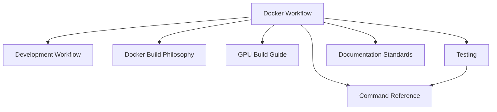

# File: documents/engineering/docker_workflow.md
# Docker Development Workflow

**Status**: Authoritative source  
**Supersedes**: docker_build_philosophy.md for workflow guidance (build doc still SSoT for images)  
**Referenced by**: engineering/README.md; command_reference.md; development_workflow.md; documentation_standards.md

> **Purpose**: Docker-only development contract for SpectralMC. Aligns naming with effectful while retaining SpectralMC’s GPU stack and `poetry run test-all` requirements.

## SSoT Link Map



| Need | Link |
|------|------|
| Daily dev loop | [Development Workflow](development_workflow.md) |
| Exact commands | [Command Reference](command_reference.md) |
| Build modes (binary/source) | [Docker Build Philosophy](docker_build_philosophy.md) |
| Legacy GPU build steps | [GPU Build Guide](gpu_build.md) |
| Test policies | [Testing](testing.md) |

## Development Contract

- **All engineering commands run inside Docker**: `docker compose -f docker/docker-compose.yml exec spectralmc poetry run <cmd>`.
- **Host-level Python/Poetry/pytest are forbidden**: no local virtualenvs, no `pytest`/`mypy`/`poetry` on the host.
- **GPU-first**: containers rely on NVIDIA runtime; ensure `nvidia-smi` works inside the `spectralmc` service.
- **Single source of truth for dependency install**: `poetry install` only inside the container; no pip installs outside the documented bootstraps in Dockerfiles.

## Command Patterns

```bash
# File: documents/engineering/docker_workflow.md
# Correct pattern (inside Docker)
docker compose -f docker/docker-compose.yml exec spectralmc poetry run check-code
docker compose -f docker/docker-compose.yml exec spectralmc poetry run test-all -v

# Forbidden on host
pytest tests/                # ❌ host-only pytest
poetry run check-code        # ❌ host poetry
python examples/demo.py      # ❌ host python
```

Optional shell alias:

```bash
# File: documents/engineering/docker_workflow.md
alias smc='docker compose -f docker/docker-compose.yml exec spectralmc poetry run'
# then: smc check-code, smc test-all, smc mypy
```

## Service Expectations

- `spectralmc` container provides code + Python toolchain.
- GPUs: available via `nvidia-container-toolkit`; validate with `docker compose ... exec spectralmc nvidia-smi`.
- Storage sidecars (S3/chain verification) are internal; avoid exposing extra ports unless required by product.

## Workflow Guardrails

- Use `poetry run check-code` before tests to enforce Ruff/Black/MyPy/link rules.
- Tests must be invoked via `poetry run test-all` (captures full logs to `/tmp/test-output.txt`).
- Build mode selection lives in compose args/`BUILD_FROM_SOURCE`; see `docker_build_philosophy.md` for details.
- Keep host clean: `poetry.toml` disables venv creation; do not override with `poetry config` commands.

## Troubleshooting (Inside Docker)

- **Container not running**: `docker compose -f docker/docker-compose.yml ps` → start with `up -d`.
- **GPU not visible**: check `nvidia-smi`; ensure Docker uses NVIDIA runtime.
- **Poetry cache issues**: rebuild container (`docker compose ... build --no-cache`) rather than running host installs.
- **Permission errors on bind mounts**: restart stack; avoid modifying permissions from host for mounted dirs.

## Cross-References

- [Docker Build Philosophy](docker_build_philosophy.md) for image layout and lockfile policy.
- [GPU Build Guide](gpu_build.md) for legacy GPUs (source build path).
- [Command Reference](command_reference.md) for canonical commands.
