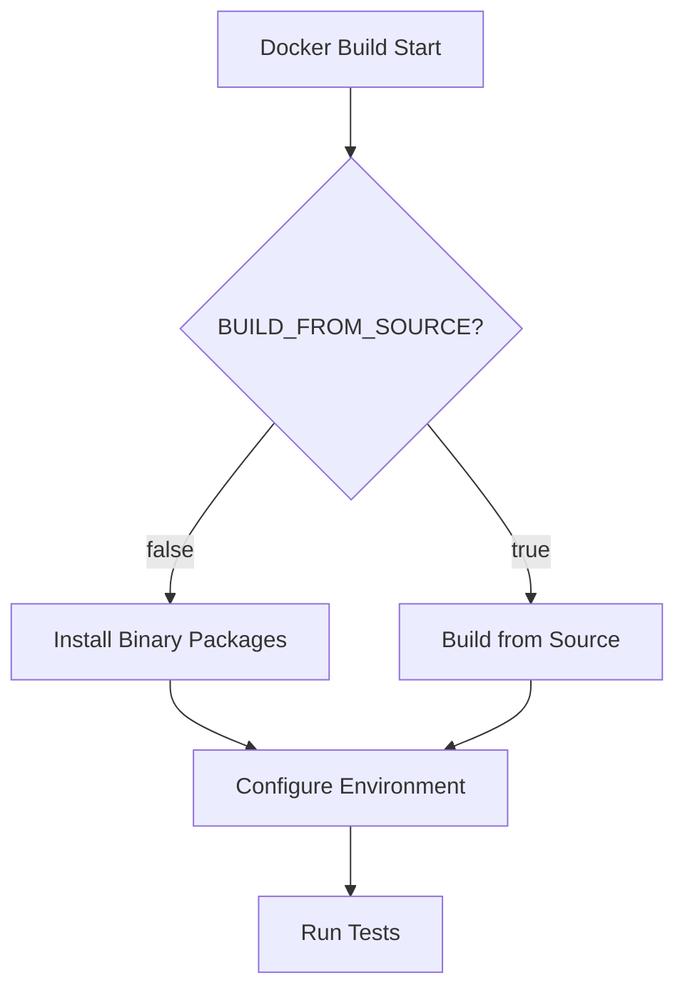
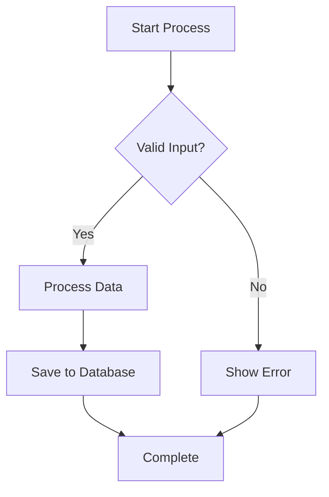
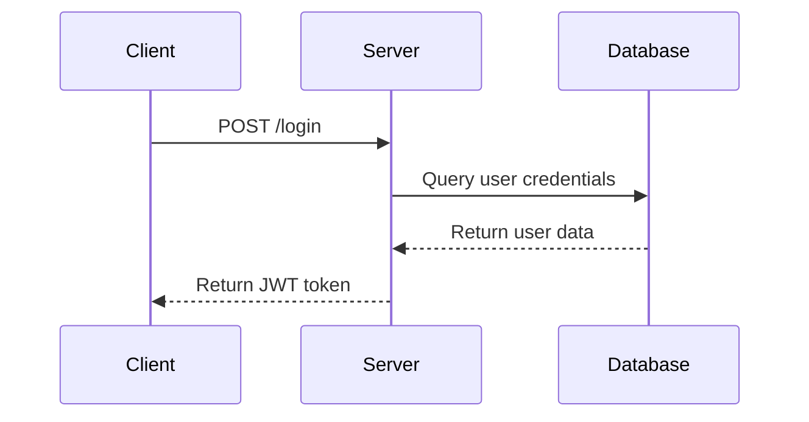
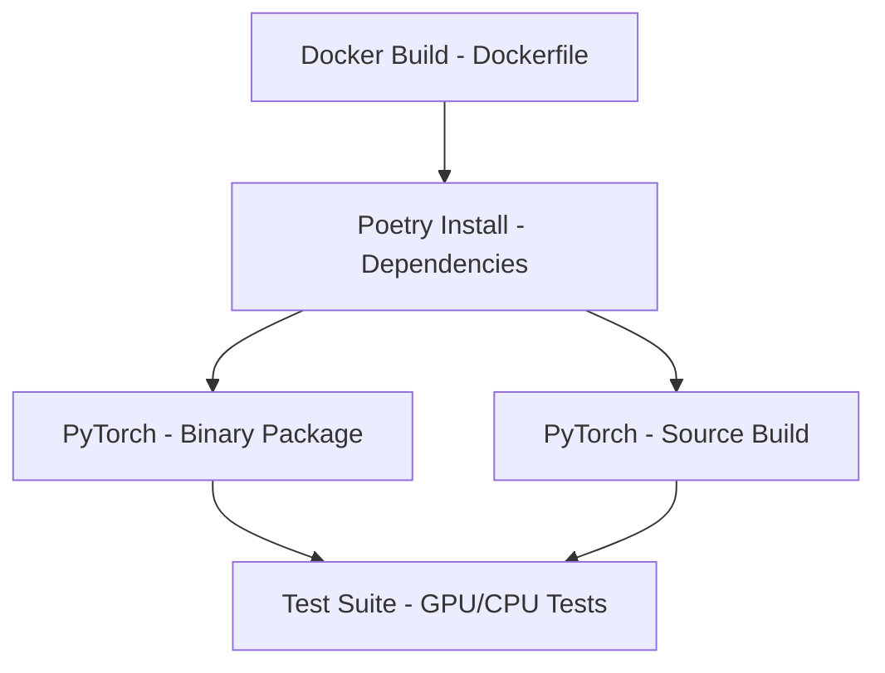
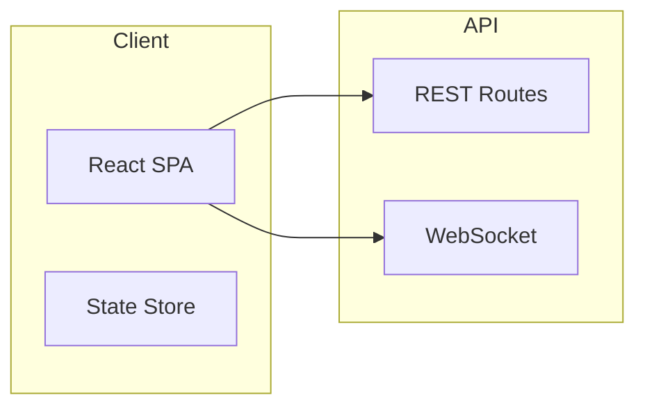
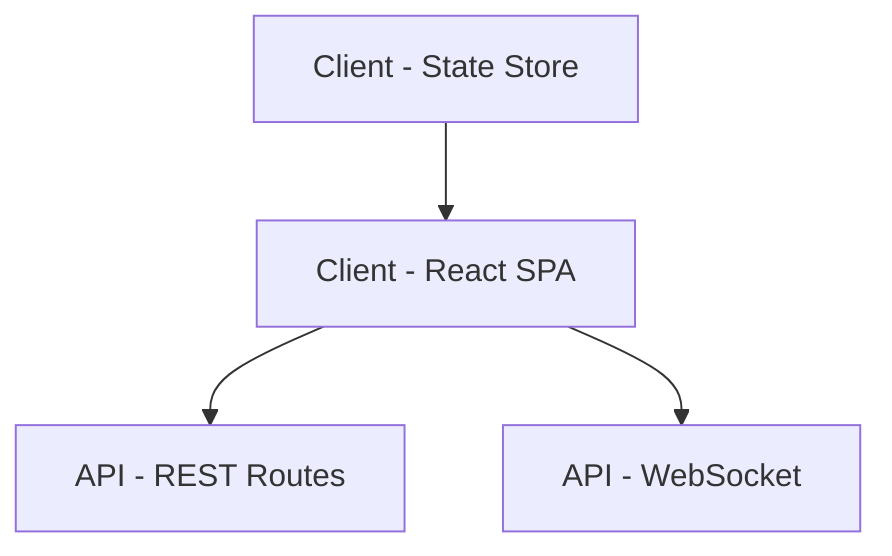
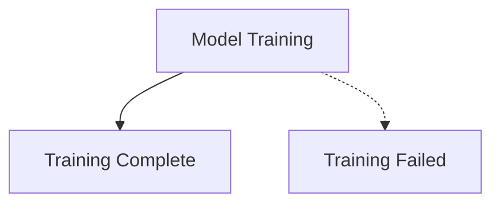
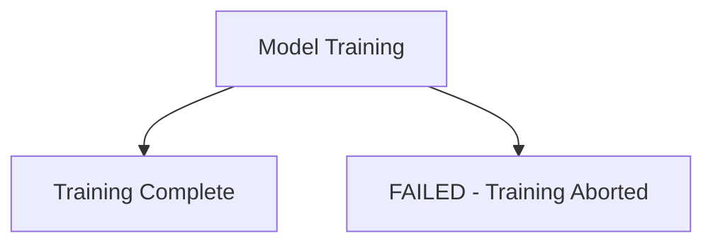
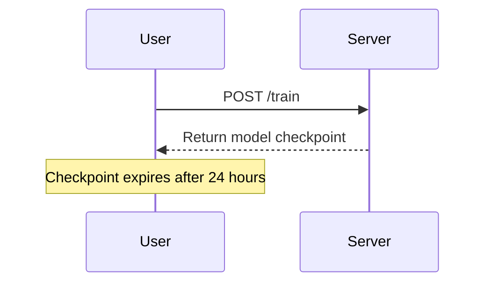
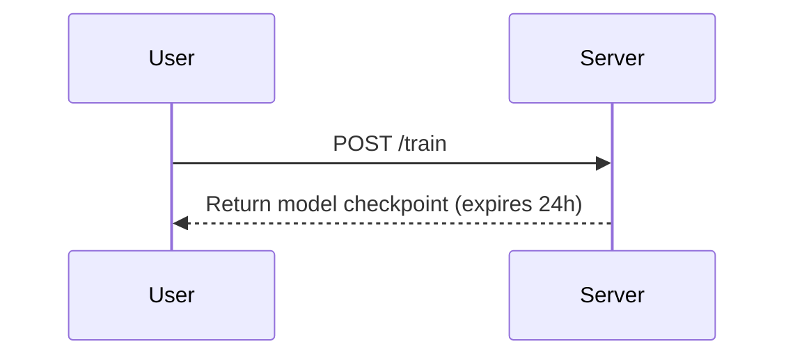

# Documentation Standards

## Overview

SpectralMC requires comprehensive documentation for all modules, functions, and classes. Documentation serves as executable specification and must be maintained alongside code.

**Related Standards**: [Coding Standards](coding_standards.md), [Pydantic Patterns](pydantic_patterns.md)

---

## Module Documentation

Every module must include comprehensive documentation at the top:

```python
"""
Complex-valued neural-network blocks for SpectralMC's test-suite
================================================================

Overview
--------
This module collects **fully-typed**, *dependency-free* PyTorch layers
that operate on pairs of real tensors representing the real and
imaginary parts of a complex signal.

Precision policy
----------------
The SpectralMC test-suite executes every case twice—once with
``torch.float32`` and once with ``torch.float64``.  For that reason **all
persistent state** (parameters *and* running statistics) is initialised
in the dtype returned by :pyfunc:`torch.get_default_dtype` *at
construction time*.

Layer catalogue
---------------

| Class name                        | Purpose                                                 |
| --------------------------------- | ------------------------------------------------------- |
| :class:`ComplexLinear`            | Dense ``ℂⁿ → ℂᵐ`` linear projection                      |
| :class:`zReLU`                    | First-quadrant rectifier (Guberman 2016)                |
| :class:`modReLU`                  | Magnitude gate with learned threshold (Arjovsky 2016)   |
"""
```

**Required elements**:
- One-line summary with visual separator (`===`)
- **Overview** section explaining module purpose
- **Implementation details** (precision policy, device handling, etc.)
- **Catalogue** or **API reference** listing main classes/functions

---

## Function Documentation

Use **Google-style docstrings** for all public functions and methods.

### Google-Style Format

Google-style docstrings use section headers followed by content. Key sections:

- **Args**: Function arguments (one per line)
- **Returns**: Return value description
- **Raises**: Exceptions that may be raised
- **Yields**: For generator functions
- **Note**: Additional implementation details
- **Example**: Usage examples (optional)

### Example from SpectralMC

```python
def forward(self, real: Tensor, imag: Tensor) -> tuple[Tensor, Tensor]:
    """Apply the affine projection.

    Args:
        real: Real part of input tensor, shape (batch, in_features).
        imag: Imaginary part of input tensor, shape (batch, in_features).

    Returns:
        Tuple of (real_output, imag_output) tensors with shape
        (batch, out_features).
    """
```

**Key features**:
- Brief summary (one line)
- Blank line after summary
- Section headers (`Args:`, `Returns:`)
- Type information in prose (redundant with type hints, but aids readability)
- Shape documentation for tensors

### Complete Function Example

```python
def complex_linear_forward(
    real_input: torch.Tensor,
    imag_input: torch.Tensor,
    real_weight: torch.Tensor,
    imag_weight: torch.Tensor,
    real_bias: torch.Tensor | None = None,
    imag_bias: torch.Tensor | None = None,
) -> tuple[torch.Tensor, torch.Tensor]:
    """Perform complex linear transformation.

    This function computes the complex matrix multiplication:
    W * z + b = (A x - B y) + i(B x + A y) + (b_real + i*b_imag)

    Args:
        real_input: Real part of input tensor, shape (batch_size, in_features).
        imag_input: Imaginary part of input tensor, shape (batch_size, in_features).
        real_weight: Real part of weight matrix, shape (out_features, in_features).
        imag_weight: Imaginary part of weight matrix, shape (out_features, in_features).
        real_bias: Real part of bias vector, shape (out_features,). Optional.
        imag_bias: Imaginary part of bias vector, shape (out_features,). Optional.

    Returns:
        Tuple of (real_output, imag_output) where each tensor has shape
        (batch_size, out_features).

    Raises:
        ValueError: If input tensor shapes are incompatible with weight matrices.

    Note:
        This implementation uses PyTorch's optimized matrix multiplication
        (torch.nn.functional.linear) for performance.

    Example:
        >>> real_in = torch.randn(32, 10)
        >>> imag_in = torch.randn(32, 10)
        >>> real_w = torch.randn(5, 10)
        >>> imag_w = torch.randn(5, 10)
        >>> real_out, imag_out = complex_linear_forward(
        ...     real_in, imag_in, real_w, imag_w
        ... )
        >>> real_out.shape
        torch.Size([32, 5])
    """
```

**Best practices**:
- Mathematical formulas when relevant
- Shape documentation for all tensor arguments
- Raise section documents exceptions
- Note section for implementation details
- Example section for non-obvious usage

---

## Class Documentation

Classes require documentation at class level **and** for all public methods:

```python
class ComplexLinear(nn.Module):
    """A fully-connected linear layer for complex-valued inputs.

    This layer supports complex weights and biases, and performs a linear transformation
    on a complex input vector. If the input is represented as (real, imag) components,
    the weight and bias are likewise represented by real and imaginary parts.

    The forward operation for a complex input z = x + i*y (with real part x and imaginary part y)
    and complex weight W = A + i*B (with real part A and imaginary part B) is:

        W * z + b = (A x - B y) + i(B x + A y) + (b_real + i*b_imag)

    where b_real and b_imag are the real and imaginary parts of the complex bias.

    Attributes:
        in_features: Number of input features (per complex component).
        out_features: Number of output features (per complex component).
        real_weight: Real part of weight matrix, shape (out_features, in_features).
        imag_weight: Imaginary part of weight matrix, shape (out_features, in_features).
        real_bias: Real part of bias vector, shape (out_features,), or None.
        imag_bias: Imaginary part of bias vector, shape (out_features,), or None.

    Example:
        >>> layer = ComplexLinear(in_features=10, out_features=5, bias=True)
        >>> real_input = torch.randn(32, 10)
        >>> imag_input = torch.randn(32, 10)
        >>> real_output, imag_output = layer(real_input, imag_input)
        >>> real_output.shape
        torch.Size([32, 5])
    """

    def __init__(self, in_features: int, out_features: int, bias: bool = True) -> None:
        """Initialize ComplexLinear layer.

        Args:
            in_features: Number of input features (per complex component).
            out_features: Number of output features (per complex component).
            bias: If True, include a complex bias term. Default: True.
        """
```

**Required elements**:
- Class-level docstring with overview
- Mathematical formulation when relevant
- Attributes section documenting all public attributes
- Example section showing typical usage
- `__init__` docstring documenting parameters

---

## Technical Documentation

Maintain the `documents/whitepapers/` folder with technical papers and implementation details:

### Existing Whitepapers

- `documents/whitepapers/spectralmc_whitepaper.md` - Core mathematical foundations
- `documents/whitepapers/characteristic_function_for_stochastic_processes.md` - Theory background
- `documents/whitepapers/deep_complex_valued_set_encoders.md` - Architecture details
- `documents/whitepapers/variable_length_cvnn_inputs.md` - Input handling
- `documents/whitepapers/imaginary_numbers_unified_intuition.md` - Mathematical intuition

### When to Create Whitepapers

Create new whitepapers for:

1. **Novel algorithms** - Original methods not found in literature
2. **Mathematical foundations** - Theoretical background for implementations
3. **Architecture decisions** - Why specific designs were chosen
4. **Performance optimizations** - Non-obvious GPU/CUDA optimizations

**Do NOT create whitepapers for**:
- Standard algorithms (link to papers instead)
- Implementation details covered by docstrings
- Temporary design experiments

---

## Docstring Formatting Rules

### Line Length

Docstrings should wrap at **88 characters** (Black's default) for consistency with code:

```python
def long_function_name(
    very_long_parameter_name: int,
    another_long_parameter: str,
) -> dict[str, float]:
    """This is a summary line that fits within 88 characters.

    This is the detailed description. It can span multiple lines and should
    wrap at 88 characters to match Black's formatting. This ensures that
    docstrings are readable both in source code and in generated documentation.

    Args:
        very_long_parameter_name: Description that may wrap to multiple lines
            if it exceeds 88 characters. Continuation lines are indented.
        another_long_parameter: Another parameter with a potentially long
            description that wraps gracefully.

    Returns:
        Dictionary mapping string keys to float values, representing the
        computed results.
    """
```

### Mathematical Notation

Use reStructuredText math directives for complex equations:

```python
def black_scholes_call(spot: float, strike: float, maturity: float) -> float:
    """Compute Black-Scholes call option price.

    Uses the Black-Scholes formula:

    .. math::

        C(S, t) = S N(d_1) - K e^{-r(T-t)} N(d_2)

    where:

    .. math::

        d_1 = \\frac{\\ln(S/K) + (r + \\sigma^2/2)(T-t)}{\\sigma\\sqrt{T-t}}

        d_2 = d_1 - \\sigma\\sqrt{T-t}

    Args:
        spot: Current stock price S.
        strike: Strike price K.
        maturity: Time to maturity T-t.

    Returns:
        Call option price C(S, t).
    """
```

Alternatively, use inline LaTeX for simpler formulas:

```python
def drift(rate: float, volatility: float) -> float:
    """Compute drift coefficient μ - σ²/2.

    Args:
        rate: Risk-free rate μ.
        volatility: Volatility σ.

    Returns:
        Drift coefficient for GBM simulation.
    """
```

---

## Code Examples in Docstrings

### Doctest Format

Use doctest format for executable examples:

```python
def add(a: int, b: int) -> int:
    """Add two integers.

    Args:
        a: First integer.
        b: Second integer.

    Returns:
        Sum of a and b.

    Example:
        >>> add(2, 3)
        5
        >>> add(-1, 1)
        0
    """
    return a + b
```

**Note**: SpectralMC does **not currently run doctests**, but the format is familiar and readable.

### Code Block Format

For non-executable examples, use code blocks:

```python
def train_model(config: Config) -> Model:
    """Train a model with given configuration.

    Example:
        ```python
        config = Config(learning_rate=0.001, epochs=100)
        model = train_model(config)
        predictions = model.predict(test_data)
        ```

    Args:
        config: Training configuration.

    Returns:
        Trained model.
    """
```

---

## Visual Documentation with Mermaid

SpectralMC uses Mermaid diagrams for architectural documentation, workflows, and system diagrams. All diagrams must follow universal compatibility guidelines to render correctly in both GitHub and VSCode.

**Related Standards**: [Docker Build Philosophy](docker_build_philosophy.md), [CPU/GPU Compute Policy](cpu_gpu_compute_policy.md)

### Orientation Guidelines

**Core Principle**: Always orient the largest axis vertically (TB direction) for maximum readability.

Diagrams that are wider than they are tall appear very small when rendered. To maximize readability:

#### When to Use TB (Top-Bottom) - Preferred

- **Sequential workflows** with more than 3 steps
- **State machines** showing status transitions
- **Decision trees** with multiple branches
- **Any diagram where the longest chain of elements would run horizontally**

#### When LR (Left-Right) is Acceptable

- Diagrams with **3 or fewer sequential elements**
- Diagrams showing **parallel/concurrent relationships** (not sequential)
- Simple input → output flows with minimal intermediate steps

#### Rule of Thumb

Count the elements in your longest chain. If more than 3, use TB orientation.

**Example from docker_build_philosophy.md**:



---

### Quick Reference: Safe vs Unsafe Syntax

#### ✅ ALWAYS SAFE TO USE

**Flowcharts**:
- Keyword: `flowchart TB` (preferred) or `flowchart LR` (only for simple diagrams)
- Node shapes: `[Box]`, `(Rounded)`, `{Diamond}` only
- Arrows: `-->` solid arrows only
- Arrow labels: `A -->|label text| B`

**Sequence Diagrams**:
- Keyword: `sequenceDiagram`
- Arrows: `->>` (solid) and `-->>` (dashed response) only
- Participants: Simple alphanumeric names
- Keep it simple: avoid complex `alt/opt/loop` nesting

#### ❌ ALWAYS AVOID

**High-Risk Features**:
- ❌ Dotted lines: `-.->`, `-.-`, `..`
- ❌ Subgraphs: `subgraph` keyword
- ❌ Thick arrows: `==>`
- ❌ Note over: `Note over Participant`
- ❌ Special characters in labels: minimize `:`, `-`, `()` in text
- ❌ Mixed arrow types in same diagram
- ❌ Comments inside diagrams: `%%`

---

### Common Safe Patterns

#### Pattern 1: Simple Flowchart (Process Flow)

**Use Case**: Process flows, decision trees, system architecture



**Why it works**: Simple nodes, solid arrows only, clear TB flow direction.

#### Pattern 2: Sequence Diagram (API Calls)

**Use Case**: API calls, authentication flows, message passing



**Why it works**: Simple participants, solid arrows only, no complex blocks.

#### Pattern 3: Architecture Diagram (Flat Structure)

**Use Case**: System components, service topology



**Why it works**: No subgraphs, uses prefixed node names for grouping, TB orientation ensures readability.

---

### Problematic Patterns + Fixes

#### Problem 1: Subgraphs for Grouping

**❌ WRONG** (fails in VSCode):



**✅ CORRECT** (works everywhere):



**Fix Strategy**: Flatten hierarchy, use prefixed node names (e.g., "Client - ", "API - "), use TB for better readability.

#### Problem 2: Dotted Lines for Status Indicators

**❌ WRONG** (fails in VSCode):



**✅ CORRECT** (works everywhere):



**Fix Strategy**: Use solid arrows, add status prefix to node label (e.g., "FAILED - ", "BLOCKED - ").

#### Problem 3: Note Over in Sequence Diagrams

**❌ WRONG** (fails in some VSCode):



**✅ CORRECT** (works everywhere):



**Fix Strategy**: Move note text into arrow label or participant message.

---

### Testing Checklist

Before committing Mermaid diagrams, verify:

- [ ] Diagram uses only safe patterns from this guide
- [ ] No dotted lines (`-.->`)
- [ ] No subgraphs (`subgraph`)
- [ ] No `Note over` in sequences
- [ ] Labels use simple text (no `:`, `()`, `{}`)
- [ ] Uses TB orientation for diagrams with >3 elements
- [ ] Tested in GitHub preview (push to branch, view in GitHub)
- [ ] Tested in VSCode with Markdown Preview Mermaid Support extension

**VSCode Extension**: Install "Markdown Preview Mermaid Support" by Matt Bierner (`bierner.markdown-mermaid`) for local testing.

---

## Summary

- **Module docs**: Overview, implementation details, API catalogue
- **Function docs**: Google-style with Args, Returns, Raises sections
- **Class docs**: Overview, mathematical formulation, Attributes, Example
- **Technical docs**: Whitepapers in `documents/whitepapers/` for theory
- **Visual docs**: Mermaid diagrams with universal compatibility (TB orientation, safe syntax)
- **Formatting**: 88-character line wrap, consistent with Black
- **Math notation**: reStructuredText or inline LaTeX
- **Examples**: Doctest format or code blocks

See also: [Coding Standards](coding_standards.md), [Docker Build Philosophy](docker_build_philosophy.md)
