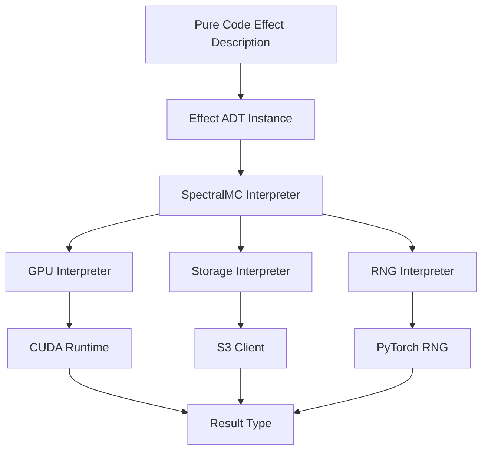
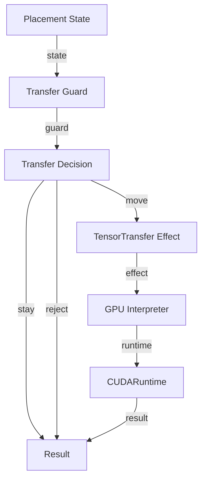
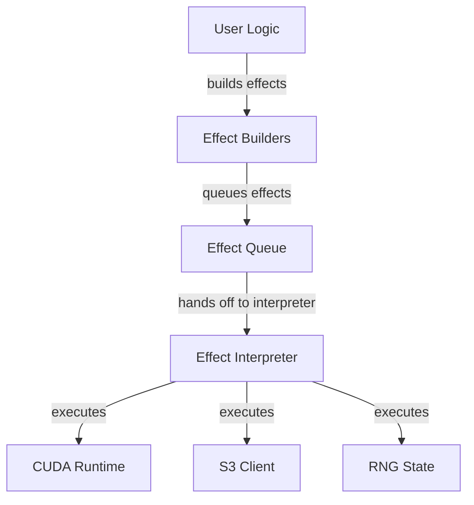
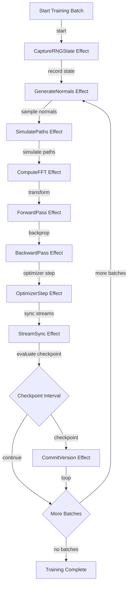

# File: documents/engineering/effect_interpreter.md
# Effect Interpreter Doctrine

**Status**: Authoritative source  
**Supersedes**: Prior effect interpreter drafts  
**Referenced by**: documents/documentation_standards.md; documents/engineering/README.md

> **Purpose**: Describe SpectralMC’s Effect Interpreter pattern for isolating side effects.

## Cross-References
- [Purity Doctrine](purity_doctrine.md)
- [Immutability Doctrine](immutability_doctrine.md)
- [Reproducibility Proofs](reproducibility_proofs.md)
- [Coding Standards](coding_standards.md)
- [Total Pure Modelling](total_pure_modelling.md)

## Overview

SpectralMC uses the **Effect Interpreter pattern** to separate the description of
computations from their execution. All side effects (GPU operations, storage I/O, RNG
state) are modeled as pure, immutable ADT types that are interpreted by a single execution
layer.

**Core Principle**: Pure code describes WHAT to do; the interpreter decides HOW and WHEN.

**Benefits**:
- **Testability**: Pure effect descriptions can be tested without GPU hardware
- **Reproducibility**: Effects capture complete execution context for deterministic replay
- **Composability**: Effects combine without coupling to execution details
- **Type Safety**: Invalid effect combinations prevented at compile time via ADTs

**Related Standards**:
- [Purity Doctrine](purity_doctrine.md) - Pure functions, no `for`/`if`/`raise`
- [Coding Standards](coding_standards.md) - Result types and ADT patterns (SSoT)
- [Immutability Doctrine](immutability_doctrine.md) - Frozen dataclasses
- [CPU/GPU Compute Policy](cpu_gpu_compute_policy.md) - Device placement rules
- [Reproducibility Proofs](reproducibility_proofs.md) - Determinism guarantees
- [Total Pure Modelling](total_pure_modelling.md) - Pure state machines that feed effects

---

## Effect ADT Hierarchy

All side effects in SpectralMC are represented as frozen dataclasses organized into a
discriminated union hierarchy. This follows the existing patterns in
[`result.py`](../../src/spectralmc/result.py) and
[`s3_errors.py`](../../src/spectralmc/storage/s3_errors.py).

### Type Hierarchy Diagram

```mermaid
flowchart TB
    Effect[Effect]
    GPUEffect[GPUEffect]
    TrainingEffect[TrainingEffect]
    StorageEffect[StorageEffect]
    RNGEffect[RNGEffect]
    MonteCarloEffect[MonteCarloEffect]

    TensorTransfer[TensorTransfer]
    StreamSync[StreamSync]
    KernelLaunch[KernelLaunch]
    ForwardPass[ForwardPass]
    BackwardPass[BackwardPass]
    OptimizerStep[OptimizerStep]
    ReadObject[ReadObject]
    WriteObject[WriteObject]
    CommitVersion[CommitVersion]
    CaptureRNG[CaptureRNGState]
    RestoreRNG[RestoreRNGState]
    GenerateNormals[GenerateNormals]
    SimulatePaths[SimulatePaths]
    ComputeFFT[ComputeFFT]

    Effect --> GPUEffect
    Effect --> TrainingEffect
    Effect --> StorageEffect
    Effect --> RNGEffect
    Effect --> MonteCarloEffect

    GPUEffect --> TensorTransfer
    GPUEffect --> StreamSync
    GPUEffect --> KernelLaunch
    TrainingEffect --> ForwardPass
    TrainingEffect --> BackwardPass
    TrainingEffect --> OptimizerStep
    StorageEffect --> ReadObject
    StorageEffect --> WriteObject
    StorageEffect --> CommitVersion
    RNGEffect --> CaptureRNG
    RNGEffect --> RestoreRNG
    MonteCarloEffect --> GenerateNormals
    MonteCarloEffect --> SimulatePaths
    MonteCarloEffect --> ComputeFFT
```



**Logging Effects**

- Use `LogMessage` to describe log side effects (level, message, logger name).
- Only the `LoggingInterpreter` emits log records; business logic must remain pure.
- Prefer logging effects over direct `logger.*` calls to preserve determinism and reviewability.

### Complete Effect ADT Implementation

The following code is production-ready and follows SpectralMC's strict typing requirements
(`mypy --strict`, no `Any`, `cast`, or `type: ignore`).

```python
# File: documents/engineering/effect_interpreter.md
"""
Effect ADT - Algebraic Data Types for all side effects in SpectralMC.

This module defines frozen dataclasses representing all effectful operations,
enabling exhaustive pattern matching and type-safe effect composition.

Type Safety:
    - All effect types are frozen dataclasses (immutable)
    - Literal discriminators enable exhaustive pattern matching
    - Union types define closed sets of effect variants
    - __post_init__ validation prevents illegal state construction

See Also:
    - effect_interpreter.md - Effect Interpreter doctrine
    - coding_standards.md - ADT patterns and Result types
"""

from __future__ import annotations

from dataclasses import dataclass
from typing import Literal, TypeVar, Generic, Callable, Coroutine, Protocol

from spectralmc.models.cpu_gpu_transfer import OutputPinning, StagePolicy
from spectralmc.models.torch import Device
from spectralmc.result import Result, Success, Failure


T = TypeVar("T")
E = TypeVar("E")
U = TypeVar("U")


# =============================================================================
# GPU Effects
# =============================================================================

@dataclass(frozen=True)
class TensorTransfer:
    """Request to transfer tensor between devices.

    Note: Only constructible via tensor_transfer() factory function,
    which returns Result[TensorTransfer, InvalidTransferError].

    Attributes:
        kind: Discriminator for pattern matching. Always "TensorTransfer".
        source_device: Device to transfer from.
        target_device: Device to transfer to.
        tensor_id: Opaque identifier for the tensor or TensorTree.
        output_pinning: Host pinning intent for CPU targets (explicit state, no booleans).
        stage_policy: Explicit staging policy (allow/forbid) instead of boolean flags.

    Example:
        >>> match tensor_transfer(Device.cuda, Device.cpu, "model_weights"):
        ...     case Success(effect):
        ...         print(f"Transfer {effect.source_device} -> {effect.target_device}")
        ...     case Failure(error):
        ...         print(f"Invalid: {error.device}")
    """
    kind: Literal["TensorTransfer"] = "TensorTransfer"
    source_device: Device = Device.cuda
    target_device: Device = Device.cpu
    tensor_id: str = ""
    output_pinning: OutputPinning = OutputPinning.UNPINNED
    stage_policy: StagePolicy = StagePolicy.ALLOW


@dataclass(frozen=True)
class InvalidTransferError:
    """Error when source and target device are identical."""
    device: Device


def tensor_transfer(
    source: Device,
    target: Device,
    tensor_id: str = "",
    *,
    output_pinning: OutputPinning = OutputPinning.UNPINNED,
    stage_policy: StagePolicy = StagePolicy.ALLOW,
) -> Result[TensorTransfer, InvalidTransferError]:
    """Create TensorTransfer, returning Failure if devices are identical.

    This is the ONLY way to construct a TensorTransfer. Direct construction
    is private (no validation). Use this factory to ensure valid transfers.

    Example:
        >>> match tensor_transfer(Device.cuda, Device.cpu, "weights"):
        ...     case Success(effect):
        ...         # Valid transfer
        ...         pass
        ...     case Failure(error):
        ...         # Invalid: same device
        ...         pass
    """
    return (
        Failure(InvalidTransferError(device=source))
        if source == target
        else Success(
            TensorTransfer(
                source_device=source,
                target_device=target,
                tensor_id=tensor_id,
                output_pinning=output_pinning,
                stage_policy=stage_policy,
            )
        )
    )


@dataclass(frozen=True)
class StreamSync:
    """Request to synchronize a CUDA stream.

    Attributes:
        kind: Discriminator for pattern matching. Always "StreamSync".
        stream_type: Which stream type to synchronize.
    """
    kind: Literal["StreamSync"] = "StreamSync"
    stream_type: Literal["torch", "cupy", "numba"] = "torch"


@dataclass(frozen=True)
class KernelLaunch:
    """Request to launch a CUDA kernel.

    Attributes:
        kind: Discriminator for pattern matching. Always "KernelLaunch".
        kernel_name: Name of the kernel function.
        grid_config: Grid dimensions for kernel launch.
        block_config: Block dimensions for kernel launch.
    """
    kind: Literal["KernelLaunch"] = "KernelLaunch"
    kernel_name: str = ""
    grid_config: tuple[int, ...] = ()
    block_config: tuple[int, ...] = ()


# GPU Effect Union - enables exhaustive pattern matching
GPUEffect = TensorTransfer | StreamSync | KernelLaunch


# =============================================================================
# Training Effects
# =============================================================================

@dataclass(frozen=True)
class ForwardPass:
    """Request to execute forward pass through a model.

    Attributes:
        kind: Discriminator for pattern matching. Always "ForwardPass".
        model_id: Identifier for the model to use.
        input_tensor_id: Identifier for the input tensor.
    """
    kind: Literal["ForwardPass"] = "ForwardPass"
    model_id: str = ""
    input_tensor_id: str = ""


@dataclass(frozen=True)
class BackwardPass:
    """Request to compute gradients via backpropagation.

    Attributes:
        kind: Discriminator for pattern matching. Always "BackwardPass".
        loss_tensor_id: Identifier for the loss tensor to backpropagate from.
    """
    kind: Literal["BackwardPass"] = "BackwardPass"
    loss_tensor_id: str = ""


@dataclass(frozen=True)
class OptimizerStep:
    """Request to update model parameters using optimizer.

    Attributes:
        kind: Discriminator for pattern matching. Always "OptimizerStep".
        optimizer_id: Identifier for the optimizer to step.
    """
    kind: Literal["OptimizerStep"] = "OptimizerStep"
    optimizer_id: str = ""


# Training Effect Union
TrainingEffect = ForwardPass | BackwardPass | OptimizerStep


# =============================================================================
# Monte Carlo Effects
# =============================================================================

@dataclass(frozen=True)
class GenerateNormals:
    """Request to generate standard normal random matrix on GPU.

    Attributes:
        kind: Discriminator for pattern matching. Always "GenerateNormals".
        rows: Number of rows in the output matrix.
        cols: Number of columns in the output matrix.
        seed: Random seed for reproducibility.
        skip: Number of random values to skip (for resuming).
    """
    kind: Literal["GenerateNormals"] = "GenerateNormals"
    rows: int = 0
    cols: int = 0
    seed: int = 0
    skip: int = 0


@dataclass(frozen=True)
class SimulatePaths:
    """Request to simulate GBM price paths on GPU.

    Attributes:
        kind: Discriminator for pattern matching. Always "SimulatePaths".
        spot: Initial spot price.
        strike: Strike price.
        rate: Risk-free interest rate.
        vol: Volatility.
        expiry: Time to expiration in years.
        timesteps: Number of timesteps to simulate.
        batches: Number of parallel simulations.
    """
    kind: Literal["SimulatePaths"] = "SimulatePaths"
    spot: float = 100.0
    strike: float = 100.0
    rate: float = 0.05
    vol: float = 0.2
    expiry: float = 1.0
    timesteps: int = 252
    batches: int = 1024


@dataclass(frozen=True)
class ComputeFFT:
    """Request to compute FFT on GPU tensor.

    Attributes:
        kind: Discriminator for pattern matching. Always "ComputeFFT".
        input_tensor_id: Identifier for the input tensor.
        axis: Axis along which to compute FFT.
    """
    kind: Literal["ComputeFFT"] = "ComputeFFT"
    input_tensor_id: str = ""
    axis: int = -1


# Monte Carlo Effect Union
MonteCarloEffect = GenerateNormals | SimulatePaths | ComputeFFT


# =============================================================================
# Storage Effects
# =============================================================================

@dataclass(frozen=True)
class ReadObject:
    """Request to read an object from S3 storage.

    Attributes:
        kind: Discriminator for pattern matching. Always "ReadObject".
        bucket: S3 bucket name.
        key: Object key within the bucket.
    """
    kind: Literal["ReadObject"] = "ReadObject"
    bucket: str = ""
    key: str = ""


@dataclass(frozen=True)
class WriteObject:
    """Request to write an object to S3 storage.

    Attributes:
        kind: Discriminator for pattern matching. Always "WriteObject".
        bucket: S3 bucket name.
        key: Object key within the bucket.
        content_hash: SHA256 hash of the content for verification.
    """
    kind: Literal["WriteObject"] = "WriteObject"
    bucket: str = ""
    key: str = ""
    content_hash: str = ""


@dataclass(frozen=True)
class CommitVersion:
    """Request to commit a new model version to blockchain storage.

    Attributes:
        kind: Discriminator for pattern matching. Always "CommitVersion".
        parent_counter: Counter of the parent version (None for genesis).
        checkpoint_hash: SHA256 hash of the checkpoint content.
        message: Commit message describing the version.
    """
    kind: Literal["CommitVersion"] = "CommitVersion"
    parent_counter: int | None = None
    checkpoint_hash: str = ""
    message: str = ""


# Storage Effect Union
StorageEffect = ReadObject | WriteObject | CommitVersion


# =============================================================================
# RNG Effects
# =============================================================================

@dataclass(frozen=True)
class CaptureRNGState:
    """Request to capture current RNG state.

    Attributes:
        kind: Discriminator for pattern matching. Always "CaptureRNGState".
        rng_type: Which RNG state to capture.
    """
    kind: Literal["CaptureRNGState"] = "CaptureRNGState"
    rng_type: Literal["torch_cpu", "torch_cuda", "cupy", "numpy"] = "torch_cpu"


@dataclass(frozen=True)
class RestoreRNGState:
    """Request to restore previously captured RNG state.

    Attributes:
        kind: Discriminator for pattern matching. Always "RestoreRNGState".
        rng_type: Which RNG state to restore.
        state_bytes: The captured state as bytes.
    """
    kind: Literal["RestoreRNGState"] = "RestoreRNGState"
    rng_type: Literal["torch_cpu", "torch_cuda", "cupy", "numpy"] = "torch_cpu"
    state_bytes: bytes = b""


# RNG Effect Union
RNGEffect = CaptureRNGState | RestoreRNGState


# =============================================================================
# Master Effect Union
# =============================================================================

Effect = GPUEffect | TrainingEffect | MonteCarloEffect | StorageEffect | RNGEffect
```

---

## Effect Interpreter Protocol

The interpreter is the **only place** where effects are executed. All other code produces
pure effect descriptions.

### Interpreter Flow Diagram



### Total Pure Models Driving Effects

Effect construction is driven by total, pure state machines described in
[total_pure_modelling.md](total_pure_modelling.md). Pure guards decide device placement,
storage ownership, and retries; interpreters only execute those decisions.



**Device transfer walkthrough**
- Pure guard computes `StayOnGpu`, `MoveToCpu(reason)`, or `RejectTransfer(reason)`; no
  silent fallbacks or missing variants.
- Only `MoveToCpu` builds a `TensorTransfer` effect; `RejectTransfer` returns a pure
  failure that tests assert on.
- Interpreters read the effect and run CUDA or host operations; they never decide whether
  a transfer is allowed.

### Pure vs Effectful Code Boundary



### Interpreter Protocol Implementation

```python
# File: documents/engineering/effect_interpreter.md
"""
Effect Interpreter Protocol and implementations.

The interpreter is the ONLY place where side effects are executed.
All other code produces pure effect descriptions.
"""

from __future__ import annotations

from typing import Protocol, TypeVar, Never
from spectralmc.result import Result, Success, Failure

T = TypeVar("T", covariant=True)
E = TypeVar("E", covariant=True)


def assert_never(value: Never) -> Never:
    """Type-safe exhaustiveness check for pattern matching.

    Use this in the default case of match statements to ensure
    all variants are handled. If a new variant is added but not
    handled, mypy will report an error.

    Example:
        >>> match effect:
        ...     case TensorTransfer(): ...
        ...     case StreamSync(): ...
        ...     case _:
        ...         assert_never(effect)  # mypy error if variants missing
    """
    raise AssertionError(f"Unhandled case: {value!r}")


class EffectInterpreter(Protocol[T, E]):
    """Protocol for effect interpretation.

    Each interpreter handles a specific category of effects and
    returns a Result type for explicit error handling.
    """

    async def interpret(self, effect: Effect) -> Result[T, E]:
        """Execute a single effect and return the result."""
        ...


class GPUInterpreter:
    """Interpreter for GPU effects.

    Handles tensor transfers, stream synchronization, and kernel launches.
    Coordinates between PyTorch, CuPy, and Numba CUDA streams.
    """

    def __init__(
        self,
        torch_stream: torch.cuda.Stream,
        cupy_stream: CuPyStream,
    ) -> None:
        self._torch_stream = torch_stream
        self._cupy_stream = cupy_stream

    async def interpret(self, effect: GPUEffect) -> Result[None, GPUError]:
        """Execute GPU effect with stream coordination."""
        match effect:
            case TensorTransfer(source_device=src, target_device=dst, tensor_id=tid):
                return await self._transfer_tensor(src, dst, tid)
            case StreamSync(stream_type=st):
                return await self._sync_stream(st)
            case KernelLaunch(kernel_name=name, grid_config=grid, block_config=block):
                return await self._launch_kernel(name, grid, block)
            case _:
                assert_never(effect)

    async def _transfer_tensor(
        self, src: Device, dst: Device, tensor_id: str
    ) -> Result[None, GPUError]:
        """Transfer tensor between devices using TensorTree API."""
        # Implementation uses spectralmc.models.cpu_gpu_transfer
        ...

    async def _sync_stream(self, stream_type: str) -> Result[None, GPUError]:
        """Synchronize the specified CUDA stream."""
        match stream_type:
            case "torch":
                self._torch_stream.synchronize()
            case "cupy":
                self._cupy_stream.synchronize()
            case "numba":
                # Numba stream sync
                ...
        return Success(None)

    async def _launch_kernel(
        self, name: str, grid: tuple[int, ...], block: tuple[int, ...]
    ) -> Result[None, GPUError]:
        """Launch a CUDA kernel."""
        # Implementation dispatches to registered kernel functions
        ...


class StorageInterpreter:
    """Interpreter for storage effects.

    Handles S3 reads, writes, and blockchain version commits.
    Uses AsyncBlockchainModelStore for atomic operations.
    """

    def __init__(self, store: AsyncBlockchainModelStore) -> None:
        self._store = store

    async def interpret(self, effect: StorageEffect) -> Result[object, StorageError]:
        """Execute storage effect."""
        match effect:
            case ReadObject(bucket=b, key=k):
                return await self._read_object(b, k)
            case WriteObject(bucket=b, key=k, content_hash=h):
                return await self._write_object(b, k, h)
            case CommitVersion(parent_counter=p, checkpoint_hash=h, message=m):
                return await self._commit_version(p, h, m)
            case _:
                assert_never(effect)


class RNGInterpreter:
    """Interpreter for RNG effects.

    Captures and restores RNG states for reproducibility.
    See reproducibility_proofs.md for determinism guarantees.
    """

    async def interpret(self, effect: RNGEffect) -> Result[bytes | None, RNGError]:
        """Execute RNG effect."""
        match effect:
            case CaptureRNGState(rng_type=rt):
                return await self._capture_state(rt)
            case RestoreRNGState(rng_type=rt, state_bytes=sb):
                return await self._restore_state(rt, sb)
            case _:
                assert_never(effect)

    async def _capture_state(
        self, rng_type: str
    ) -> Result[bytes, RNGError]:
        """Capture RNG state as bytes for serialization."""
        match rng_type:
            case "torch_cpu":
                state = torch.get_rng_state().cpu().numpy().tobytes()
                return Success(state)
            case "torch_cuda":
                states = torch.cuda.get_rng_state_all()
                # Serialize all CUDA device states
                ...
            case "numpy":
                # numpy.random state capture
                ...
        return Failure(RNGError(f"Unknown RNG type: {rng_type}"))


class SpectralMCInterpreter:
    """Master interpreter composing all effect interpreters.

    Routes effects to the appropriate sub-interpreter based on type.
    This is the ONLY entry point for effect execution in SpectralMC.

    Example:
        >>> interpreter = SpectralMCInterpreter(gpu, storage, rng)
        >>> result = await interpreter.interpret(effect)
        >>> match result:
        ...     case Success(value): ...
        ...     case Failure(error): ...
    """

    def __init__(
        self,
        gpu: GPUInterpreter,
        storage: StorageInterpreter,
        rng: RNGInterpreter,
    ) -> None:
        self._gpu = gpu
        self._storage = storage
        self._rng = rng

    async def interpret(self, effect: Effect) -> Result[object, EffectError]:
        """Route effect to appropriate sub-interpreter."""
        match effect:
            case TensorTransfer() | StreamSync() | KernelLaunch():
                return await self._gpu.interpret(effect)
            case ForwardPass() | BackwardPass() | OptimizerStep():
                return await self._training.interpret(effect)
            case GenerateNormals() | SimulatePaths() | ComputeFFT():
                return await self._montecarlo.interpret(effect)
            case ReadObject() | WriteObject() | CommitVersion():
                return await self._storage.interpret(effect)
            case CaptureRNGState() | RestoreRNGState():
                return await self._rng.interpret(effect)
            case _:
                assert_never(effect)
```

---

## Effect Composition

Effects can be composed sequentially or in parallel while maintaining purity.

### Sequential Composition

```python
# File: documents/engineering/effect_interpreter.md
@dataclass(frozen=True)
class EffectSequence(Generic[T]):
    """Sequence of effects to execute in order.

    Attributes:
        effects: Tuple of effects to execute sequentially.
        continuation: Function to combine results into final value.

    Example:
        >>> training_step = EffectSequence(
        ...     effects=(
        ...         ForwardPass(model_id="cvnn", input_tensor_id="batch"),
        ...         BackwardPass(loss_tensor_id="loss"),
        ...         OptimizerStep(optimizer_id="adam"),
        ...         StreamSync(stream_type="torch"),
        ...     ),
        ...     continuation=lambda results: results[-1],
        ... )
    """
    effects: tuple[Effect, ...]
    continuation: Callable[[list[object]], T]


def sequence_effects(*effects: Effect) -> EffectSequence[list[object]]:
    """Compose effects to execute sequentially.

    Returns:
        EffectSequence that executes effects in order and returns all results.
    """
    return EffectSequence(effects=effects, continuation=lambda x: x)


def map_effect(
    effect: Effect,
    f: Callable[[object], T]
) -> EffectSequence[T]:
    """Map a function over an effect's result.

    This is the functor operation for effects.
    """
    return EffectSequence(
        effects=(effect,),
        continuation=lambda results: f(results[0])
    )
```

### Parallel Composition

```python
# File: documents/engineering/effect_interpreter.md
@dataclass(frozen=True)
class EffectParallel(Generic[T]):
    """Parallel effects to execute concurrently.

    Only use for effects that are truly independent with no ordering
    requirements. The interpreter may execute these in any order or
    concurrently.

    Attributes:
        effects: Tuple of independent effects.
        combiner: Function to combine all results.

    Example:
        >>> # Upload multiple artifacts in parallel
        >>> upload_artifacts = EffectParallel(
        ...     effects=(
        ...         WriteObject(bucket="models", key="v1/checkpoint.pb", ...),
        ...         WriteObject(bucket="models", key="v1/metadata.json", ...),
        ...         WriteObject(bucket="models", key="v1/content_hash.txt", ...),
        ...     ),
        ...     combiner=lambda results: all(r.is_success() for r in results),
        ... )
    """
    effects: tuple[Effect, ...]
    combiner: Callable[[list[object]], T]


def parallel_effects(*effects: Effect) -> EffectParallel[list[object]]:
    """Compose effects to execute in parallel.

    Returns:
        EffectParallel that executes effects concurrently.
    """
    return EffectParallel(effects=effects, combiner=lambda x: x)
```

### Monadic Bind (flat_map)

```python
# File: documents/engineering/effect_interpreter.md
def flat_map_effect(
    effect: Effect,
    f: Callable[[object], Effect],
) -> EffectSequence[object]:
    """Monadic bind for effects.

    Execute an effect, then use its result to produce the next effect.
    This enables dynamic effect sequencing based on intermediate results.

    Example:
        >>> # Read config, then use it to determine what to write
        >>> def write_based_on_config(config: dict) -> Effect:
        ...     return WriteObject(
        ...         bucket="models",
        ...         key=config["output_path"],
        ...         content_hash="...",
        ...     )
        >>>
        >>> pipeline = flat_map_effect(
        ...     ReadObject(bucket="config", key="settings.json"),
        ...     write_based_on_config,
        ... )
    """
    # Implementation requires interpreter support for dynamic sequencing
    ...
```

---

## Making Illegal States Unrepresentable

The Effect ADT design uses type-level constraints and factory functions to prevent invalid
effect combinations.

### Device Transfer Validation

Transfers to the same device are prevented by factory functions returning Result:

```python
# File: documents/engineering/effect_interpreter.md
@dataclass(frozen=True)
class TensorTransfer:
    """Only constructible via tensor_transfer() factory."""
    source_device: Device
    target_device: Device


@dataclass(frozen=True)
class InvalidTransferError:
    device: Device


def tensor_transfer(
    source: Device, target: Device
) -> Result[TensorTransfer, InvalidTransferError]:
    """Create TensorTransfer, returning Failure if devices are identical."""
    return (
        Failure(InvalidTransferError(device=source))
        if source == target
        else Success(TensorTransfer(source_device=source, target_device=target))
    )


# Usage - must handle Result:
match tensor_transfer(Device.cpu, Device.cpu):
    case Success(transfer):
        # Valid transfer - use it
        pass
    case Failure(error):
        # Invalid transfer - handle error
        print(f"Cannot transfer to same device: {error.device}")
```

### Training Phase State Machine

Use separate types to enforce valid training state transitions:

```python
# File: documents/engineering/effect_interpreter.md
@dataclass(frozen=True)
class ModelInference:
    """Model is in inference mode - backward not allowed."""
    model_id: str


@dataclass(frozen=True)
class ModelTraining:
    """Model is in training mode - backward allowed."""
    model_id: str


ModelState = ModelInference | ModelTraining


@dataclass(frozen=True)
class BackwardPass:
    """Backward pass - ONLY valid in training state.

    The model_state field MUST be ModelTraining, not ModelState.
    This is enforced at the type level by mypy.
    """
    model_state: ModelTraining  # NOT ModelState!
    loss_tensor_id: str


# This is a TYPE ERROR caught by mypy:
# inference_model = ModelInference(model_id="cvnn")
# BackwardPass(model_state=inference_model, ...)  # mypy error!
```

### Checkpoint Dependency Chain

Prevent orphan commits by requiring parent for non-genesis versions:

```python
# File: documents/engineering/effect_interpreter.md
@dataclass(frozen=True)
class GenesisCommit:
    """First commit in the chain - no parent required."""
    checkpoint_data: bytes
    content_hash: str


@dataclass(frozen=True)
class IncrementalCommit:
    """Subsequent commit - parent REQUIRED at type level."""
    parent_version: ModelVersion  # NOT optional!
    checkpoint_data: bytes
    content_hash: str


CommitEffect = GenesisCommit | IncrementalCommit

# Cannot accidentally create orphan commit - type system prevents it
```

### Stream Synchronization Requirements

Enforce synchronization before tensor reads:

```python
# File: documents/engineering/effect_interpreter.md
@dataclass(frozen=True)
class UnsynchronizedTensor:
    """Tensor may have pending GPU operations."""
    tensor_id: str
    pending_stream: Literal["torch", "cupy", "numba"]


@dataclass(frozen=True)
class SynchronizedTensor:
    """Tensor is safe to read - all GPU operations complete."""
    tensor_id: str


TensorState = UnsynchronizedTensor | SynchronizedTensor


@dataclass(frozen=True)
class TensorRead:
    """Read tensor data - ONLY valid for synchronized tensors.

    The type system ensures synchronization happened before read.
    """
    tensor: SynchronizedTensor  # Type-enforced synchronization


# TYPE ERROR - must synchronize first:
# unsync = UnsynchronizedTensor(tensor_id="x", pending_stream="cupy")
# TensorRead(tensor=unsync)  # mypy error!
```

---

## Testing with Mock Interpreters

Mock interpreters enable testing pure effect logic without GPU hardware or network access.

```python
# File: documents/engineering/effect_interpreter.md
class MockInterpreter:
    """Test interpreter that records effects without execution.

    Use this for unit testing effect-producing code without side effects.

    Example:
        >>> mock = MockInterpreter()
        >>> mock.mock_results[ForwardPass] = Success({"loss": 0.1})
        >>>
        >>> # Run your code that produces effects
        >>> result = await my_training_function(mock)
        >>>
        >>> # Verify correct effect sequence
        >>> assert len(mock.recorded_effects) == 4
        >>> assert isinstance(mock.recorded_effects[0], ForwardPass)
        >>> assert isinstance(mock.recorded_effects[1], BackwardPass)
    """

    def __init__(self) -> None:
        self.recorded_effects: list[Effect] = []
        self.mock_results: dict[type[Effect], Result[object, object]] = {}

    async def interpret(self, effect: Effect) -> Result[object, object]:
        """Record effect and return mock result."""
        self.recorded_effects.append(effect)
        effect_type = type(effect)
        if effect_type in self.mock_results:
            return self.mock_results[effect_type]
        return Success(None)

    def assert_effect_sequence(self, expected: list[type[Effect]]) -> None:
        """Assert that recorded effects match expected sequence."""
        actual = [type(e) for e in self.recorded_effects]
        assert actual == expected, f"Expected {expected}, got {actual}"


# Example test
async def test_training_step_effects() -> None:
    """Verify training step produces correct effect sequence."""
    mock = MockInterpreter()
    mock.mock_results[ForwardPass] = Success({"loss_tensor_id": "loss_001"})
    mock.mock_results[BackwardPass] = Success(None)
    mock.mock_results[OptimizerStep] = Success(None)
    mock.mock_results[StreamSync] = Success(None)

    # Execute training step with mock interpreter
    await execute_training_step(mock)

    # Verify effect sequence
    mock.assert_effect_sequence([
        ForwardPass,
        BackwardPass,
        OptimizerStep,
        StreamSync,
    ])
```

---

## Training Loop with Effects

The following diagram shows a complete training loop modeled as effects:



---

## Training Logic Must Be Pure

Training orchestration builds Effect ADTs - it does **NOT** execute side effects directly.
Only the Effect Interpreter executes effects.

### Anti-Pattern: Impure Training Loop

```python
# File: documents/engineering/effect_interpreter.md
# ❌ WRONG - Direct side effects in training
def train_batch(model: nn.Module, data: Tensor) -> float:
    for batch in dataloader:  # VIOLATION: for loop
        output = model(batch)  # VIOLATION: direct GPU op
        loss = compute_loss(output)
        loss.backward()  # VIOLATION: direct GPU op
        optimizer.step()  # VIOLATION: direct GPU op
        logger.info(f"Loss: {loss}")  # VIOLATION: side effect
    return loss.item()
```

**Why this is wrong:**
- `for` loop is imperative, not expression-oriented
- Direct GPU operations bypass effect tracking
- Logging is a side effect hidden in business logic
- Cannot test without GPU hardware
- Cannot reproduce exact behavior without identical state

### Correct Pattern: Pure Effect Building

```python
# File: documents/engineering/effect_interpreter.md
# ✅ CORRECT - Pure function building Effect sequence
def build_training_batch_effects(
    model_id: str,
    batch_ids: tuple[str, ...],
) -> EffectSequence[TrainingResult]:
    """Pure function that builds training effect sequence.

    This function:
    - Takes immutable inputs
    - Returns an Effect ADT (no side effects)
    - Uses comprehensions, not for loops
    - Is testable with MockInterpreter
    """
    batch_effects = tuple(
        sequence_effects(
            ForwardPass(model_id=model_id, input_tensor_id=bid),
            BackwardPass(loss_tensor_id=f"loss_{bid}"),
            OptimizerStep(optimizer_id="adam"),
            StreamSync(stream_type="torch"),
        )
        for bid in batch_ids
    )

    return EffectSequence(
        effects=batch_effects,
        continuation=lambda results: TrainingResult(
            final_loss=results[-1].loss,
            batches_completed=len(batch_ids),
        ),
    )


# Interpreter executes the effects (ONLY place for side effects)
async def run_training(interpreter: SpectralMCInterpreter) -> None:
    effects = build_training_batch_effects("cvnn", ("batch_0", "batch_1"))
    result = await interpreter.interpret(effects)
    match result:
        case Success(training_result):
            # Handle success
            pass
        case Failure(error):
            # Handle error
            pass
```

### Why This Matters

| Aspect | Impure Training | Pure Effect Building |
|--------|-----------------|---------------------|
| **Testability** | Requires GPU hardware | MockInterpreter, no hardware needed |
| **Reproducibility** | Hidden state mutations | Same inputs → same effect sequence |
| **Composability** | Tightly coupled to runtime | Effects compose freely |
| **Debugging** | Must inspect runtime state | Can inspect effect sequence statically |
| **Parallelization** | Race conditions possible | Pure, safe to parallelize |

### The Golden Rule

> **Pure code describes WHAT to do; the interpreter decides HOW and WHEN.**

Training logic should produce a **description** of the training process as Effect ADTs. The
Effect Interpreter then **executes** those effects. This separation enables:

1. **Testing without GPU**: Mock interpreter returns predetermined results
2. **Effect inspection**: Log or analyze effect sequence before execution
3. **Effect replay**: Re-run exact same effects for debugging
4. **Effect composition**: Combine training effects with storage, metrics, etc.

See [Purity Doctrine](purity_doctrine.md) for complete purity requirements.

---

## Migration Strategy

### Phase 1: Document Existing Effects (Current Phase)
- Identify all side effects in current codebase
- Document implicit effect boundaries
- No code changes required

### Phase 2: Introduce Effect ADTs (Non-Breaking)
- Create effect types in new module `src/spectralmc/effects/`
- Existing code continues to work unchanged
- New code can use effects optionally

### Phase 3: Implement Interpreters (Parallel Implementations)
- Create interpreters for each effect category
- Migrate subsystems one at a time
- Maintain backward compatibility with existing APIs

### Phase 4: Full Effect System (Breaking Changes)
- All side effects modeled as ADTs
- Single interpreter entry point
- Pure code separated from effectful execution
- Deprecate direct side-effect APIs

---

## Related Documentation

- [Purity Doctrine](purity_doctrine.md) - Pure functions, factory patterns for validation
- [Coding Standards](coding_standards.md) - Result types and ADT patterns (SSoT)
- [Reproducibility Proofs](reproducibility_proofs.md) - How effects enable provable reproducibility
- [Immutability Doctrine](immutability_doctrine.md) - Frozen dataclass requirements
- [CPU/GPU Compute Policy](cpu_gpu_compute_policy.md) - Device placement rules
- [Torch Runtime (facade removed)](pytorch_facade.md) - Determinism configuration as runtime ADT + effect sequencing
- [Blockchain Storage](blockchain_storage.md) - Storage effects implementation
- [Total Pure Modelling](total_pure_modelling.md) - Source of the pure state machines that
  feed effect builders


## GPUInterpreter Transfer Delegation

- GPUInterpreter delegates device moves to the torch façade via `spectralmc.models.cpu_gpu_transfer.move_tensor_tree()`, which plans transfers (`TransferDecision`) purely and executes them with stream ownership.
- Unpinned host → CUDA transfers are staged through pinned buffers; non-blocking is only used when safe. Invalid plans surface as `TransferRejected`/`InvalidTransferError`; no timing retries or silent fallbacks.
- Registry updates occur only after successful execution; errors remain pure `Result` values.
