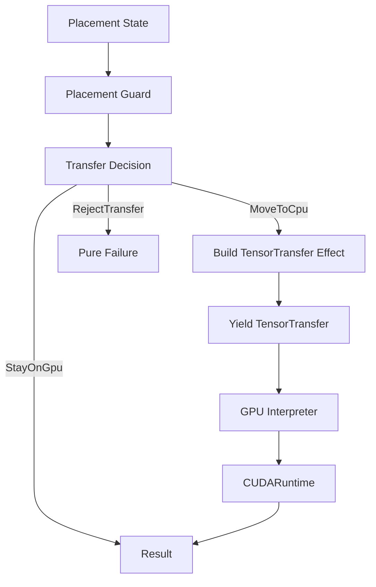

# File: documents/engineering/effect_patterns.md
# Effect Program Patterns

**Status**: Authoritative source  
**Supersedes**: Prior scattered examples  
**Referenced by**: engineering/README.md; code_quality.md; testing.md

> **Purpose**: Canonical patterns for writing SpectralMC programs using generator-based
> effects. Aligned with effectful naming while reflecting SpectralMC’s GPU/storage/RNG
> focus.

## SSoT Link Map

## Overview

- Programs are synchronous generators that yield effect ADTs; they do not perform I/O directly.
- Pure code forbids loops/conditionals/`raise`; use `match`, comprehensions, and Result returns.
- GPU device selection is explicit (`cuda:0`); no CPU fallbacks.
- Logging is modeled as an effect; interpreters own emission.
- Pure ADTs originate from [total_pure_modelling.md](total_pure_modelling.md); programs only
  translate those total states into effects.

## Pattern 1: Generator-Based DSL

- Build workflows as generators that `yield` typed effect ADTs.
- Compose with `yield from` to reuse subprograms without side effects.
- Keep return values immutable (tuples/records).

## Pattern 2: Fail-Fast Error Propagation

- Use Result-based factories for effects (e.g., tensor transfers that validate device transitions).
- Pattern match on Result to branch without exceptions; exhaustive `match` with `assert_never`.
- Avoid silent fallbacks; invalid states must be failures surfaced to callers/tests.

## Pattern 3: Deterministic GPU Flow

- Initialize tensors/models on CPU; yield explicit transfer effects to `cuda:0`.
- Kernel effects must include grid/block metadata; interpreters validate device consistency.
- RNG state is captured/restored explicitly as effects to keep replayability.
- Pair device placement guards with transfer effects (see Mermaid model below) so CPU
  transfers never happen implicitly.

## Pattern 4: Logging as Data

- Emit log requests as `LogMessage` effects with level/message/context.
- Interpreters emit logs; pure code remains deterministic and testable.

## Pattern 5: Composition and Isolation

- Programs may combine GPU, storage, and RNG effects; interpreters sequence them.
- Avoid calling infrastructure APIs from pure code; add new effect variants and extend interpreters instead.
- Prefer small, reusable generator helpers for repetitive flows (e.g., checkpoint + transfer).
- When combining flows, pull the total pure model first and branch via exhaustive `match`;
  generators must not invent new states.

## Pure Model → Effects (GPU Transfer)

Total pure models describe the allowed GPU↔CPU transitions; generators only emit effects
for allowed moves. Forbidden moves return pure failures that tests assert on.

- `Placement` encodes explicit device, pinned status, and size caps (per
  [total_pure_modelling.md](total_pure_modelling.md)).
- `Guard` is a pure function returning an exhaustive decision ADT; no default branches.
- Only `MoveToCpu` yields a `TensorTransfer` effect; `RejectTransfer` short-circuits tests
  with deterministic reasons.

## Common Mistakes (and Fixes)

| Mistake | Fix | SSoT |
|---------|-----|------|
| Direct `torch` import in program | Import facade first; keep program pure | pytorch_facade.md |
| Conditional GPU fallback (`if cuda else cpu`) | Enforce `cuda:0` and fail fast | cpu_gpu_compute_policy.md |
| Side effects inside generator | Yield effect ADTs and interpret | effect_interpreter.md |
| Non-exhaustive matches on Results/ADTs | Add `assert_never` branches | purity_doctrine.md |
| Mutable updates to program state | Use frozen dataclasses + `replace` | immutability_doctrine.md |

## Testing Guidance

- Test programs with mock interpreters for pure logic; integration tests run on GPU via `test-all`.
- Seed RNG explicitly in tests; assert device is CUDA at module scope.
- Use exhaustive pattern matching in tests to verify all error paths.
- Add fixtures that exercise each transfer decision branch, matching the diagram above.

## Cross-References

- [Architecture](architecture.md) — Layering and interpreter boundaries referenced by these
  patterns.
- [Effect Interpreter Doctrine](effect_interpreter.md) — Execution model for the effects
  yielded here.
- [Purity Doctrine](purity_doctrine.md) — Expression-only rules enforced in these
  generators.
- [Code Quality](code_quality.md) — Type/purity/immutability gates applied to effect
  programs.
- [Total Pure Modelling](total_pure_modelling.md) — Device and lifecycle models that feed
  effect programs.
- [Documentation Standards](../documentation_standards.md) — Metadata/link requirements
  when documenting new patterns.
