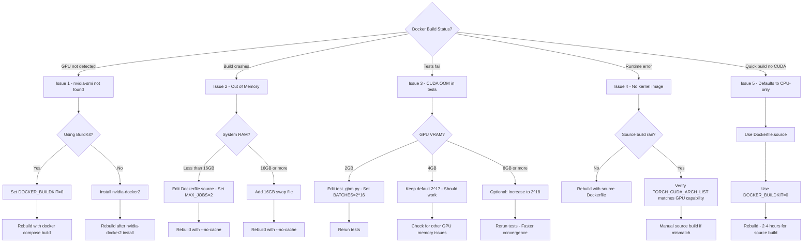

# GPU Build Guide

This guide documents how to build SpectralMC with GPU support, with special focus on legacy GPU compatibility (GTX 970 / Maxwell architecture).

**Last Updated**: 2025-11-30

**Related Standards**: [Docker Build Philosophy](docker_build_philosophy.md), [Coding Standards](coding_standards.md)

---

## Table of Contents

- [Quick Start (GTX 970)](#quick-start-gtx-970)
- [Build Strategy Overview](#build-strategy-overview)
- [Why Two Dockerfiles?](#why-two-dockerfiles)
- [The GTX 970 Compatibility Problem](#the-gtx-970-compatibility-problem)
- [Critical Version Constraints](#critical-version-constraints)
- [Dockerfile.source Architecture](#dockerfilesource-architecture)
- [Build Commands](#build-commands)
- [Validation](#validation)
- [Troubleshooting](#troubleshooting)
- [Key Learnings](#key-learnings)
- [Hardware Reference](#hardware-reference)

---

## Quick Start (GTX 970)

For users building SpectralMC on NVIDIA GeForce GTX 970 (Maxwell architecture, compute capability 5.2):

**Single Command Build**:
```bash
cd docker && docker compose build spectralmc
```

**Build Characteristics**:
- **Build time**: 2-4 hours (first build only)
- **Cached builds**: ~30 seconds for code changes
- **PyTorch**: 2.4.0a0+gitee1b680 (built from git tag v2.4.1)
- **CUDA**: 11.8
- **NumPy**: 2.0+ compatible
- **LAPACK**: OpenBLAS integration

**Validation Results** (Nov 30, 2025):
- Total tests: **227/227 passing (100%)**
- GPU tests: 11/11 passing
- CPU tests: 216/216 passing
- LAPACK/OpenBLAS: Working
- Test execution time: ~4 minutes

**Next Steps**: See [Validation](#validation) for detailed verification steps.

---

## Build Strategy Overview

SpectralMC uses a **dual-Dockerfile strategy** to support both modern and legacy GPUs:

| Dockerfile | Target GPUs | Build Time | Method |
|------------|-------------|------------|--------|
| `Dockerfile` | GTX 1060+, RTX series (compute 6.0+) | 10-15 min | Binary wheels |
| `Dockerfile.source` | GTX 970, GTX 980 (compute 5.2+) | 2-4 hours | Source compilation |

**Default build** uses `Dockerfile` (fast, binary wheels).

**Legacy GPU build** requires `Dockerfile.source` with source compilation.

For general Docker build philosophy, Poetry installation patterns, and layer optimization strategy, see [Docker Build Philosophy](docker_build_philosophy.md). **This document focuses on GTX 970 / legacy GPU specific requirements.**

---

## Why Two Dockerfiles?

### The Problem

PyTorch binary wheels from PyPI **do not include CUDA kernels for compute capability < 6.0**. This means:

- GTX 1060 and newer: Binary wheels work
- GTX 970/980 (Maxwell): Binary wheels fail with "no kernel image available"

### The Solution

For legacy GPUs, we compile PyTorch from source with the appropriate CUDA architecture flag (`TORCH_CUDA_ARCH_LIST="5.2"`).

### Key Differences

| Aspect | Dockerfile (Binary) | Dockerfile.source (Legacy GPU) |
|--------|---------------------|--------------------------------|
| **Base Image** | `nvidia/cuda:12.8.1-devel-ubuntu22.04` | `nvidia/cuda:11.8.0-cudnn8-devel-ubuntu22.04` |
| **CUDA Version** | 12.8 | 11.8 |
| **PyTorch Version** | 2.7.1 (binary wheel) | 2.4.1 (source build) |
| **PyTorch Install** | `poetry install` | `git clone` + `python setup.py bdist_wheel` |
| **Build Time** | 10-15 minutes | 2-4 hours (first build) |
| **GPU Support** | Compute 6.0+ | Compute 5.2+ |
| **Supported GPUs** | GTX 1060+, RTX 20/30/40/50 series | GTX 970, GTX 980, plus all modern GPUs |

---

## The GTX 970 Compatibility Problem

Running SpectralMC on GTX 970 requires satisfying **three hard constraints simultaneously**:

| Constraint | Requirement | Why |
|------------|-------------|-----|
| GTX 970 hardware | sm_52 CUDA kernels | Maxwell architecture, compute capability 5.2 |
| SpectralMC codebase | NumPy 2.0+ | Uses NumPy 2.0 APIs, cannot downgrade |
| NumPy 2.0 compatibility | PyTorch 2.4+ | PyTorch 2.1-2.3 incompatible with NumPy 2.0 C API |

### The Narrow Solution Space

```
PyTorch Version    | sm_52 Binary | sm_52 Source | NumPy 2.0 |
-------------------|--------------|--------------|-----------|
2.1.x              | NO           | YES          | NO        | ← NumPy incompatible
2.2.x              | NO           | YES          | NO        | ← NumPy incompatible
2.3.x              | NO           | YES          | NO        | ← NumPy incompatible
2.4.x              | NO           | YES          | YES       | ← SWEET SPOT
2.5.x - 2.7.x      | NO           | YES          | YES       | ← Works
2.8.x+             | NO           | NO           | YES       | ← sm_52 source removed
```

**Only PyTorch 2.4.x - 2.7.x** can be built from source with sm_52 support AND work with NumPy 2.0.

We use **PyTorch 2.4.1** as the proven, validated version.

### CUDA Version Constraint

| CUDA Version | sm_52 Support | Notes |
|--------------|---------------|-------|
| CUDA 11.8 | Full support | Last version with complete Maxwell support |
| CUDA 12.0 | Deprecated | Works but with warnings |
| CUDA 12.1+ | Removed | sm_52 support completely removed |

We use **CUDA 11.8** as the last version with full Maxwell support.

---

## Critical Version Constraints

### DO NOT CHANGE These Versions

| Component | Required Version | Breaking Change |
|-----------|------------------|-----------------|
| CUDA | 11.8 | 12.1+ removes sm_52 support |
| PyTorch | 2.4.1 | 2.8+ removes sm_52 source code |
| Base Image | `nvidia/cuda:11.8.0-cudnn8-devel-ubuntu22.04` | Must match CUDA 11.8 |

### Why Not Upgrade?

**Q: Why not use PyTorch 2.7.0 like the binary Dockerfile?**

A: PyTorch 2.8+ removed the sm_52 CUDA kernel source code entirely. While 2.7.x still has it, we use 2.4.1 as the proven, validated version that works with our dependency stack.

**Q: Why not use CUDA 12.x?**

A: CUDA 12.1+ removed Maxwell architecture support. CUDA 11.8 is the last version that fully supports sm_52.

**Q: Can I use a newer PyTorch for GTX 970?**

A: Only if that version still contains sm_52 source code AND you're willing to revalidate the entire test suite. PyTorch 2.4.1 is proven to work.

---

## Dockerfile.source Architecture

### Layer Strategy

The Dockerfile is organized for optimal caching:

```
LAYER 1:   System dependencies (changes: never)
LAYER 1.5: Build tools for source builds (changes: never)
LAYER 2:   Python 3.12 installation (changes: rarely)
LAYER 3:   Poetry installation (changes: rarely)
LAYER 4:   Python build dependencies (changes: rarely)
LAYER 5:   Early validation - fast fail (changes: never)
LAYER 6:   ccache configuration (changes: never)
LAYER 7:   Copy pyproject.toml only (changes: occasionally)
LAYER 8:   Poetry install dependencies (changes: occasionally)
LAYER 9:   PyTorch source build (changes: rarely) ← 2-4 hours
LAYER 10:  CuPy verification (changes: rarely)
LAYER 11:  CUDA build validation (changes: rarely)
LAYER 12:  Copy application source (changes: frequently)
LAYER 13:  Install SpectralMC + restore PyTorch wheel (changes: frequently)
LAYER 14:  Testing policy enforcement (changes: rarely)
LAYER 15:  Final configuration (changes: rarely)
```

### The Poetry Override Problem

**Problem**: Poetry's dependency resolver will overwrite our source-built PyTorch with a binary wheel.

**Timeline**:
1. LAYER 8: `poetry install --no-root` installs dependencies (may pull torch binary)
2. LAYER 9: Build PyTorch 2.4.1 from source with sm_52
3. LAYER 12: Copy application source code
4. LAYER 13: `poetry install` to install SpectralMC package → **overwrites torch!**

**Solution**: Wheel persistence strategy

```dockerfile
# In LAYER 9: Save the built wheel
python setup.py bdist_wheel 2>&1 | tee /tmp/pytorch-build.log && \
mkdir -p /opt/pytorch-wheel && \
cp dist/*.whl /opt/pytorch-wheel/ && \
pip install --force-reinstall /opt/pytorch-wheel/*.whl

# In LAYER 13: Restore after poetry install
poetry install --no-interaction && \
if grep -q "pytorch_source_sm52" /spectralmc/.build-marker; then \
    pip install --force-reinstall --no-deps /opt/pytorch-wheel/*.whl; \
fi
```

### Build Environment Variables

```dockerfile
# CUDA architecture for GTX 970
TORCH_CUDA_ARCH_LIST="5.2"

# Enable CUDA support
USE_CUDA=1
USE_CUDNN=1
USE_NCCL=0          # Disable multi-GPU (not needed)

# Compilation settings
MAX_JOBS=4          # Reduce to 2 for <16GB RAM
CUDA_HOME=/usr/local/cuda-11.8

# LAPACK/BLAS for CPU operations
BLAS=OpenBLAS
USE_LAPACK=1
```

---

## Build Commands

### GTX 970 / Legacy GPU Build

```bash
# Navigate to docker directory
cd docker

# Build with source compilation (2-4 hours first time)
docker compose -f docker-compose.yml build spectralmc

# Start the container
docker compose -f docker-compose.yml up -d
```

### Modern GPU Build

```bash
# Use the standard Dockerfile (fast binary build)
cd docker
docker compose up --build -d
```

### Rebuild from Scratch

```bash
# Remove cached layers and rebuild
docker compose -f docker/docker-compose.yml build --no-cache spectralmc
```

---

## Validation

### 1. Runtime GPU Validation

```bash
docker compose -f docker/docker-compose.yml exec spectralmc python -c "
import torch
print(f'PyTorch: {torch.__version__}')
print(f'CUDA available: {torch.cuda.is_available()}')
print(f'CUDA version: {torch.version.cuda}')
print(f'Arch list: {torch.cuda.get_arch_list()}')
print(f'Device: {torch.cuda.get_device_name(0)}')

# Test actual GPU operation
x = torch.randn(100, device='cuda')
y = x @ x
print(f'GPU tensor test: PASSED')
"
```

**Expected output for GTX 970**:
```
PyTorch: 2.4.0a0+gitee1b680
CUDA available: True
CUDA version: 11.8
Arch list: ['sm_52']
Device: NVIDIA GeForce GTX 970
GPU tensor test: PASSED
```

### 2. Run Test Suite

```bash
docker compose -f docker/docker-compose.yml exec spectralmc poetry run test-all
```

**Expected** (as of Nov 30, 2025): 227/227 tests passing (100%)
- 11/11 GPU tests passing
- 216/216 CPU tests passing

### 3. Verify CuPy

```bash
docker compose -f docker/docker-compose.yml exec spectralmc python -c "
import cupy as cp
print(f'CuPy: {cp.__version__}')
x = cp.random.randn(100)
print(f'CuPy GPU test: PASSED')
"
```

---

## Troubleshooting

### Quick Troubleshooting Flowchart

Use this flowchart to quickly identify and resolve GPU build issues:



**See detailed solutions below for each issue.**

### Build Fails: Out of Memory During Compilation

**Symptom**:
```
c++: fatal error: Killed signal terminated program cc1plus
```

**Cause**: PyTorch source build needs 8-16GB RAM with `MAX_JOBS=4`.

**Solution**: Reduce parallel jobs or add swap

```bash
# Option 1: Edit Dockerfile.source, change MAX_JOBS
export MAX_JOBS=2  # or even 1 for very limited RAM

# Option 2: Add swap space
sudo fallocate -l 16G /swapfile
sudo chmod 600 /swapfile
sudo mkswap /swapfile
sudo swapon /swapfile
```

### Runtime Error: No Kernel Image Available

**Symptom**:
```
RuntimeError: CUDA error: no kernel image is available for execution on the device
```

**Cause**: PyTorch not compiled for sm_52.

**Diagnosis**:
```bash
docker compose exec spectralmc python -c "
import torch
print(f'Arch list: {torch.cuda.get_arch_list()}')
print(f'GPU capability: {torch.cuda.get_device_capability(0)}')
"
```

If arch list doesn't include `sm_52`, rebuild:
```bash
docker compose -f docker/docker-compose.yml build --no-cache spectralmc
```

### Poetry Overwrote Source-Built PyTorch

**Symptom**: After build, `torch.version.cuda` shows 12.x instead of 11.8

**Cause**: The wheel restoration in LAYER 13 failed.

**Check**:
```bash
docker compose exec spectralmc cat /spectralmc/.build-marker
```

Should show `BUILD_TYPE=pytorch_source_sm52`. If not, check build logs.

### Tests Fail: CUDA Out of Memory

**Symptom**:
```
cupy.cuda.memory.OutOfMemoryError: Out of memory allocating 1,073,741,824 bytes
```

**Cause**: Test batch size too large for 4GB VRAM.

**Solution**: Batch sizes are configured for 4GB minimum. If you have less VRAM, edit `tests/test_gbm.py`:

```python
# For 2GB GPUs:
_BATCHES_PER_RUN = 2**16  # 65,536 batches

# For 4GB GPUs (default):
_BATCHES_PER_RUN = 2**17  # 131,072 batches

# For 8GB+ GPUs:
_BATCHES_PER_RUN = 2**18  # 262,144 batches
```

### Build Takes Forever / Hangs

**Cause**: Source compilation is genuinely slow (2-4 hours).

**Tips**:
- Run overnight or during lunch
- Docker layer caching makes subsequent builds fast (~30 seconds)
- Don't use `--no-cache` unless necessary

---

## Key Learnings

These insights were gathered during the GTX 970 compatibility investigation (November 2025):

| Learning | Implication |
|----------|-------------|
| PyTorch binary wheels don't include sm_52 | Must build from source |
| PyTorch 2.1-2.3 incompatible with NumPy 2.0 | Cannot use PyTorch before 2.4 |
| PyTorch 2.8+ removed sm_52 source code | Cannot use PyTorch after 2.7.x |
| CUDA 12.1+ removed Maxwell support | Must use CUDA 11.8 |
| `torch.cuda.get_arch_list()` needs GPU | Cannot validate architecture at build time |
| Docker build has no GPU access | All GPU validation must happen at runtime |
| Poetry runs twice in Dockerfile | Both installs can override torch |
| Wheel persistence solves poetry override | Save wheel, let poetry overwrite, then restore |
| Binary wheel availability not guaranteed | PyPI removes old wheels periodically |

### Build Reproducibility

| Build Type | Reproducibility | Notes |
|------------|-----------------|-------|
| Source build | Guaranteed | Builds from specific git tag (v2.4.1) |
| Binary build | Not guaranteed | Depends on PyPI wheel availability |

For production deployments requiring GTX 970 support, always use source builds.

---

## Hardware Reference

### GTX 970 Specifications

- **Architecture**: Maxwell (5th generation)
- **Compute Capability**: 5.2 (sm_52)
- **CUDA Cores**: 1664
- **VRAM**: 4GB GDDR5
- **Release Date**: September 2014

### Supported GPU Families

| GPU Family | Compute Cap | Dockerfile | Build Type |
|------------|-------------|------------|------------|
| RTX 50 series | 10.x | `Dockerfile` | Binary |
| RTX 40 series | 8.9 | `Dockerfile` | Binary |
| RTX 30 series | 8.6 | `Dockerfile` | Binary |
| RTX 20 series | 7.5 | `Dockerfile` | Binary |
| GTX 16 series | 7.5 | `Dockerfile` | Binary |
| GTX 10 series | 6.1 | `Dockerfile` | Binary |
| GTX 980/970 (Maxwell) | 5.2 | `Dockerfile.source` | **Source** |
| GTX 780 Ti (Kepler) | 3.5 | `Dockerfile.source` | **Source** |

---

## Build Times Reference

| GPU Family | Compute Cap | Build Method | Typical Build Time |
|------------|-------------|--------------|-------------------|
| RTX 40/30/20 | 8.9/8.6/7.5 | Binary | 10-15 minutes |
| GTX 16/10 series | 7.5/6.1 | Binary | 10-15 minutes |
| GTX 970/980 (Maxwell) | 5.2 | **Source** | **2-4 hours** |

**Tip**: Run source builds overnight. Docker layer caching makes subsequent builds ~30 seconds.

---

## Quick Reference Card

```bash
# GTX 970 build
cd docker && docker compose build spectralmc

# Start container
docker compose up -d

# Validate GPU
docker compose exec spectralmc python -c "import torch; print(torch.cuda.get_arch_list())"
# Expected: ['sm_52']

# Run tests
docker compose exec spectralmc poetry run test-all
# Expected: 227 passed

# Check PyTorch version
docker compose exec spectralmc python -c "import torch; print(torch.__version__, torch.version.cuda)"
# Expected: 2.4.0a0+gitee1b680 11.8
```
