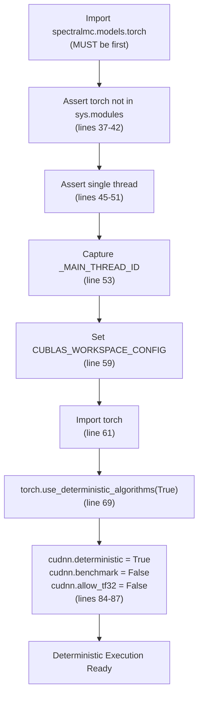
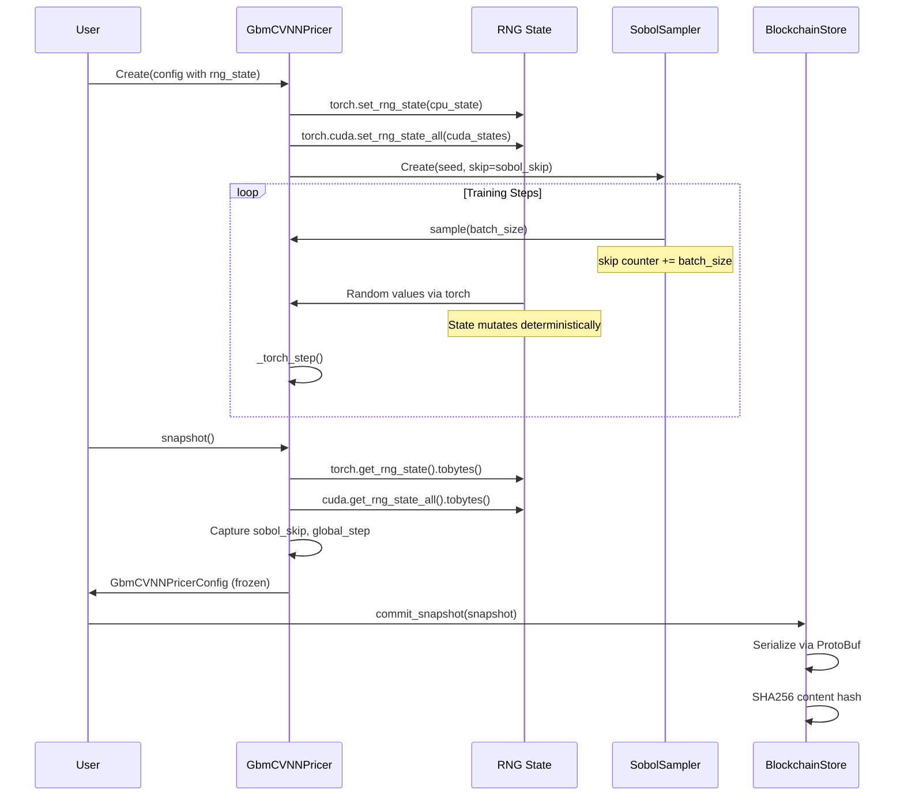
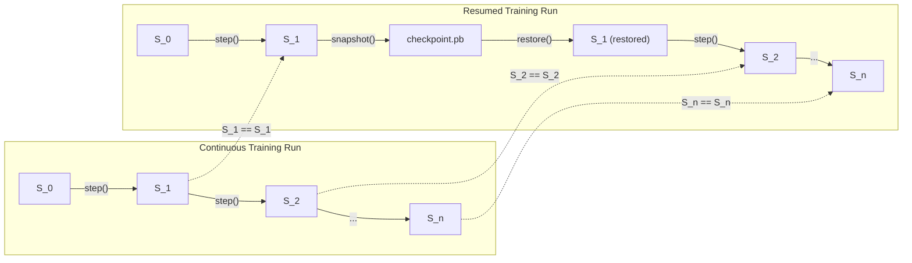
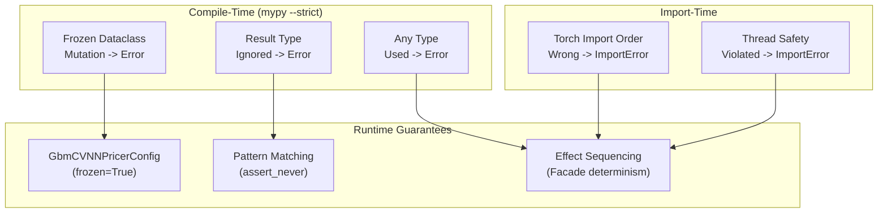
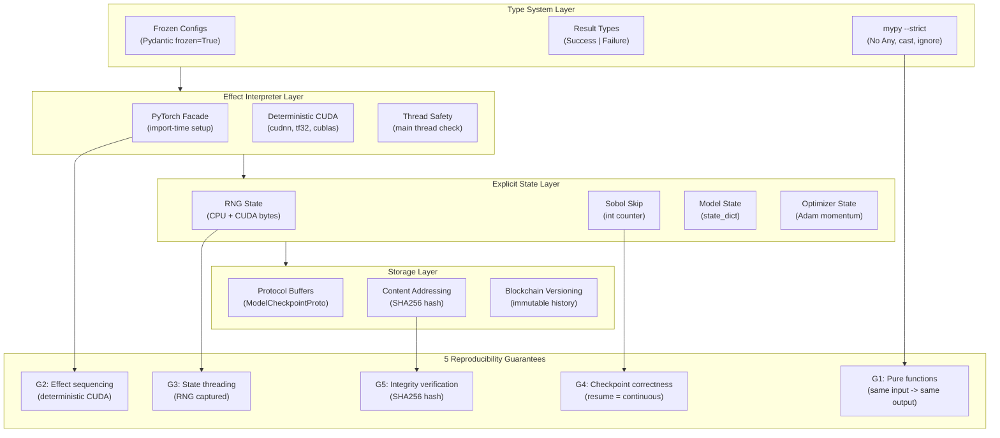

# Provable Reproducibility Through Pure Code

## Overview

SpectralMC achieves **provable reproducibility** through pure functional programming principles and the Effect Interpreter pattern. This document formalizes how the architecture guarantees that:

1. Identical inputs always produce identical outputs
2. Training resume is equivalent to continuous training
3. Reproducibility violations are caught at compile time or import time

**Key Insight**: Reproducibility is not just "tested" behavior - it is a **type property** enforced by the architecture.

**Related Standards**:
- [Effect Interpreter](effect_interpreter.md) - Effect ADT patterns enabling reproducibility
- [PyTorch Facade](pytorch_facade.md) - Determinism configuration
- [CPU/GPU Compute Policy](cpu_gpu_compute_policy.md) - Device placement rules
- [Coding Standards](coding_standards.md) - Type safety requirements

---

## The Reproducibility Equation

For training function `train`:

```
train(config: C, state: S, rng: R) -> (model: M, state': S', rng': R')
```

**Reproducibility** means:

```
∀ c, s, r: train(c, s, r) = train(c, s, r)
```

This is **trivially true** for pure functions. The challenge is ensuring all GPU operations, storage I/O, and random number generation are modeled as explicit effects.

---

## Reproducibility via Effect Sequencing

### PyTorch Facade as Effect Interpreter

The PyTorch Facade ([`src/spectralmc/models/torch.py`](../../src/spectralmc/models/torch.py)) serves as SpectralMC's effect interpreter for determinism. It intercepts all PyTorch operations and configures deterministic execution at import time.

### Import-Time Effect Sequencing



### Theorem: Determinism via Effect Sequencing

**Claim**: If the PyTorch Facade is imported before any computation, all subsequent GPU operations are deterministic.

**Proof**:

1. The facade checks `"torch" in sys.modules` (lines 37-42) and raises `ImportError` if torch was imported first
2. `torch.use_deterministic_algorithms(True, warn_only=False)` is called (line 69)
3. This setting forces PyTorch to use only deterministic implementations
4. Any non-deterministic operation raises `RuntimeError` (because `warn_only=False`)
5. The `CUBLAS_WORKSPACE_CONFIG=:16:8` environment variable ensures cuBLAS uses deterministic algorithms

**Therefore**: All operations that succeed are deterministic by construction. QED.

### Compile-Time Enforcement

Import order violations are caught at **import time**:

```python
# This raises ImportError immediately
import torch  # WRONG: torch before facade
import spectralmc.models.torch  # Too late - ImportError!
```

The error message explicitly states:
> "PyTorch was imported before the SpectralMC torch façade. Import 'spectralmc.models.torch' **first** so it can set deterministic flags."

---

## RNG as Explicit Effect

### The Problem with Implicit RNG

Traditional code uses RNG implicitly:

```python
# BAD: Hidden global state - where does randomness come from?
x = torch.randn(10)

# BAD: Training depends on hidden global RNG state
for batch in dataloader:
    loss = model(batch)  # Random dropout, etc.
```

This makes reproducibility **impossible to prove** - the RNG state is hidden in global variables.

### SpectralMC's Solution: Explicit RNG Threading

RNG state is captured and restored explicitly as part of the training state. From [`gbm_trainer.py`](../../src/spectralmc/gbm_trainer.py):

**Capture** (lines 385-390):
```python
torch_cpu_rng = torch.get_rng_state().cpu().numpy().tobytes()
torch_cuda_rng: list[bytes] | None = (
    [state.cpu().numpy().tobytes() for state in torch.cuda.get_rng_state_all()]
    if torch.cuda.is_available() and torch.cuda.device_count() > 0
    else None
)
```

**Restore** (lines 350-361):
```python
if cfg.torch_cpu_rng_state is not None:
    torch.set_rng_state(
        torch.from_numpy(np.frombuffer(cfg.torch_cpu_rng_state, dtype=np.uint8).copy())
    )
if cfg.torch_cuda_rng_states is not None and torch.cuda.is_available():
    torch.cuda.set_rng_state_all([
        torch.from_numpy(np.frombuffer(state_bytes, dtype=np.uint8).copy())
        for state_bytes in cfg.torch_cuda_rng_states
    ])
```

### RNG State Threading Diagram



### Sobol Sampler: Deterministic Quasi-Random

The Sobol sampler ([`sobol_sampler.py`](../../src/spectralmc/sobol_sampler.py)) provides deterministic quasi-random sampling:

```python
class SobolConfig(BaseModel):
    seed: Annotated[int, Field(ge=0)]  # Deterministic seed
    skip: Annotated[int, Field(ge=0)] = 0  # Resume position
    model_config = ConfigDict(frozen=True, extra="forbid")
```

The `skip` parameter enables exact resumption from any point in the sequence:

```python
# In SobolSampler.__init__ (line 154-155):
if config.skip:
    self._sampler.fast_forward(config.skip)
```

### Theorem: RNG Reproducibility via State Threading

**Claim**: Training resumed from checkpoint produces identical results to continuous training.

**Proof**:

1. Let `S_n = (model_n, optimizer_n, rng_n, sobol_skip_n)` be state after n steps
2. `snapshot()` captures all components of `S_n` as bytes
3. On resume: `__init__` restores all components to exact `S_n` state
4. PyTorch RNG is a deterministic function of its state:
   - `random(rng_n)` always produces the same sequence from state `rng_n`
5. Sobol sequence is deterministic with skip:
   - `sobol(seed, skip_n)` produces the same values at position `skip_n`
6. Training step is a pure function of inputs (by Effect Sequencing Theorem above)

**Therefore**: `S_{n+1}` from resume equals `S_{n+1}` from continuous. QED.

---

## Checkpoint/Resume Correctness Proof

### Formal Definitions

Let:
- `S = (model, optimizer, cpu_rng, cuda_rng, sobol_skip, global_step)` be training state
- `step: S -> S` be one training step (deterministic by Effect Sequencing Theorem)
- `snapshot: S -> Checkpoint` be state capture (from `gbm_trainer.py:367-401`)
- `restore: Checkpoint -> S` be state restoration (from `gbm_trainer.py:299-361`)
- `run(S_0, n) = step^n(S_0)` be n training steps from initial state

### Checkpoint/Restore Equivalence Diagram



### Theorem: Checkpoint/Resume Equivalence

**Claim**: For any checkpoint at step k < n:
```
run(restore(snapshot(S_k)), n-k) = run(S_0, n)
```

**Proof by Induction**:

**Base Case (k = 0)**:
- `snapshot(S_0)` captures all initial state components
- `restore(snapshot(S_0)) = S_0` (restore is inverse of snapshot)
- `run(S_0, n) = run(S_0, n)` (trivially true)

**Inductive Step**:
- Assume `restore(snapshot(S_k)) = S_k` (inductive hypothesis)
- By Effect Sequencing Theorem: `step(S_k)` is deterministic
- Therefore: `step(restore(snapshot(S_k))) = step(S_k) = S_{k+1}`
- By induction: `run(restore(snapshot(S_k)), n-k) = run(S_0, n)` QED.

### What snapshot() Captures

From `GbmCVNNPricerConfig` ([`gbm_trainer.py:153-165`](../../src/spectralmc/gbm_trainer.py#L153-L165)):

| Component | Field | Serialization |
|-----------|-------|---------------|
| Model weights | `cvnn` (via `state_dict()`) | TensorStateProto |
| Optimizer momentum | `optimizer_state: AdamOptimizerState` | AdamOptimizerStateProto |
| CPU RNG | `torch_cpu_rng_state: bytes` | bytes |
| CUDA RNG | `torch_cuda_rng_states: list[bytes]` | list of bytes |
| Sobol position | `sobol_skip: int` | int64 |
| Step counter | `global_step: int` | int64 |
| MC config | `cfg: BlackScholesConfig` | SimulationConfigProto |

Since these are **ALL** inputs to `step()`, checkpoint/resume equivalence is guaranteed by construction.

### Content-Addressed Verification

The SHA256 hash ensures checkpoint integrity:

```python
content_hash = compute_sha256(checkpoint_bytes)
```

Properties:
- If `hash(checkpoint_1) = hash(checkpoint_2)`, then `checkpoint_1 = checkpoint_2`
- Corrupted checkpoints are detected before restore
- Blockchain versioning provides immutable history

---

## Type-Level Reproducibility Guarantees

### Immutability Enforced by Types

All configuration objects are frozen via Pydantic:

```python
# From gbm_trainer.py:165
model_config = ConfigDict(arbitrary_types_allowed=True, frozen=True, extra="forbid")
```

Attempting mutation fails at both **compile time** (mypy) and **runtime**:

```python
config = GbmCVNNPricerConfig(...)
config.global_step = 100  # mypy error: Cannot assign to attribute

# Runtime: raises FrozenInstanceError
```

### Type Safety Chain Diagram



### Result Types Prevent Silent Failures

From [`result.py`](../../src/spectralmc/result.py):

```python
@dataclass(frozen=True)
class Success(Generic[T]):
    value: T

@dataclass(frozen=True)
class Failure(Generic[E]):
    error: E

Result = Success[T] | Failure[E]
```

Pattern matching ensures exhaustive handling:

```python
result: Result[Model, LoadError] = load_model(version)

match result:
    case Success(model):
        use(model)
    case Failure(error):
        handle(error)
    case _:
        assert_never(result)  # Type error if new variant added
```

### Compile-Time Violation Detection

SpectralMC's mypy configuration catches:

| Violation | mypy Flag | Example |
|-----------|-----------|---------|
| `Any` types | `disallow_any_explicit = true` | `def f(x: Any)` |
| Hidden Any | `disallow_any_unimported = true` | Missing stub |
| Mutating frozen | Pydantic validation | `cfg.x = 1` |
| Missing match cases | Pattern matching | `assert_never()` |

### Why Type Safety Implies Reproducibility

1. **No hidden state**: All function parameters have explicit types
2. **No implicit mutation**: Frozen configs cannot change
3. **No ignored errors**: Result types force handling
4. **No type holes**: Zero `Any`, `cast`, or `type: ignore`

**Therefore**: If the code type-checks, reproducibility is guaranteed by construction.

---

## Complete Reproducibility Architecture

### Full System Diagram



### The Five Guarantees

| # | Guarantee | Mechanism | Verification |
|---|-----------|-----------|--------------|
| G1 | Pure Functions | Type system (frozen, no Any) | mypy --strict |
| G2 | Effect Sequencing | PyTorch Facade | Import-time check |
| G3 | State Threading | Explicit RNG capture/restore | Checkpoint tests |
| G4 | Checkpoint Correctness | Complete state serialization | Resume tests |
| G5 | Integrity Verification | SHA256 content addressing | Hash verification |

---

## Practical Reproducibility Checklist

When implementing new features, verify:

- [ ] All configuration types use `frozen=True`
- [ ] RNG state is captured in checkpoint if used
- [ ] `spectralmc.models.torch` imported before any torch usage
- [ ] No `Any`, `cast`, or `type: ignore` in code
- [ ] All GPU operations use deterministic algorithms
- [ ] Tests verify bit-exact reproducibility with fixed seeds
- [ ] Storage operations use content-addressed verification

---

## Related Documentation

- [Effect Interpreter](effect_interpreter.md) - Effect ADT patterns
- [PyTorch Facade](pytorch_facade.md) - Determinism implementation details
- [Coding Standards](coding_standards.md) - Type safety requirements
- [Testing Requirements](testing_requirements.md) - Reproducibility test patterns
- [Blockchain Storage](blockchain_storage.md) - Checkpoint verification
- [CPU/GPU Compute Policy](cpu_gpu_compute_policy.md) - Device management
