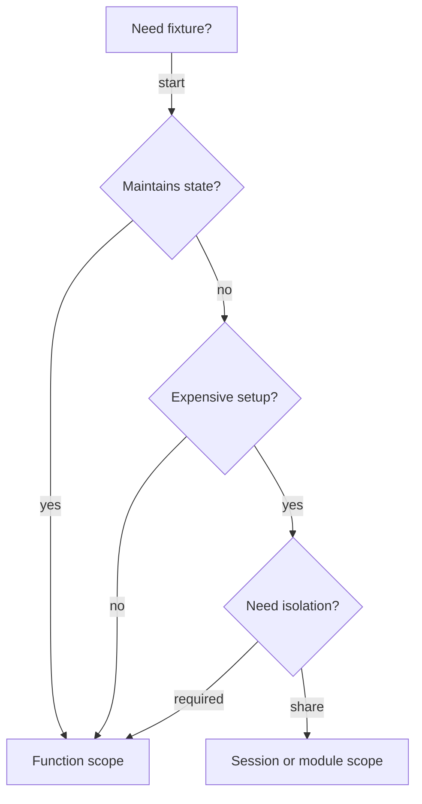

# File: documents/engineering/testing_architecture.md
# Testing Architecture

**Status**: Authoritative source
**Supersedes**: None (new document)
**Referenced by**: testing_requirements.md, testing.md, README.md

> **Purpose**: SSoT for SpectralMC test organization, DRY principles, fixture hierarchies, and helper consolidation patterns.

## Cross-References

- [Testing Requirements](testing_requirements.md) — GPU enforcement, determinism, anti-patterns
- [Coding Standards](coding_standards.md) — Type safety, purity doctrine
- [Purity Doctrine](purity_doctrine.md) — Test code exemptions
- [Documentation Standards](../documentation_standards.md) — Metadata and formatting
- [Total Pure Modelling](total_pure_modelling.md) — Shapes to mirror in fixtures and generators

---

## Overview

SpectralMC's test suite enforces a **DRY (Don't Repeat Yourself) doctrine** to minimize code duplication while maintaining test readability and isolation. This document establishes:

- Canonical locations for shared test utilities
- Pytest best practices for test organization
- Fixture patterns and scope guidelines
- Helper consolidation strategies

The DRY doctrine applies both **within** test suites (unit/integration/e2e) and **across** them, with clear guidelines on where to place shared code.

Tests should source scenarios from the total models in
[total_pure_modelling.md](total_pure_modelling.md) to ensure coverage of every allowed
state (including rejection and retry variants) without duplicating model definitions.

---

## DRY Doctrine for Tests

### Philosophy

SpectralMC tests adhere to four core principles:

1. **Minimize verbatim repetitions**: Individual tests should avoid duplicating identical code from other tests (within 3+ lines threshold)
2. **Use pytest idioms**: Prefer pytest patterns (fixtures, `conftest.py`, parametrization) over custom abstractions
3. **Apply DRYness comprehensively**: Consolidate helpers both within test suites (unit/, integration/, e2e/) and across them
4. **Keep tests terse**: The end goal is individual tests that are as concise and focused as possible

### What Qualifies as "Repetition"?

**Duplicate (consolidate)**:
- 3+ identical lines across multiple test files
- Same config builder logic in 2+ files
- Identical helper functions (e.g., `_expect_success` in 9 files)
- Module-level constants appearing in 3+ files

**Not duplicate (keep inline)**:
- Test-specific setup that differs slightly between tests
- Single-use assertions unique to one test
- Constants used in only 1-2 files

### Trade-offs: DRY vs. Test Isolation

**Err on the side of isolation**:
- If a helper obscures test intent, keep code inline
- If fixture state could leak between tests, use function scope
- If parametrization makes test failures hard to debug, use separate test functions

**Favor DRY**:
- For boilerplate setup that's identical across tests
- For Result unwrapping patterns
- For config factories with reasonable defaults
- For numerical tolerances and common constants

---

## Test Organization Hierarchy

### Directory Structure

```text
# File: documents/engineering/testing_architecture.md
tests/
├── conftest.py                     # Global fixtures, GPU cleanup
├── helpers/                        # Shared test utilities (NEW)
│   ├── __init__.py                 # Convenient re-exports
│   ├── result_utils.py             # Result unwrapping (expect_success, etc.)
│   ├── factories.py                # Config builders (make_*_config)
│   ├── assertions.py               # Custom assertions
│   └── constants.py                # Shared test constants
├── test_async_normals.py           # Unit tests for async normal generation
├── test_cvnn.py                    # Unit tests for CVNN
├── test_gbm.py                     # Integration tests for GBM
├── test_storage/                   # Storage system tests (suite)
│   ├── test_chain.py
│   ├── test_store.py
│   ├── test_inference_client.py
│   └── ...
├── test_serialization/             # Serialization tests (suite)
│   ├── test_common_converters.py
│   └── ...
└── test_e2e/                       # End-to-end tests (suite)
    └── test_training_checkpoint.py
```

### Naming Conventions

- **Test modules**: `test_<module_name>.py` mirrors `src/spectralmc/<module_name>.py`
- **Test suites**: Directories like `test_storage/` group related tests
- **Helper modules**: Descriptive names (`result_utils`, `factories`, not `utils`, `helpers`)

### When to Create Suite-Specific Helpers

Create a `test_suite/conftest.py` or `test_suite/helpers.py` when:
- Helpers are only used within that suite (e.g., storage-specific fixtures)
- The helper depends on suite-specific modules
- Moving to global `tests/helpers/` would couple unrelated tests

Otherwise, prefer global `tests/helpers/` for cross-suite patterns.

---

## Helper Function Consolidation

### Canonical Locations

SpectralMC defines **four** canonical locations for shared test code:

1. **tests/helpers/result_utils.py** - Result type unwrapping
2. **tests/helpers/factories.py** - Config/model builders
3. **tests/helpers/assertions.py** - Custom assertion helpers
4. **tests/helpers/constants.py** - Shared test constants

### 1. Result Type Unwrapping (result_utils.py)

**Consolidates**: `_expect_success()` pattern duplicated in 9+ files

**Before** (duplicated in test_models_torch.py, test_gbm_trainer.py, etc.):
```python
# File: tests/test_models_torch.py
T = TypeVar("T")
E = TypeVar("E")

def _expect_success(result: Result[T, E]) -> T:
    match result:
        case Success(value):
            return value
        case Failure(error):
            raise AssertionError(f"Unexpected failure: {error}")
```

**After** (single canonical location):
```python
# File: tests/helpers/result_utils.py
T = TypeVar("T")
E = TypeVar("E")

def expect_success(result: Result[T, E]) -> T:
    """Unwrap Success or fail test with error message."""
    match result:
        case Success(value):
            return value
        case Failure(error):
            raise AssertionError(f"Unexpected failure: {error}")
```

**Usage**:
```python
# File: tests/test_models_torch.py
from tests.helpers import expect_success

def test_dtype_roundtrip() -> None:
    for d in sm_torch.DType:
        torch_dt = d.to_torch()
        dtype = expect_success(sm_torch.DType.from_torch(torch_dt))
        assert dtype is d
```

### 2. Config Builders (factories.py)

**Consolidates**: `make_test_config()` pattern duplicated in 6+ files

**Before** (duplicated in test_inference_client.py, test_e2e_storage.py, etc.):
```python
# File: tests/test_storage/test_inference_client.py
def make_test_config(model: torch.nn.Module, global_step: int = 0):
    match build_simulation_params(
        timesteps=100, network_size=1024, batches_per_mc_run=8,
        threads_per_block=256, mc_seed=42, buffer_size=10000,
        skip=0, dtype=Precision.float32
    ):
        case Failure(sim_err):
            pytest.fail(f"SimulationParams creation failed: {sim_err}")
        case Success(sim_params):
            pass

    match build_black_scholes_config(
        sim_params=sim_params,
        simulate_log_return=True,
        normalize_forwards=True,
    ):
        case Failure(bs_err):
            pytest.fail(f"BlackScholesConfig creation failed: {bs_err}")
        case Success(bs_config):
            pass

    cpu_rng_state = torch.get_rng_state().numpy().tobytes()

    return GbmCVNNPricerConfig(
        cfg=bs_config,
        domain_bounds={},
        cvnn=model,
        optimizer_state=None,
        global_step=global_step,
        sobol_skip=0,
        torch_cpu_rng_state=cpu_rng_state,
        torch_cuda_rng_states=[],
    )
```

**After** (single canonical location):
```python
# File: tests/helpers/factories.py
def make_gbm_cvnn_config(
    model: torch.nn.Module,
    global_step: int = 0,
    sim_params: SimulationParams | None = None,
    bs_config: BlackScholesConfig | None = None,
) -> GbmCVNNPricerConfig:
    """Create GbmCVNNPricerConfig for testing."""
    if bs_config is None:
        bs_config = make_black_scholes_config(sim_params)

    cpu_rng_state = torch.get_rng_state().numpy().tobytes()

    return GbmCVNNPricerConfig(
        cfg=bs_config,
        domain_bounds={},
        cvnn=model,
        optimizer_state=None,
        global_step=global_step,
        sobol_skip=0,
        torch_cpu_rng_state=cpu_rng_state,
        torch_cuda_rng_states=[],
    )
```

**Usage**:
```python
# File: tests/test_storage/test_inference_client.py
from tests.helpers import make_gbm_cvnn_config

@pytest.mark.asyncio
async def test_pinned_mode_basic(async_store: AsyncBlockchainModelStore) -> None:
    model1 = torch.nn.Linear(5, 5)
    config1 = make_gbm_cvnn_config(model1, global_step=100)
    # ... rest of test
```

**Factories Available**:
- `make_simulation_params()` - SimulationParams with defaults
- `make_black_scholes_config()` - BlackScholesConfig with defaults
- `make_gbm_cvnn_config()` - GbmCVNNPricerConfig with defaults

### 3. Assertion Helpers (assertions.py)

**Provides**: Enhanced assertions with better error messages

```python
# File: tests/helpers/assertions.py
def assert_tensors_close(
    actual: torch.Tensor,
    expected: torch.Tensor,
    *,
    rtol: float = 1e-5,
    atol: float = 1e-8,
    msg: str | None = None,
) -> None:
    """Assert tensors are close with enhanced error messages.

    Reports both absolute and relative differences when assertion fails.
    """
    if not torch.allclose(actual, expected, rtol=rtol, atol=atol):
        diff_abs = (actual - expected).abs().max().item()
        diff_rel = ((actual - expected).abs() / (expected.abs() + 1e-8)).max().item()
        error_msg = (
            f"Tensors differ: max_abs_diff={diff_abs:.2e}, "
            f"max_rel_diff={diff_rel:.2e}, rtol={rtol:.2e}, atol={atol:.2e}"
        )
        if msg:
            error_msg = f"{msg}: {error_msg}"
        raise AssertionError(error_msg)
```

**Assertions Available**:
- `assert_tensors_close()` - Enhanced `torch.allclose` with detailed diffs
- `assert_no_nan_inf()` - Validate tensor is finite (critical for GPU tests)
- `assert_converged()` - Validate loss/variance convergence criteria

### 4. Shared Constants (constants.py)

**Consolidates**: Magic numbers duplicated across test files

```python
# File: tests/helpers/constants.py
# Simulation parameters
DEFAULT_TIMESTEPS = 100
DEFAULT_NETWORK_SIZE = 1024
DEFAULT_BATCHES_PER_RUN = 8
DEFAULT_MC_SEED = 42

# Numerical tolerances
RTOL_FLOAT32 = 1e-5
RTOL_FLOAT64 = 1e-8
ATOL_FLOAT32 = 1e-8
ATOL_FLOAT64 = 1e-10

# Training parameters
DEFAULT_LEARNING_RATE = 1e-3
CONVERGENCE_THRESHOLD = 1e-6
```

**When to extract constants**:
- Value used in 3+ test files → Extract to `constants.py`
- Value used in 1-2 files → Keep inline or as module constant
- Test-specific magic numbers → Keep inline with comment explaining value

---

## Fixture Patterns

### Fixture Scope Guidelines

Use this decision tree:



**Function scope** (default):
- Fixture maintains state
- Test modifies fixture data
- Setup is cheap (<100ms)
- **Safety first**: When in doubt, use function scope

**Module scope**:
- Immutable fixture (frozen dataclass, read-only)
- Expensive setup (>100ms)
- No state leakage between tests

**Session scope**:
- Global resources (event loop, database connection)
- Never modified by tests
- Cleanup in fixture teardown

### Parametrized Fixtures

**Use for**: Testing behavior across different configurations

```python
# File: tests/test_cvnn.py
@pytest.fixture(params=[torch.float32, torch.float64], ids=["f32", "f64"])
def dtype(request: pytest.FixtureRequest) -> torch.dtype:
    """Parametrize tests across float32 and float64."""
    return request.param

def test_complex_linear_forward(dtype: torch.dtype) -> None:
    """Test runs twice: once for f32, once for f64."""
    with default_dtype(dtype):
        layer = ComplexLinear(in_features=4, out_features=2)
        # ... rest of test
```

**Prefer over**: For loops inside tests (parametrization gives better test isolation and failure reporting)

### Fixture Factories

**Use for**: Fixtures that need customization per test

```python
# File: tests/conftest.py
@pytest.fixture
def make_model():
    """Factory fixture for creating models with custom sizes."""
    def _make_model(input_size: int, output_size: int):
        torch.manual_seed(42)
        return torch.nn.Linear(input_size, output_size).cuda()
    return _make_model

def test_small_model(make_model):
    model = make_model(10, 5)
    # ... test with small model

def test_large_model(make_model):
    model = make_model(1000, 500)
    # ... test with large model
```

### Async Fixtures

SpectralMC uses async fixtures for storage tests. Pattern from `conftest.py`:

```python
# File: tests/conftest.py
@pytest.fixture
async def async_store() -> AsyncGenerator[AsyncBlockchainModelStore, None]:
    """Create AsyncBlockchainModelStore with unique test bucket."""
    bucket_name = f"test-{uuid.uuid4().hex[:12]}"

    async with AsyncBlockchainModelStore(bucket_name) as store:
        # Setup: Create bucket
        await store._s3_client.create_bucket(Bucket=bucket_name)

        yield store

        # Teardown: Delete all objects and bucket
        paginator = store._s3_client.get_paginator("list_objects_v2")
        async for page in paginator.paginate(Bucket=bucket_name):
            if "Contents" in page:
                objects = [{"Key": obj["Key"]} for obj in page["Contents"]]
                if objects:
                    await store._s3_client.delete_objects(
                        Bucket=bucket_name, Delete={"Objects": objects}
                    )
        await store._s3_client.delete_bucket(Bucket=bucket_name)
```

**Key points**:
- Use `AsyncGenerator` type hint
- Setup before `yield`, teardown after
- Cleanup is best-effort (don't fail test if cleanup fails)

---

## Constants and Configuration

### When to Extract Constants

**Extract to constants.py**:
- Used in 3+ test files
- Represents a domain constant (DEFAULT_TIMESTEPS, DEFAULT_MC_SEED)
- Numerical tolerance that should be consistent

**Keep as module constant** (at top of test file):
- Used in 2-3 tests in same file
- File-specific configuration

**Keep inline**:
- Used once
- Test-specific value that differs from defaults
- Value with inline comment explaining why it's that specific number

### Example: Good Constant Usage

```python
# File: tests/test_gbm.py
from tests.helpers import DEFAULT_TIMESTEPS, DEFAULT_NETWORK_SIZE, RTOL_FLOAT32

def test_gbm_pricing() -> None:
    """Test GBM pricing with default parameters."""
    params = make_simulation_params(
        timesteps=DEFAULT_TIMESTEPS,
        network_size=DEFAULT_NETWORK_SIZE,
    )

    # Test-specific override with inline comment
    batches = 16  # Use more batches for this convergence test
    config = make_black_scholes_config(params)

    result = price_option(config)
    expected = 1.234

    assert_tensors_close(result, expected, rtol=RTOL_FLOAT32)
```

---

## Pytest Best Practices

### Parametrization Over Loops

**❌ WRONG**:
```python
# File: tests/test_example.py
def test_multiple_sizes() -> None:
    for size in [10, 100, 1000]:
        model = torch.nn.Linear(size, size)
        output = model(torch.randn(1, size))
        assert output.shape == (1, size)
```

**✅ CORRECT**:
```python
# File: tests/test_example.py
@pytest.mark.parametrize("size", [10, 100, 1000])
def test_multiple_sizes(size: int) -> None:
    model = torch.nn.Linear(size, size)
    output = model(torch.randn(1, size))
    assert output.shape == (1, size)
```

**Why**: Parametrization provides better test isolation, clearer failure messages, and ability to run single parameter with `-k`.

### Fixture Composition Over Inheritance

**❌ WRONG**:
```python
# File: tests/test_example.py
class TestBase:
    @pytest.fixture
    def model(self):
        return torch.nn.Linear(10, 10)

class TestModel(TestBase):
    def test_forward(self, model):
        # ...
```

**✅ CORRECT**:
```python
# File: tests/test_example.py
@pytest.fixture
def base_model():
    return torch.nn.Linear(10, 10)

@pytest.fixture
def trained_model(base_model):
    """Fixture that depends on base_model fixture."""
    # Train the model
    return base_model

def test_forward(base_model):
    # ...

def test_trained_forward(trained_model):
    # ...
```

**Why**: Fixture composition is more flexible and doesn't require class-based tests.

### Custom Markers

SpectralMC uses these markers:

```python
# File: tests/test_example.py
@pytest.mark.asyncio         # Async test (pytest-asyncio)
async def test_async():
    # ...

@pytest.mark.cpu             # Intentional CPU test (exception to GPU-only rule)
def test_cpu_device():
    # ...

@pytest.mark.timeout(seconds=120)  # Override 60s default timeout
def test_long_simulation():
    # ...
```

**Define markers in conftest.py**:
```python
# File: tests/conftest.py
def pytest_configure(config):
    config.addinivalue_line("markers", "cpu: Intentional CPU test")
```

### Avoid Class-Based Tests

**Prefer**: Module-level test functions

```python
# File: tests/test_example.py
# ✅ CORRECT - Function-based tests
def test_forward():
    # ...

def test_backward():
    # ...
```

**Avoid**: Class-based test organization unless grouping is truly necessary

```python
# File: tests/test_example.py
# ❌ AVOID - Unnecessary class grouping
class TestModel:
    def test_forward(self):
        # ...

    def test_backward(self):
        # ...
```

**Why**: Pytest functions are simpler, more flexible with fixtures, and don't encourage shared state.

---

## Anti-Patterns

### AP1: Duplicated Helper Functions

**❌ WRONG** - Helper duplicated in 9 files:
```python
# File: tests/test_models_torch.py
T = TypeVar("T")
E = TypeVar("E")

def _expect_success(result: Result[T, E]) -> T:
    match result:
        case Success(value):
            return value
        case Failure(error):
            raise AssertionError(f"Unexpected failure: {error}")

# File: tests/test_gbm_trainer.py
T = TypeVar("T")
E = TypeVar("E")

def _expect_success(result: Result[T, E]) -> T:  # Duplicate!
    match result:
        case Success(value):
            return value
        case Failure(error):
            raise AssertionError(f"Unexpected failure: {error}")
```

**✅ CORRECT** - Import from shared location:
```python
# File: tests/test_models_torch.py
from tests.helpers import expect_success

def test_dtype_roundtrip() -> None:
    dtype = expect_success(sm_torch.DType.from_torch(torch.float32))
    # ...
```

**Impact**: Reduces ~36 lines of duplication across 9 files to single canonical location.

### AP2: Scattered Factory Functions

**❌ WRONG** - Config builder duplicated in 6+ files:
```python
# File: tests/test_storage/test_inference_client.py
def make_test_config(model, global_step=0):
    match build_simulation_params(...):
        case Failure(sim_err):
            pytest.fail(f"SimulationParams creation failed: {sim_err}")
        case Success(sim_params):
            pass
    # ... 30+ more lines of boilerplate

# File: tests/test_storage/test_e2e_storage.py
def make_test_snapshot(global_step=0):  # Nearly identical!
    match build_simulation_params(...):
        case Failure(sim_err):
            pytest.fail(f"SimulationParams creation failed: {sim_err}")
        case Success(sim_params):
            pass
    # ... 30+ more lines of boilerplate
```

**✅ CORRECT** - Use shared factory:
```python
# File: tests/test_storage/test_inference_client.py
from tests.helpers import make_gbm_cvnn_config

def test_something():
    model = torch.nn.Linear(5, 5)
    config = make_gbm_cvnn_config(model, global_step=100)
    # ... rest of test
```

**Impact**: Reduces ~240 lines of duplicated config builders to single factory with defaults.

### AP3: Copy-Pasted Setup Code

**❌ WRONG** - Repeated setup in every test:
```python
# File: tests/test_example.py
def test_training_1() -> None:
    torch.manual_seed(42)
    model = torch.nn.Linear(10, 10).cuda()
    optimizer = torch.optim.Adam(model.parameters())
    # ... test logic

def test_training_2() -> None:
    torch.manual_seed(42)  # Duplicate!
    model = torch.nn.Linear(10, 10).cuda()  # Duplicate!
    optimizer = torch.optim.Adam(model.parameters())  # Duplicate!
    # ... test logic
```

**✅ CORRECT** - Use fixture:
```python
# File: tests/test_example.py
@pytest.fixture
def trained_model():
    torch.manual_seed(42)
    model = torch.nn.Linear(10, 10).cuda()
    return model

def test_training_1(trained_model) -> None:
    # ... test logic

def test_training_2(trained_model) -> None:
    # ... test logic
```

**Impact**: Reduces boilerplate, ensures consistency, single location to update setup.

### AP4: Inline Constants Instead of Shared Values

**❌ WRONG** - Magic numbers duplicated:
```python
# File: tests/test_gbm.py
def test_gbm_1() -> None:
    timesteps = 100
    network_size = 1024
    batches = 8
    # ...

# File: tests/test_gbm_trainer.py
def test_gbm_2() -> None:
    timesteps = 100  # Duplicate!
    network_size = 1024  # Duplicate!
    batches = 8  # Duplicate!
    # ...
```

**✅ CORRECT** - Shared constants:
```python
# File: tests/test_gbm.py
from tests.helpers import DEFAULT_TIMESTEPS, DEFAULT_NETWORK_SIZE, DEFAULT_BATCHES_PER_RUN

def test_gbm_1() -> None:
    params = make_simulation_params(
        timesteps=DEFAULT_TIMESTEPS,
        network_size=DEFAULT_NETWORK_SIZE,
        batches_per_mc_run=DEFAULT_BATCHES_PER_RUN,
    )
    # ...
```

**Impact**: Single location to update default values, explicit naming improves readability.

---

## Migration Guide

### For Existing Tests

**Step 1**: Identify duplication
```bash
# File: documents/engineering/testing_architecture.md
# Find _expect_success duplicates
grep -r "_expect_success" tests/

# Find make_test_ config builders
grep -r "def make_test_" tests/
```

**Step 2**: Update imports
```python
# File: tests/test_models_torch.py
# Remove old duplicated code (lines 32-41)
# Add new import
from tests.helpers import expect_success
```

**Step 3**: Update call sites
```python
# File: tests/test_models_torch.py
# Old: _expect_success(result)
# New: expect_success(result)
```

**Step 4**: Validate
```bash
# File: documents/engineering/testing_architecture.md
docker compose -f docker/docker-compose.yml exec spectralmc \
  poetry run test-all tests/test_models_torch.py > /tmp/test-output.txt 2>&1
```

### For New Tests

**Step 1**: Check if helper exists
```python
# File: tests/helpers/__init__.py
# Review __all__ list for available helpers
```

**Step 2**: Import what you need
```python
# File: tests/test_new_feature.py
from tests.helpers import (
    expect_success,
    make_gbm_cvnn_config,
    assert_tensors_close,
    DEFAULT_TIMESTEPS,
    RTOL_FLOAT32,
)
```

**Step 3**: Write terse tests
```python
# File: tests/test_new_feature.py
def test_new_feature() -> None:
    """Test new feature with minimal boilerplate."""
    config = make_gbm_cvnn_config(model)
    result = expect_success(run_simulation(config))
    assert_tensors_close(result, expected, rtol=RTOL_FLOAT32)
```

### Adding New Helpers

**When to add to tests/helpers/**:
- Helper used in 3+ test files
- Helper is generic enough for cross-suite use
- Helper follows existing patterns (Result unwrapping, factories, assertions, constants)

**How to add**:
1. Add function to appropriate module (result_utils.py, factories.py, etc.)
2. Add to module's `__all__` list
3. Import in `tests/helpers/__init__.py`
4. Add to `__init__.__all__` list
5. Document in this file (testing_architecture.md)

**Example**:
```python
# File: tests/helpers/assertions.py
def assert_distribution_shape(
    samples: torch.Tensor,
    expected_mean: float,
    expected_std: float,
    rtol: float = 0.1,
) -> None:
    """Assert samples have expected distribution parameters."""
    actual_mean = samples.mean().item()
    actual_std = samples.std().item()

    if abs(actual_mean - expected_mean) / expected_mean > rtol:
        raise AssertionError(f"Mean {actual_mean} differs from {expected_mean}")

    if abs(actual_std - expected_std) / expected_std > rtol:
        raise AssertionError(f"Std {actual_std} differs from {expected_std}")

__all__ = [
    # ... existing
    "assert_distribution_shape",  # Add to __all__
]
```

---

## Summary

### Key Takeaways

1. **Use tests/helpers/ for shared utilities** - Result unwrapping, factories, assertions, constants
2. **Prefer pytest idioms** - Fixtures over setup functions, parametrization over loops
3. **Balance DRY with readability** - Consolidate when it improves clarity, keep inline when it obscures intent
4. **Follow fixture scope guidelines** - Function scope by default, module/session for expensive immutable setup
5. **Extract constants after 3+ uses** - Avoid magic numbers scattered across tests

### Checklist for New Tests

- [ ] Check tests/helpers/ for existing utilities before writing new helpers
- [ ] Use `expect_success()` for Result unwrapping instead of match statements
- [ ] Use factory functions (`make_*_config`) instead of inline builders
- [ ] Use shared constants (DEFAULT_*) instead of magic numbers
- [ ] Use fixtures for repeated setup instead of copy-paste
- [ ] Use `@pytest.mark.parametrize` instead of for loops
- [ ] Validate test passes: `poetry run test-all tests/test_X.py`
- [ ] Validate type safety: `poetry run check-code`

### Further Reading

- [Testing Requirements](testing_requirements.md) — GPU enforcement, determinism, 13 anti-patterns
- [Coding Standards](coding_standards.md) — Type safety and purity rules
- [Purity Doctrine](purity_doctrine.md) — Exemptions for test code
- [pytest documentation](https://docs.pytest.org/) — Fixtures, parametrization, markers