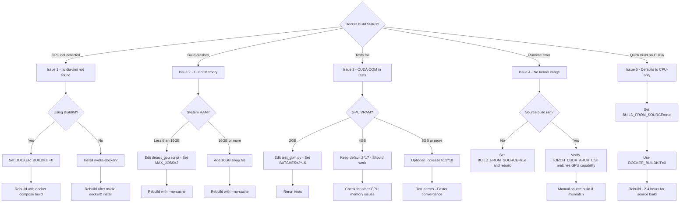

# GPU Build Troubleshooting Guide

This guide covers common issues when building SpectralMC with GPU support, especially for legacy GPUs (Maxwell/Kepler architecture).

## Table of Contents
- [Quick Troubleshooting Flowchart](#quick-troubleshooting-flowchart)
- [Build Fails: nvidia-smi not found](#build-fails-nvidia-smi-not-found)
- [Build Fails: Out of Memory During Compilation](#build-fails-out-of-memory-during-compilation)
- [Tests Fail: CUDA out of memory](#tests-fail-cuda-out-of-memory)
- [GPU Operations Fail: no kernel image available](#gpu-operations-fail-no-kernel-image-available)
- [Build Defaults to CPU-only Mode](#build-defaults-to-cpu-only-mode)
- [Verify Build Configuration](#verify-build-configuration)

---

## Quick Troubleshooting Flowchart

Use this flowchart to quickly identify and resolve GPU build issues:



**See detailed solutions below for each issue.**

---

## Build Fails: nvidia-smi not found

**Symptom**:
```
=== SpectralMC GPU Detection & Build ===
⚠ No GPU detected, installing CPU-only packages
```

**Cause**: GPU not accessible during Docker build.

**Solution**:

### 1. Verify nvidia-docker2 is installed
```bash
# Test GPU access in Docker
docker run --rm --gpus all nvidia/cuda:12.8.1-base-ubuntu22.04 nvidia-smi

# Expected: Shows your GPU info
# If fails, continue to step 2
```

### 2. Install nvidia-docker2
```bash
# Ubuntu/Debian
sudo apt-get update
sudo apt-get install -y nvidia-docker2
sudo systemctl restart docker

# Verify installation
docker run --rm --gpus all nvidia/cuda:12.8.1-base-ubuntu22.04 nvidia-smi
```

### 3. Use legacy Docker builder
```bash
# BuildKit doesn't support GPU during build
cd docker
DOCKER_BUILDKIT=0 docker compose build spectralmc
```

**Verification**:
```bash
# Check build logs for GPU detection
DOCKER_BUILDKIT=0 docker compose build spectralmc 2>&1 | grep "Detected GPU"

# Expected output:
# ✓ Detected GPU: NVIDIA GeForce GTX 970
# ✓ Compute capability: 5.2 (sm_52)
```

---

## Build Fails: Out of Memory During Compilation

**Symptom**:
```
c++: fatal error: Killed signal terminated program cc1plus
compilation terminated.
error: command 'gcc' failed with exit status 1
```

**Cause**: PyTorch source build consumes 8-16GB RAM. Compiler parallelization (`MAX_JOBS=4`) exhausts system memory.

**Solution**:

### 1. Reduce parallel jobs
Edit `docker/detect_gpu_and_build.sh`:
```bash
# Line 38: Change from 4 to 2 (or 1 for very limited RAM)
export MAX_JOBS=2  # Reduce from 4
```

### 2. Increase system swap
```bash
# Check current swap
free -h

# Add 16GB swap file
sudo fallocate -l 16G /swapfile
sudo chmod 600 /swapfile
sudo mkswap /swapfile
sudo swapon /swapfile

# Make permanent
echo '/swapfile none swap sw 0 0' | sudo tee -a /etc/fstab
```

### 3. Close other applications
```bash
# Free memory before build
docker system prune -af
# Close browsers, IDEs, etc.
```

**Rebuild**:
```bash
cd docker
DOCKER_BUILDKIT=0 docker compose build --no-cache spectralmc
```

---

## Tests Fail: CUDA out of memory

**Symptom**:
```
cupy.cuda.memory.OutOfMemoryError: Out of memory allocating 1,073,741,824 bytes
RuntimeError: CUDA out of memory. Tried to allocate 1024 MiB
```

**Cause**: Test batch size too large for GPU VRAM (GTX 970 has 4GB).

**Solution**:

### 1. Verify current batch size
```bash
grep "_BATCHES_PER_RUN" /home/matthewnowak/SpectralMC/tests/test_gbm.py

# Should show:
# _BATCHES_PER_RUN = 2**17  # 131,072 batches (~1.3GB GPU RAM)
```

### 2. Reduce batch size for smaller GPUs
Edit `tests/test_gbm.py` line 39:
```python
# For 2GB GPUs (e.g., GTX 1050):
_BATCHES_PER_RUN = 2**16  # 65,536 batches (~650MB)

# For 4GB GPUs (e.g., GTX 970) - default:
_BATCHES_PER_RUN = 2**17  # 131,072 batches (~1.3GB)

# For 8GB+ GPUs (e.g., RTX 3070):
_BATCHES_PER_RUN = 2**18  # 262,144 batches (~2.6GB)
```

### 3. Check GPU memory usage
```bash
# Monitor GPU memory during tests
docker compose -f docker/docker-compose.yml exec spectralmc watch -n 1 nvidia-smi

# Run tests in another terminal
docker compose -f docker/docker-compose.yml exec spectralmc poetry run test-all
```

**Memory Guidelines**:
- Reserve ~500MB for system/OS
- Test suite needs headroom for temporary allocations
- Use 60-70% of total VRAM for batch size

---

## GPU Operations Fail: no kernel image available

**Symptom**:
```
RuntimeError: CUDA error: no kernel image is available for execution on the device
CUDA kernel errors might be asynchronously reported
```

**Cause**: PyTorch not compiled for your GPU architecture. This happens when:
1. Binary installation used for old GPU (compute capability < 6.0)
2. Source build failed silently during Docker build

**Solution**:

### 1. Check if source build ran
```bash
# View Docker build logs
docker compose -f docker/docker-compose.yml logs spectralmc | grep "Building PyTorch"

# Expected for GTX 970:
# >>> Building PyTorch and CuPy from source for legacy GPU (sm_52)
# ✓ PyTorch built successfully for sm_52
```

### 2. Rebuild with clean slate
```bash
# Remove old image
docker compose down
docker rmi spectralmc:local

# Rebuild from scratch
cd docker
DOCKER_BUILDKIT=0 docker compose build --no-cache spectralmc

# Watch for GPU detection output
```

### 3. Verify GPU compute capability matches build
```bash
# Check GPU compute capability
nvidia-smi --query-gpu=compute_cap --format=csv,noheader

# Check PyTorch CUDA arch list (inside container)
docker compose exec spectralmc python -c "
import torch
cap = torch.cuda.get_device_capability(0)
print(f'GPU compute capability: {cap[0]}.{cap[1]}')
print(f'PyTorch built for architectures: {torch.cuda.get_arch_list()}')
"
```

### 4. Force source build
Edit `docker/detect_gpu_and_build.sh` to always build from source (for testing):
```bash
# Line 23: Force source build
BUILD_FROM_SOURCE=1  # Add this line to bypass detection
```

---

## Build Defaults to CPU-only Mode

**Symptom**:
Build completes quickly (~10 min), but GPU tests fail:
```
pytest.skip("CUDA not available")
torch.cuda.is_available() returns False
```

**Cause**: Docker build couldn't detect GPU (no nvidia-smi during build).

**Diagnosis**:
```bash
# Check build logs
docker compose logs spectralmc | grep "GPU Detection"

# If shows:
# ⚠ No GPU detected, installing CPU-only packages
# Then GPU wasn't available during build
```

**Solution**:

### 1. Verify GPU access during build
```bash
# Must use DOCKER_BUILDKIT=0 for GPU access
cd docker
DOCKER_BUILDKIT=0 docker compose build spectralmc

# NOT: docker compose build (uses BuildKit by default)
```

### 2. Check Docker daemon GPU support
```bash
# Test GPU in regular container
docker run --rm --gpus all nvidia/cuda:12.8.1-base-ubuntu22.04 nvidia-smi

# If fails: nvidia-docker2 not installed properly
```

### 3. Alternative: Build with Docker CLI directly
```bash
cd /home/matthewnowak/SpectralMC
DOCKER_BUILDKIT=0 docker build --gpus all -t spectralmc:local -f docker/Dockerfile .

# Then update compose to use existing image
docker compose up -d
```

---

## Verify Build Configuration

After successful build, verify GPU support:

### 1. Run verification script
```bash
docker compose exec spectralmc bash scripts/verify_gpu_build.sh

# Expected output:
# GPU: NVIDIA GeForce GTX 970
# Compute Capability: 5.2
# PyTorch version: 2.7.0
# CUDA available: True
# ✓ PyTorch GPU matmul: (1000, 1000)
# ✓ CuPy GPU dot product: (1000, 1000)
# === All GPU operations successful ===
```

### 2. Run GPU validation tests
```bash
docker compose exec spectralmc poetry run pytest tests/test_gpu_memory.py -v

# Expected: All 4 tests pass
# - test_gpu_memory_sufficient
# - test_gpu_compute_capability
# - test_gpu_operations_basic
# - test_cupy_available
```

### 3. Check PyTorch kernel support
```bash
docker compose exec spectralmc python -c "
import torch
if torch.cuda.is_available():
    cap = torch.cuda.get_device_capability(0)
    print(f'GPU: {torch.cuda.get_device_name(0)}')
    print(f'Compute: {cap[0]}.{cap[1]}')
    print(f'Archs: {torch.cuda.get_arch_list()}')

    # Test actual kernel execution
    x = torch.randn(100, 100, device='cuda')
    y = x @ x.T
    print(f'✓ Kernel execution successful: {y.shape}')
else:
    print('✗ CUDA not available - rebuild required')
"
```

---

## Common Build Times

| GPU Family | Compute Cap | Install Method | Typical Build Time |
|------------|-------------|----------------|-------------------|
| RTX 40/30/20 | 8.9/8.6/7.5 | Binary | 5-10 minutes |
| GTX 16/10 series | 7.5/6.1 | Binary | 5-10 minutes |
| GTX 970/980 (Maxwell) | 5.2 | **Source** | **2-4 hours** |
| GTX 780 Ti (Kepler) | 3.5 | **Source** | **2-4 hours** |

**Tip**: Run source builds overnight or during lunch break.

---

## Getting Help

If issues persist:

1. **Check logs**:
   ```bash
   # Full build log
   DOCKER_BUILDKIT=0 docker compose build spectralmc 2>&1 | tee build.log

   # Container logs
   docker compose logs spectralmc > container.log
   ```

2. **Provide system info**:
   ```bash
   # GPU info
   nvidia-smi

   # Docker version
   docker --version
   docker compose version

   # nvidia-docker2 version
   dpkg -l | grep nvidia-docker
   ```

3. **Create GitHub issue** with:
   - GPU model and compute capability
   - Full build.log
   - Output of `scripts/verify_gpu_build.sh`
   - Error messages from test failures

---

## Advanced: Manual Source Build

For debugging or custom CUDA architectures:

```bash
# Enter container
docker compose exec spectralmc bash

# Set environment
export TORCH_CUDA_ARCH_LIST="5.2"  # Your compute capability
export MAX_JOBS=2
export USE_CUDA=1

# Clone and build PyTorch
git clone --depth 1 --branch v2.7.0 --recursive https://github.com/pytorch/pytorch.git /tmp/pytorch
cd /tmp/pytorch
python setup.py install

# Verify
python -c "import torch; print(torch.cuda.is_available())"
```

**Note**: This bypasses Poetry dependency management. Use for debugging only.
