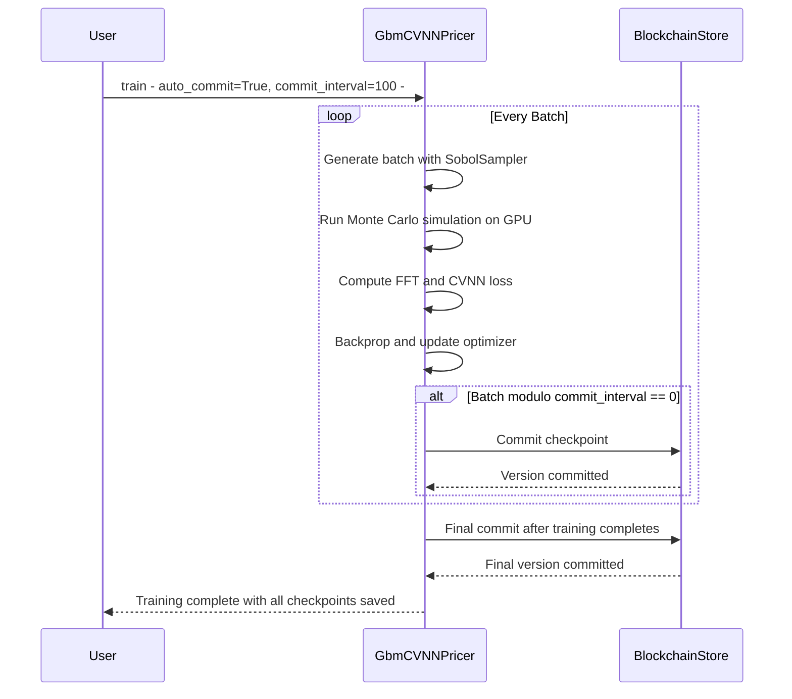
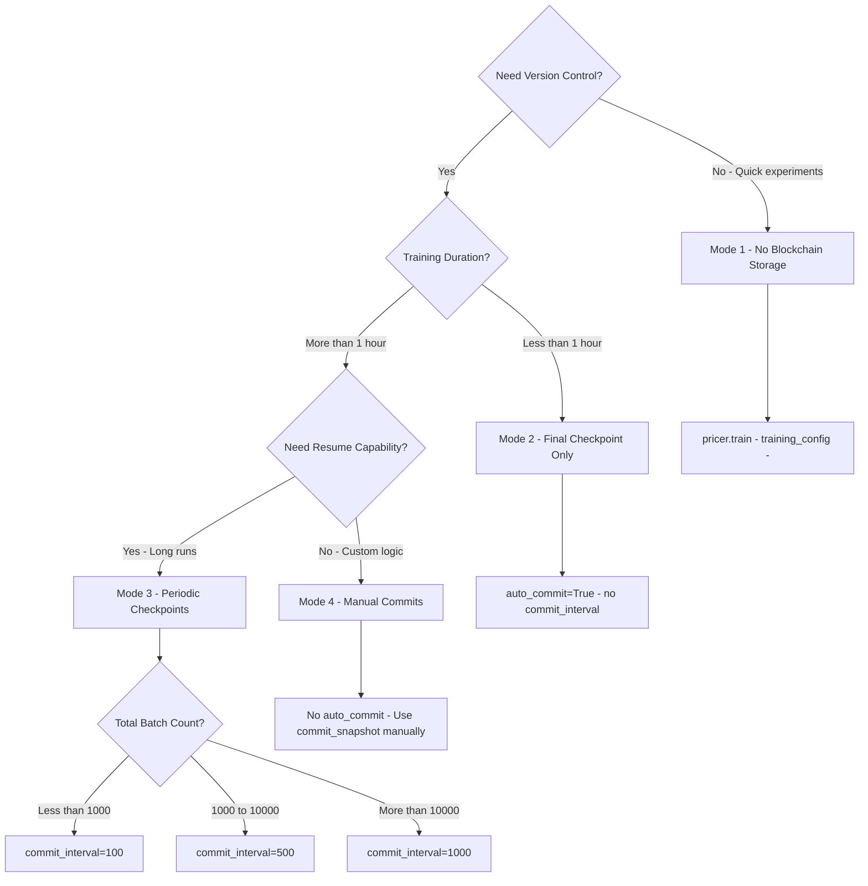
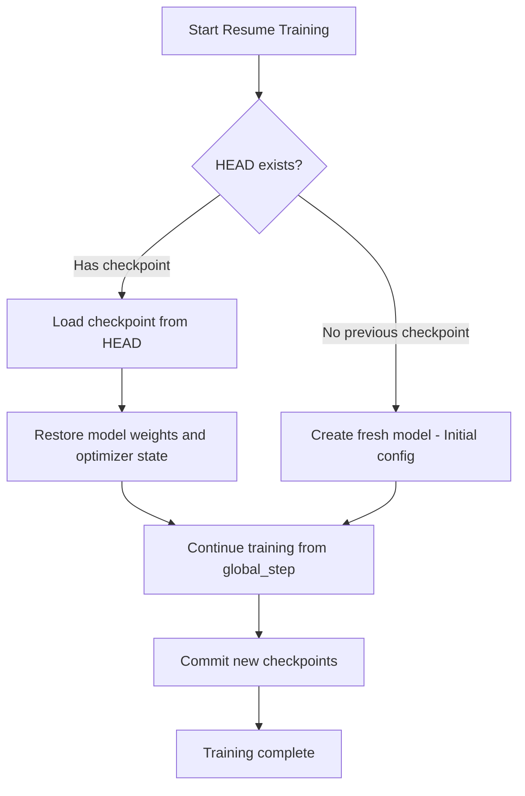

# Training Integration with Blockchain Storage

This guide explains how to integrate blockchain model versioning with the GBM training loop using automatic commits.

## Table of Contents

1. [Overview](#overview)
2. [Quick Start](#quick-start)
3. [Training Modes](#training-modes)
4. [Configuration Options](#configuration-options)
5. [Error Handling](#error-handling)
6. [Testing & Validation](#testing--validation)
7. [Examples](#examples)
8. [Best Practices](#best-practices)

## Overview

SpectralMC's `GbmCVNNPricer.train()` method integrates seamlessly with blockchain storage to automatically commit model checkpoints during and after training. This enables:

- **Automatic version control** without manual commit code
- **Periodic checkpoints** during long training runs
- **Complete state preservation** including optimizer state
- **Training reproducibility** with full checkpoint history
- **Backward compatibility** with existing training code

### Key Features

-  **Backward compatible**: Works with existing training code (blockchain storage is optional)
-  **Graceful error handling**: Commit failures are logged but don't crash training
-  **Optimizer state preservation**: Full checkpoints include Adam optimizer state
-  **Template interpolation**: Commit messages support `{step}`, `{loss}`, `{batch}` variables
-  **Async-to-sync bridge**: Uses `asyncio.run()` for seamless integration

## Quick Start

### Auto-Commit Training Flow

How automatic commits integrate with the training loop:



**Key Features**:
- Commits are non-blocking (training continues immediately)
- Commit failures logged but don't crash training
- Optimizer state preserved in each checkpoint
- Template variables: `{step}`, `{loss}`, `{batch}`

### Basic Auto-Commit

Train a model and automatically commit the final checkpoint:

```python
import asyncio
import torch
from spectralmc.gbm import BlackScholesConfig, SimulationParams
from spectralmc.gbm_trainer import GbmCVNNPricer, GbmCVNNPricerConfig, TrainingConfig
from spectralmc.models.numerical import Precision
from spectralmc.storage import AsyncBlockchainModelStore

async def train_with_auto_commit():
    # Create model
    model = torch.nn.Linear(5, 5).cuda()

    # Create simulation config
    sim_params = SimulationParams(
        timesteps=100,
        network_size=1024,
        batches_per_mc_run=8,
        threads_per_block=256,
        mc_seed=42,
        buffer_size=10000,
        skip=0,
        dtype=Precision.float32
    )

    bs_config = BlackScholesConfig(
        sim_params=sim_params,
        simulate_log_return=True,
        normalize_forwards=True
    )

    # Create pricer config
    pricer_config = GbmCVNNPricerConfig(
        cfg=bs_config,
        domain_bounds={},
        cvnn=model,
        optimizer_state=None,
        global_step=0,
        sobol_skip=0,
        torch_cpu_rng_state=torch.get_rng_state().numpy().tobytes(),
        torch_cuda_rng_states=[
            state.cpu().numpy().tobytes()
            for state in torch.cuda.get_rng_state_all()
        ]
    )

    # Initialize pricer
    pricer = GbmCVNNPricer(pricer_config)

    # Training configuration
    training_config = TrainingConfig(
        num_batches=1000,
        batch_size=32,
        learning_rate=0.001
    )

    # Train with automatic commit
    async with AsyncBlockchainModelStore("my-model-bucket") as store:
        pricer.train(
            training_config,
            blockchain_store=store,
            auto_commit=True,
            commit_message_template="Training complete: step={step}, loss={loss:.4f}"
        )

        # Verify commit
        head = await store.get_head()
        print(f" Committed version {head.counter}: {head.content_hash[:8]}")
        print(f"  Message: {head.commit_message}")

# Run training
asyncio.run(train_with_auto_commit())
```

### Periodic Checkpoints

Commit every N batches during training for long-running experiments:

```python
# Commit every 100 batches
pricer.train(
    training_config,
    blockchain_store=store,
    auto_commit=True,
    commit_interval=100,
    commit_message_template="Checkpoint: step={step}, loss={loss:.4f}"
)
```

## Training Modes

### Decision Tree: Which Training Mode?

Use this flowchart to select the right training mode for your use case:



**See detailed mode descriptions below.**

---

### Mode 1: No Blockchain Storage (Default)

Existing training code continues to work without modification:

```python
# No blockchain storage - works exactly as before
pricer.train(training_config)
```

**Use Cases**:
- Quick experiments
- Local development
- Debugging training loops
- Legacy compatibility

### Mode 2: Final Checkpoint Only

Automatically commit only after training completes:

```python
pricer.train(
    training_config,
    blockchain_store=store,
    auto_commit=True,
    commit_message_template="Final: step={step}, loss={loss:.4f}"
)
```

**Use Cases**:
- Short training runs (< 1 hour)
- Production training with single final model
- Minimal storage overhead
- Simple version control

### Mode 3: Periodic Checkpoints

Commit at regular intervals during training:

```python
pricer.train(
    training_config,
    blockchain_store=store,
    auto_commit=True,
    commit_interval=100,  # Commit every 100 batches
    commit_message_template="Checkpoint: step={step}, loss={loss:.4f}, batch={batch}"
)
```

**Use Cases**:
- Long training runs (hours/days)
- Experiment tracking
- Training resume capability
- Loss curve analysis

### Mode 4: Manual Commits Only

Use blockchain storage but control commits manually:

```python
from spectralmc.storage import commit_snapshot

# Train without auto_commit
pricer.train(training_config)

# Manually commit when desired
async with AsyncBlockchainModelStore("my-model-bucket") as store:
    snapshot = pricer.snapshot()
    version = await commit_snapshot(
        store,
        snapshot,
        "Manual checkpoint after validation"
    )
```

**Use Cases**:
- Custom checkpoint logic
- Validation-based checkpointing
- Conditional commits (e.g., only if validation improves)

## Configuration Options

### Training Config

Standard `TrainingConfig` parameters:

```python
training_config = TrainingConfig(
    num_batches=1000,      # Total training batches
    batch_size=32,         # Samples per batch
    learning_rate=0.001    # Adam learning rate
)
```

### Blockchain Storage Parameters

Parameters for `pricer.train()` method:

| Parameter | Type | Default | Description |
|-----------|------|---------|-------------|
| `blockchain_store` | `AsyncBlockchainModelStore \| None` | `None` | Blockchain storage instance |
| `auto_commit` | `bool` | `False` | Enable automatic final commit |
| `commit_interval` | `int \| None` | `None` | Commit every N batches (requires `auto_commit=True`) |
| `commit_message_template` | `str` | `"Training checkpoint..."` | Message template with variables |

### Commit Message Templates

Use these variables in commit messages:

- `{step}`: Current global step
- `{loss}`: Current training loss
- `{batch}`: Current batch number

**Examples**:

```python
# Simple
commit_message_template="Checkpoint at step {step}"

# Detailed
commit_message_template="Training: step={step}, loss={loss:.6f}, batch={batch}"

# Production
commit_message_template="Production model v{step}: loss={loss:.4f}"
```

## Error Handling

### Validation Errors

Training validates blockchain parameters before starting:

```python
# L ERROR: auto_commit requires blockchain_store
pricer.train(training_config, auto_commit=True)
# Raises: ValueError: auto_commit or commit_interval requires blockchain_store

# L ERROR: commit_interval requires blockchain_store
pricer.train(training_config, commit_interval=100)
# Raises: ValueError: auto_commit or commit_interval requires blockchain_store

#  CORRECT
pricer.train(training_config, blockchain_store=store, auto_commit=True)
```

### Graceful Commit Failures

Commit failures are logged but **do not crash training**:

```python
# Training continues even if S3 is unreachable
pricer.train(
    training_config,
    blockchain_store=store,  # S3 connection might fail
    auto_commit=True
)
# Training completes normally
# Error logged: "Failed to commit at step 1000: Connection timeout"
```

**Rationale**: Training runs are expensive and shouldn't fail due to storage issues. Users can manually commit after training if needed.

### Retry Logic

The blockchain store has built-in retry logic:

- **Exponential backoff**: 1s, 2s, 4s delays
- **Max retries**: 3 attempts
- **Atomic CAS**: Prevents race conditions with concurrent commits

## Testing & Validation

### Test Coverage

Training integration has comprehensive test coverage:

-  `test_training_with_auto_commit`: Final checkpoint creation
-  `test_training_with_commit_interval`: Periodic commits
-  `test_training_without_storage_backward_compat`: Legacy compatibility
-  `test_training_validation_auto_commit_requires_store`: Parameter validation
-  `test_training_commit_message_template`: Template interpolation
-  `test_training_commit_preserves_optimizer_state`: State preservation

Run tests:

```bash
docker compose -f docker/docker-compose.yml exec spectralmc pytest tests/test_storage/test_training_integration.py -v
```

### Manual Verification

After training with auto_commit, verify the commit:

```python
async def verify_training_commit():
    async with AsyncBlockchainModelStore("my-model-bucket") as store:
        # Check HEAD
        head = await store.get_head()
        print(f"Latest version: {head.counter}")
        print(f"Content hash: {head.content_hash}")
        print(f"Message: {head.commit_message}")

        # Load and verify checkpoint
        from spectralmc.storage import load_snapshot_from_checkpoint
        snapshot = await load_snapshot_from_checkpoint(
            store, head, model_template, config_template
        )
        print(f"Global step: {snapshot.global_step}")
        print(f"Optimizer state preserved: {snapshot.optimizer_state is not None}")

asyncio.run(verify_training_commit())
```

## Examples

### Example 1: Production Training Pipeline

```python
async def production_training_pipeline():
    """Production training with automatic checkpointing."""

    # Initialize storage
    async with AsyncBlockchainModelStore("prod-models") as store:
        # Create model and config
        model = create_production_model()
        config = create_production_config(model)
        pricer = GbmCVNNPricer(config)

        # Training config
        training_config = TrainingConfig(
            num_batches=10000,
            batch_size=64,
            learning_rate=0.0005
        )

        # Train with periodic checkpoints every 500 batches
        print("Starting training...")
        pricer.train(
            training_config,
            blockchain_store=store,
            auto_commit=True,
            commit_interval=500,
            commit_message_template="[PROD] step={step}, loss={loss:.6f}"
        )

        # Verify final checkpoint
        head = await store.get_head()
        print(f" Training complete")
        print(f"  Final version: {head.counter}")
        print(f"  Total checkpoints: {head.counter + 1}")

        # Tag production release
        # (Manual tagging for production control)

        return head

asyncio.run(production_training_pipeline())
```

### Example 2: Experiment Tracking

```python
async def experiment_tracking():
    """Track multiple experiments with version control."""

    experiments = {
        "baseline": {"lr": 0.001, "batch": 32},
        "high_lr": {"lr": 0.01, "batch": 32},
        "large_batch": {"lr": 0.001, "batch": 128}
    }

    async with AsyncBlockchainModelStore("experiments-2025") as store:
        for name, params in experiments.items():
            print(f"\nRunning experiment: {name}")

            model = torch.nn.Linear(5, 5).cuda()
            config = make_config(model)
            pricer = GbmCVNNPricer(config)

            training_config = TrainingConfig(
                num_batches=1000,
                batch_size=params["batch"],
                learning_rate=params["lr"]
            )

            pricer.train(
                training_config,
                blockchain_store=store,
                auto_commit=True,
                commit_message_template=f"[{name}] lr={params['lr']}, batch={params['batch']}, loss={{loss:.4f}}"
            )

            head = await store.get_head()
            print(f"   Committed as v{head.counter}")

        # List all experiments
        print("\nAll experiments:")
        for i in range((await store.get_head()).counter + 1):
            version = await store.get_version(f"v{i:010d}")
            print(f"  v{i}: {version.commit_message}")

asyncio.run(experiment_tracking())
```

### Example 3: Training Resume

**Training Resume Workflow**:



**State Preservation**:
- Model weights fully restored
- Optimizer state (Adam momentum) preserved
- `global_step` continues from checkpoint
- Sobol skip offset ensures no duplicate samples
- RNG state restored for reproducibility

**Code Example**:

```python
async def resume_training():
    """Resume training from last checkpoint."""

    async with AsyncBlockchainModelStore("my-models") as store:
        head = await store.get_head()

        if head is None:
            print("No previous checkpoint, starting fresh")
            snapshot = create_initial_config()
        else:
            print(f"Resuming from checkpoint v{head.counter}")
            snapshot = await load_snapshot_from_checkpoint(
                store, head, model_template, config_template
            )

        # Create pricer from snapshot
        pricer = GbmCVNNPricer(snapshot)

        # Continue training
        training_config = TrainingConfig(
            num_batches=1000,
            batch_size=32,
            learning_rate=0.001
        )

        pricer.train(
            training_config,
            blockchain_store=store,
            auto_commit=True,
            commit_interval=100,
            commit_message_template="Resume: step={step}, loss={loss:.4f}"
        )

        new_head = await store.get_head()
        print(f" Training resumed, now at v{new_head.counter}")

asyncio.run(resume_training())
```

## Best Practices

### 1. Commit Message Conventions

Use structured commit messages for easy filtering:

```python
# Production
commit_message_template="[PROD] v{step}: loss={loss:.4f}"

# Experiments
commit_message_template="[EXP-baseline] step={step}, loss={loss:.6f}"

# Debugging
commit_message_template="[DEBUG] Testing hyperparams: step={step}"
```

### 2. Periodic Checkpoint Frequency

Choose `commit_interval` based on training duration:

| Training Duration | Recommended Interval | Reason |
|-------------------|---------------------|--------|
| < 10 minutes | No periodic (final only) | Minimal overhead |
| 10-60 minutes | Every 100-500 batches | Balance frequency/storage |
| 1-24 hours | Every 500-1000 batches | Regular snapshots |
| > 24 hours | Every 1000-5000 batches | Avoid storage bloat |

### 3. Garbage Collection

Regularly clean up old checkpoints:

```bash
# Keep last 20 versions, protect production releases
python -m spectralmc.storage gc-run my-model-bucket 20 --protect-tags 5,12,42 --yes
```

### 4. Production Tagging

Tag important versions for protection from GC:

```python
# After validating model performance
# Manually protect version 42 by adding to protect_tags in GC policy
```

### 5. Monitoring

Use TensorBoard to visualize training history:

```bash
python -m spectralmc.storage tensorboard-log my-model-bucket
tensorboard --logdir=runs/
```

### 6. Bucket Organization

Use separate buckets for different purposes:

- `prod-models`: Production releases only
- `experiments-2025`: All experiments
- `dev-{username}`: Personal development

### 7. Error Recovery

If commit fails during training:

```python
# Training completed but commit failed
# Manually commit the final state
pricer = GbmCVNNPricer(config)  # Your trained pricer
snapshot = pricer.snapshot()

async with AsyncBlockchainModelStore("my-models") as store:
    version = await commit_snapshot(
        store,
        snapshot,
        "Manual commit after training completed"
    )
```

## See Also

- [deployment.md](deployment.md): Production deployment guide
- [CLAUDE.md](../../CLAUDE.md): Complete development guide
- [examples/training_with_blockchain_storage.py](../../examples/training_with_blockchain_storage.py): Full working example
- [tests/test_storage/test_training_integration.py](../../tests/test_storage/test_training_integration.py): Integration tests
